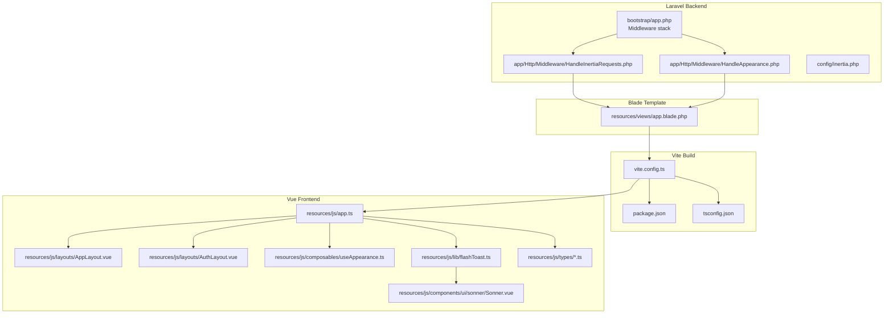
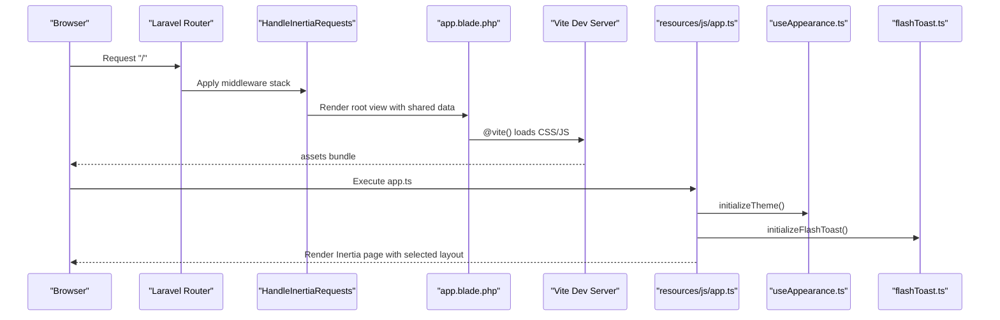
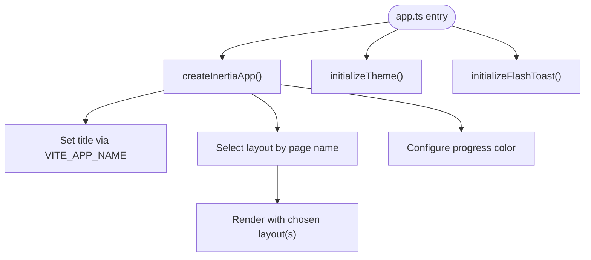
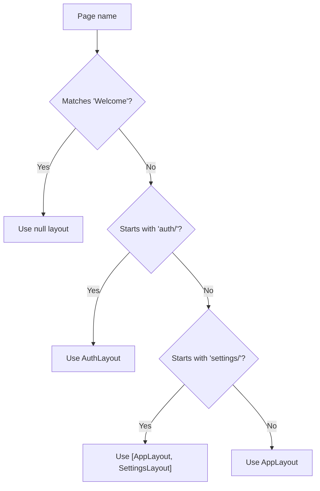
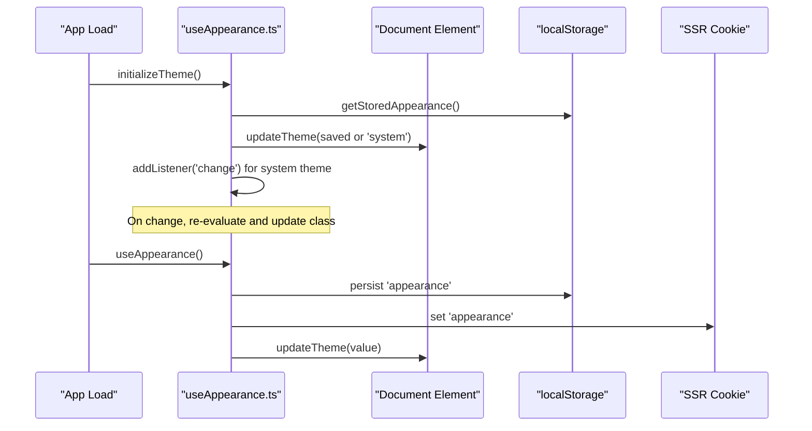
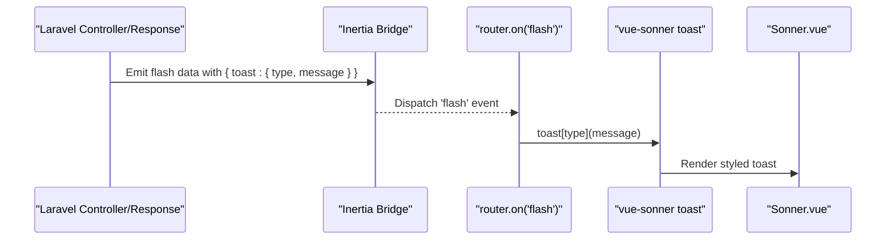
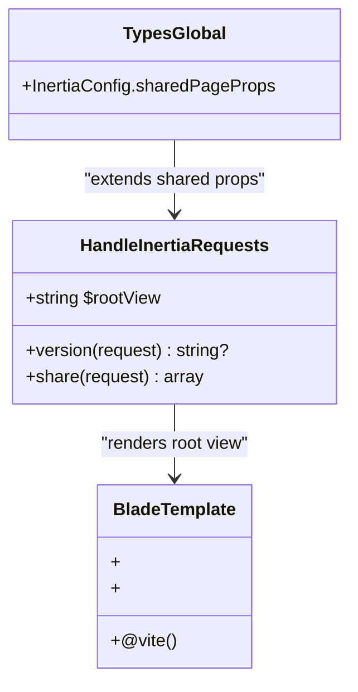
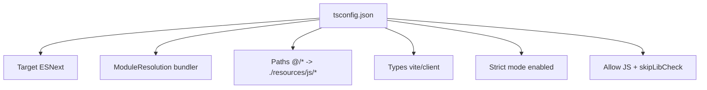
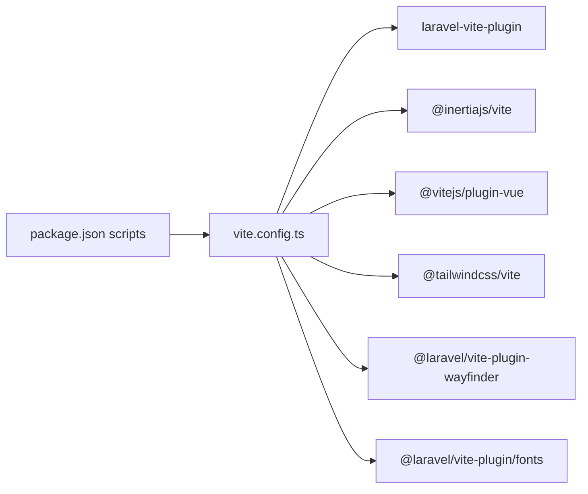
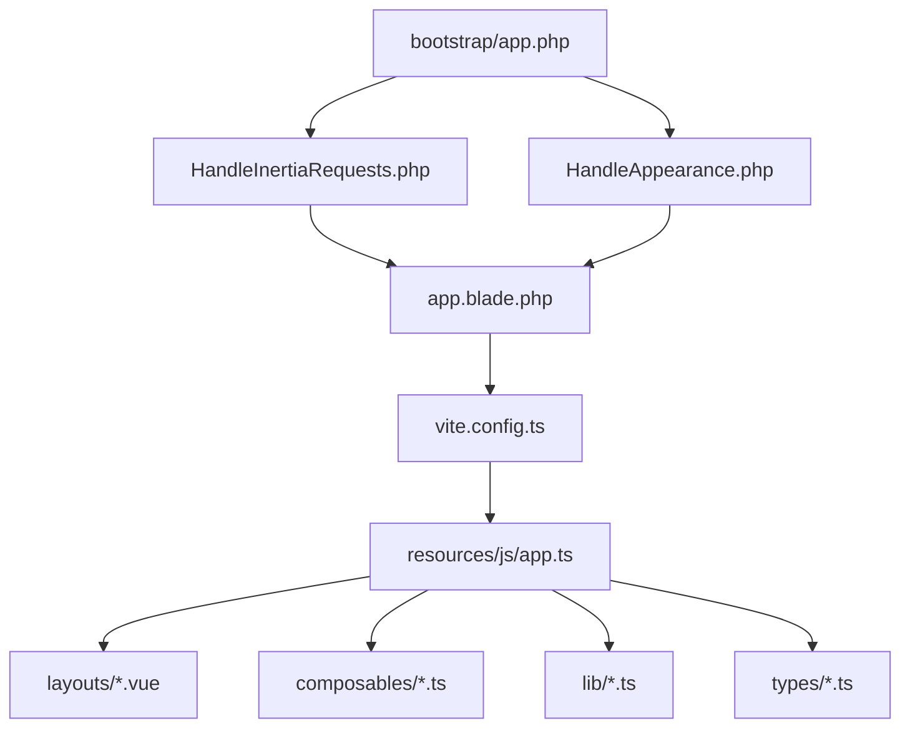

# Vue Application Setup & Configuration

<cite>
**Referenced Files in This Document**
- [app.ts](file://resources/js/app.ts)
- [app.blade.php](file://resources/views/app.blade.php)
- [vite.config.ts](file://vite.config.ts)
- [tsconfig.json](file://tsconfig.json)
- [package.json](file://package.json)
- [AppLayout.vue](file://resources/js/layouts/AppLayout.vue)
- [AuthLayout.vue](file://resources/js/layouts/AuthLayout.vue)
- [useAppearance.ts](file://resources/js/composables/useAppearance.ts)
- [flashToast.ts](file://resources/js/lib/flashToast.ts)
- [global.d.ts](file://resources/js/types/global.d.ts)
- [HandleInertiaRequests.php](file://app/Http/Middleware/HandleInertiaRequests.php)
- [inertia.php](file://config/inertia.php)
- [app.php](file://bootstrap/app.php)
- [HandleAppearance.php](file://app/Http/Middleware/HandleAppearance.php)
- [Sonner.vue](file://resources/js/components/ui/sonner/Sonner.vue)
- [ui.ts](file://resources/js/types/ui.ts)
- [navigation.ts](file://resources/js/types/navigation.ts)
</cite>

## Table of Contents
1. [Introduction](#introduction)
2. [Project Structure](#project-structure)
3. [Core Components](#core-components)
4. [Architecture Overview](#architecture-overview)
5. [Detailed Component Analysis](#detailed-component-analysis)
6. [Dependency Analysis](#dependency-analysis)
7. [Performance Considerations](#performance-considerations)
8. [Troubleshooting Guide](#troubleshooting-guide)
9. [Conclusion](#conclusion)
10. [Appendices](#appendices)

## Introduction
This document explains the Vue.js application setup and configuration in SmartRecruit ATS. It covers the application entry point, Inertia.js integration patterns, TypeScript configuration, initialization flows for theme and flash toast systems, layout system with dynamic layout selection, build configuration, environment variables, and development workflow. It also provides practical guidance for extending application configuration and adding new global configurations.

## Project Structure
The Vue application integrates tightly with Laravel via Inertia.js. The frontend is organized under resources/js with pages, layouts, composables, libraries, and types. The Blade root template loads assets via Vite and renders the Inertia app shell. Build tooling is configured in Vite with plugins for Vue, Inertia, Tailwind CSS, and font delivery.

**Diagram sources**
- [app.php:17-25](file://bootstrap/app.php#L17-L25)
- [HandleInertiaRequests.php:17-46](file://app/Http/Middleware/HandleInertiaRequests.php#L17-L46)
- [HandleAppearance.php:19-22](file://app/Http/Middleware/HandleAppearance.php#L19-L22)
- [inertia.php:36-51](file://config/inertia.php#L36-L51)
- [app.blade.php:39-42](file://resources/views/app.blade.php#L39-L42)
- [vite.config.ts:9-34](file://vite.config.ts#L9-L34)
- [package.json:5-14](file://package.json#L5-L14)
- [tsconfig.json:36-43](file://tsconfig.json#L36-L43)
- [app.ts:10-27](file://resources/js/app.ts#L10-L27)
- [AppLayout.vue:1-15](file://resources/js/layouts/AppLayout.vue#L1-L15)
- [AuthLayout.vue:1-15](file://resources/js/layouts/AuthLayout.vue#L1-L15)
- [useAppearance.ts:73-84](file://resources/js/composables/useAppearance.ts#L73-L84)
- [flashToast.ts:5-16](file://resources/js/lib/flashToast.ts#L5-L16)
- [Sonner.vue:12-44](file://resources/js/components/ui/sonner/Sonner.vue#L12-L44)
- [global.d.ts:4-14](file://resources/js/types/global.d.ts#L4-L14)

**Section sources**
- [app.php:17-25](file://bootstrap/app.php#L17-L25)
- [app.blade.php:39-42](file://resources/views/app.blade.php#L39-L42)
- [vite.config.ts:9-34](file://vite.config.ts#L9-L34)
- [package.json:5-14](file://package.json#L5-L14)
- [tsconfig.json:36-43](file://tsconfig.json#L36-L43)

## Core Components
- Application entry point initializes Inertia.js, sets dynamic layouts, progress bar color, and app title. It also triggers theme and flash toast initialization on load.
- Blade root template injects assets via Vite, sets initial dark mode based on server-provided appearance, and renders the Inertia app shell.
- Vite configuration wires Laravel plugin, Inertia plugin, Vue plugin, Tailwind CSS, Wayfinder, and font delivery.
- TypeScript configuration enables modern ECMAScript features, bundler module resolution, path aliases, and strict type checking.
- Middleware stack shares application-wide data and handles appearance cookie propagation to the view layer.

Key implementation references:
- [app.ts:10-27](file://resources/js/app.ts#L10-L27)
- [app.blade.php:39-42](file://resources/views/app.blade.php#L39-L42)
- [vite.config.ts:9-34](file://vite.config.ts#L9-L34)
- [tsconfig.json:14-22](file://tsconfig.json#L14-L22)
- [HandleInertiaRequests.php:36-46](file://app/Http/Middleware/HandleInertiaRequests.php#L36-L46)
- [HandleAppearance.php:19-22](file://app/Http/Middleware/HandleAppearance.php#L19-L22)

**Section sources**
- [app.ts:10-27](file://resources/js/app.ts#L10-L27)
- [app.blade.php:39-42](file://resources/views/app.blade.php#L39-L42)
- [vite.config.ts:9-34](file://vite.config.ts#L9-L34)
- [tsconfig.json:14-22](file://tsconfig.json#L14-L22)
- [HandleInertiaRequests.php:36-46](file://app/Http/Middleware/HandleInertiaRequests.php#L36-L46)
- [HandleAppearance.php:19-22](file://app/Http/Middleware/HandleAppearance.php#L19-L22)

## Architecture Overview
The application follows a server-driven SPA architecture powered by Inertia.js. Laravel serves the root Blade template, which loads Vite-built assets. Vue components render pages, layouts, and UI primitives. Middleware ensures shared data and appearance preferences are available to both server and client.

**Diagram sources**
- [app.blade.php:39-42](file://resources/views/app.blade.php#L39-L42)
- [HandleInertiaRequests.php:17-46](file://app/Http/Middleware/HandleInertiaRequests.php#L17-L46)
- [app.ts:29-33](file://resources/js/app.ts#L29-L33)
- [useAppearance.ts:73-84](file://resources/js/composables/useAppearance.ts#L73-L84)
- [flashToast.ts:5-16](file://resources/js/lib/flashToast.ts#L5-L16)

## Detailed Component Analysis

### Application Entry Point and Initialization
The Vue application bootstraps via Inertia.js with:
- Dynamic layout selection based on the page name pattern.
- Shared title construction using the Vite environment variable.
- Progress indicator color configuration.
- Immediate theme and flash toast initialization on load.

**Diagram sources**
- [app.ts:10-27](file://resources/js/app.ts#L10-L27)
- [app.ts:29-33](file://resources/js/app.ts#L29-L33)

**Section sources**
- [app.ts:8-27](file://resources/js/app.ts#L8-L27)
- [app.ts:29-33](file://resources/js/app.ts#L29-L33)

### Layout System and Dynamic Selection
Layouts are selected dynamically based on the page component name:
- Welcome page uses no layout.
- Pages under auth/ namespace use the Auth layout.
- Pages under settings/ namespace use a dual layout chain: AppLayout followed by SettingsLayout.
- Other pages use the default AppLayout.

**Diagram sources**
- [app.ts:12-23](file://resources/js/app.ts#L12-L23)

**Section sources**
- [app.ts:12-23](file://resources/js/app.ts#L12-L23)
- [AppLayout.vue:1-15](file://resources/js/layouts/AppLayout.vue#L1-L15)
- [AuthLayout.vue:1-15](file://resources/js/layouts/AuthLayout.vue#L1-L15)

### Theme Initialization and Persistence
The theme system supports three modes: light, dark, and system. It:
- Reads stored appearance from localStorage on mount.
- Applies dark mode class to the document element based on resolved appearance.
- Listens to system theme changes and updates accordingly.
- Persists user choice in both localStorage and a cookie for SSR compatibility.

**Diagram sources**
- [useAppearance.ts:73-84](file://resources/js/composables/useAppearance.ts#L73-L84)
- [useAppearance.ts:88-124](file://resources/js/composables/useAppearance.ts#L88-L124)
- [HandleAppearance.php:19-22](file://app/Http/Middleware/HandleAppearance.php#L19-L22)

**Section sources**
- [useAppearance.ts:73-84](file://resources/js/composables/useAppearance.ts#L73-L84)
- [useAppearance.ts:88-124](file://resources/js/composables/useAppearance.ts#L88-L124)
- [HandleAppearance.php:19-22](file://app/Http/Middleware/HandleAppearance.php#L19-L22)

### Flash Toast System
Flash toast messages are initialized to listen for a custom Inertia event containing flash data. When received, it triggers the appropriate toast notification based on the message type.

**Diagram sources**
- [flashToast.ts:5-16](file://resources/js/lib/flashToast.ts#L5-L16)
- [Sonner.vue:12-44](file://resources/js/components/ui/sonner/Sonner.vue#L12-L44)

**Section sources**
- [flashToast.ts:5-16](file://resources/js/lib/flashToast.ts#L5-L16)
- [Sonner.vue:12-44](file://resources/js/components/ui/sonner/Sonner.vue#L12-L44)
- [ui.ts:6-9](file://resources/js/types/ui.ts#L6-L9)

### Inertia.js Integration Patterns
Laravel middleware:
- Sets the root view to the Blade template.
- Shares application-wide data including user context and sidebar state.
- Provides asset versioning via the parent implementation.

**Diagram sources**
- [HandleInertiaRequests.php:17-46](file://app/Http/Middleware/HandleInertiaRequests.php#L17-L46)
- [app.blade.php:39-46](file://resources/views/app.blade.php#L39-L46)
- [global.d.ts:16-25](file://resources/js/types/global.d.ts#L16-L25)

**Section sources**
- [HandleInertiaRequests.php:17-46](file://app/Http/Middleware/HandleInertiaRequests.php#L17-L46)
- [global.d.ts:16-25](file://resources/js/types/global.d.ts#L16-L25)

### TypeScript Configuration
TypeScript compiler options enable modern ECMAScript features, strict type checking, bundler module resolution, path aliases, and JSON module support. Includes Vue and Vite types for accurate type inference.

**Diagram sources**
- [tsconfig.json:14-22](file://tsconfig.json#L14-L22)
- [tsconfig.json:36-43](file://tsconfig.json#L36-L43)
- [tsconfig.json:94-117](file://tsconfig.json#L94-L117)

**Section sources**
- [tsconfig.json:14-22](file://tsconfig.json#L14-L22)
- [tsconfig.json:36-43](file://tsconfig.json#L36-L43)
- [tsconfig.json:94-117](file://tsconfig.json#L94-L117)

### Build Configuration and Development Workflow
Vite configuration integrates:
- Laravel plugin for asset building and font delivery.
- Inertia plugin for seamless SPA navigation.
- Vue plugin with asset URL transformation.
- Tailwind CSS plugin and Wayfinder for form variants.

Development scripts include building, linting, formatting, and type checking.

**Diagram sources**
- [package.json:5-14](file://package.json#L5-L14)
- [vite.config.ts:9-34](file://vite.config.ts#L9-L34)

**Section sources**
- [package.json:5-14](file://package.json#L5-L14)
- [vite.config.ts:9-34](file://vite.config.ts#L9-L34)

## Dependency Analysis
The application exhibits layered dependencies:
- Laravel bootstrap configures middleware and encryption exceptions for cookies used by appearance and sidebar state.
- Middleware stack ensures shared data availability and appearance propagation to the view.
- Blade template depends on Vite for asset loading and Inertia for rendering.
- Vue app depends on Inertia, composables, and UI libraries.

**Diagram sources**
- [app.php:17-25](file://bootstrap/app.php#L17-L25)
- [HandleInertiaRequests.php:17-46](file://app/Http/Middleware/HandleInertiaRequests.php#L17-L46)
- [HandleAppearance.php:19-22](file://app/Http/Middleware/HandleAppearance.php#L19-L22)
- [app.blade.php:39-42](file://resources/views/app.blade.php#L39-L42)
- [vite.config.ts:9-34](file://vite.config.ts#L9-L34)
- [app.ts:10-27](file://resources/js/app.ts#L10-L27)

**Section sources**
- [app.php:17-25](file://bootstrap/app.php#L17-L25)
- [HandleInertiaRequests.php:17-46](file://app/Http/Middleware/HandleInertiaRequests.php#L17-L46)
- [HandleAppearance.php:19-22](file://app/Http/Middleware/HandleAppearance.php#L19-L22)
- [app.blade.php:39-42](file://resources/views/app.blade.php#L39-L42)
- [vite.config.ts:9-34](file://vite.config.ts#L9-L34)
- [app.ts:10-27](file://resources/js/app.ts#L10-L27)

## Performance Considerations
- Keep layout chains minimal to reduce render overhead; the dual layout for settings is intentional but should be used sparingly.
- Prefer lazy-loading heavy components and deferring non-critical assets.
- Use Vite’s built-in code splitting and tree-shaking; avoid importing large libraries unnecessarily.
- Minimize unnecessary re-renders by leveraging Vue’s reactivity and memoization patterns.
- Ensure environment variables are properly typed to prevent runtime misconfiguration.

## Troubleshooting Guide
Common issues and resolutions:
- Layout not applied: Verify page name patterns and ensure the component exists under the configured pages path.
- Theme not persisting: Confirm localStorage availability and cookie handling; check media query listeners.
- Flash toast not showing: Ensure the server emits the expected flash payload and the client listens for the 'flash' event.
- Asset not loading in development: Confirm Vite dev server is running and the @vite directive includes the correct entry points.

**Section sources**
- [app.ts:12-23](file://resources/js/app.ts#L12-L23)
- [inertia.php:36-51](file://config/inertia.php#L36-L51)
- [useAppearance.ts:73-84](file://resources/js/composables/useAppearance.ts#L73-L84)
- [flashToast.ts:5-16](file://resources/js/lib/flashToast.ts#L5-L16)
- [app.blade.php:39-42](file://resources/views/app.blade.php#L39-L42)

## Conclusion
SmartRecruit ATS combines Laravel and Vue with Inertia.js to deliver a cohesive, server-driven SPA. The setup emphasizes modular layouts, robust theme handling, and a unified toast system. The build pipeline leverages Vite with dedicated plugins for optimal developer experience and performance. Extending the configuration involves updating middleware shared props, layout selection logic, and TypeScript definitions while maintaining type safety and consistent UX.

## Appendices

### Environment Variables
- VITE_APP_NAME: Used to construct the document title in the Inertia app initializer.

**Section sources**
- [app.ts:8](file://resources/js/app.ts#L8)
- [global.d.ts:6](file://resources/js/types/global.d.ts#L6)

### Extending Application Configuration
- Adding new shared data: Extend the shared props in the Inertia middleware to include additional context for Vue components.
- Customizing layout selection: Modify the layout switch logic in the Inertia app initializer to support new page namespaces.
- Global UI enhancements: Introduce new composables or libraries following existing patterns and update TypeScript declarations as needed.

**Section sources**
- [HandleInertiaRequests.php:36-46](file://app/Http/Middleware/HandleInertiaRequests.php#L36-L46)
- [app.ts:12-23](file://resources/js/app.ts#L12-L23)
- [global.d.ts:16-25](file://resources/js/types/global.d.ts#L16-L25)