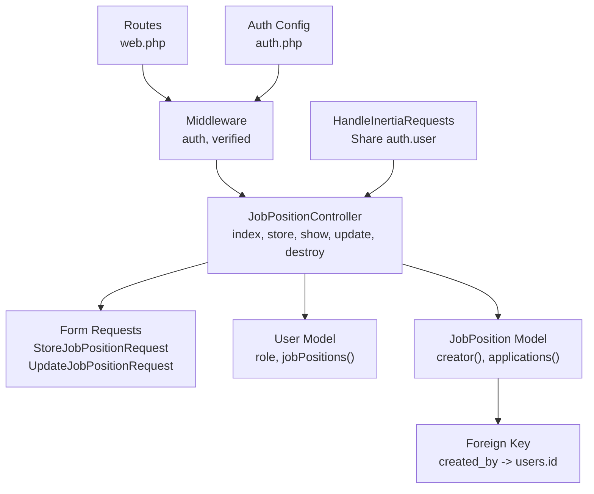
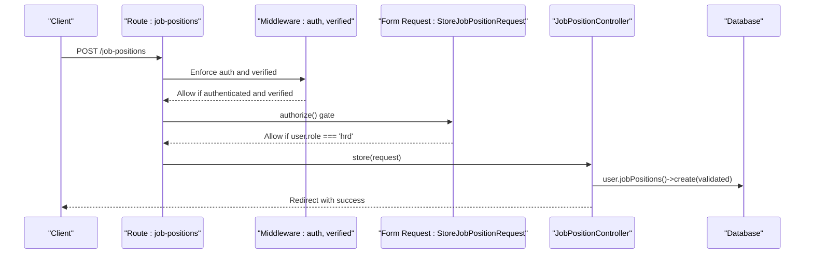
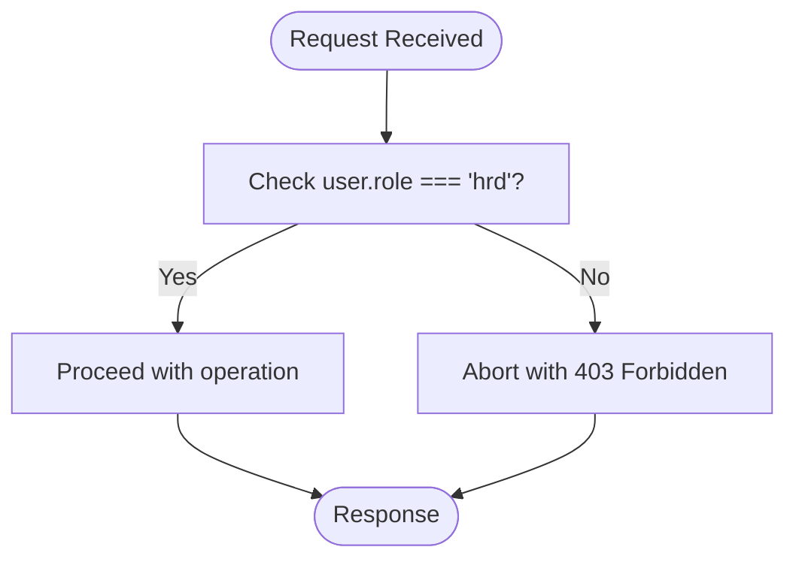
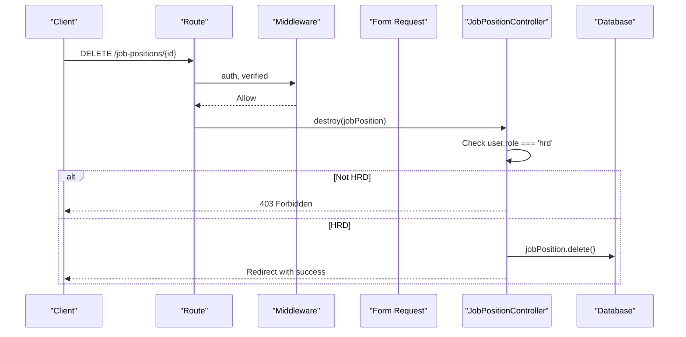
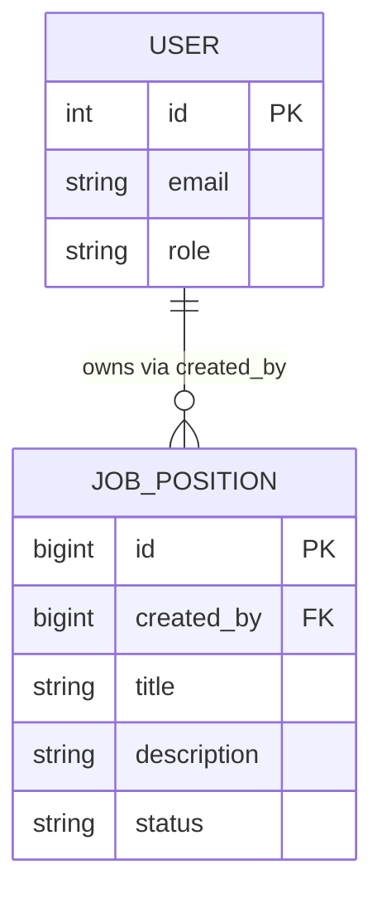
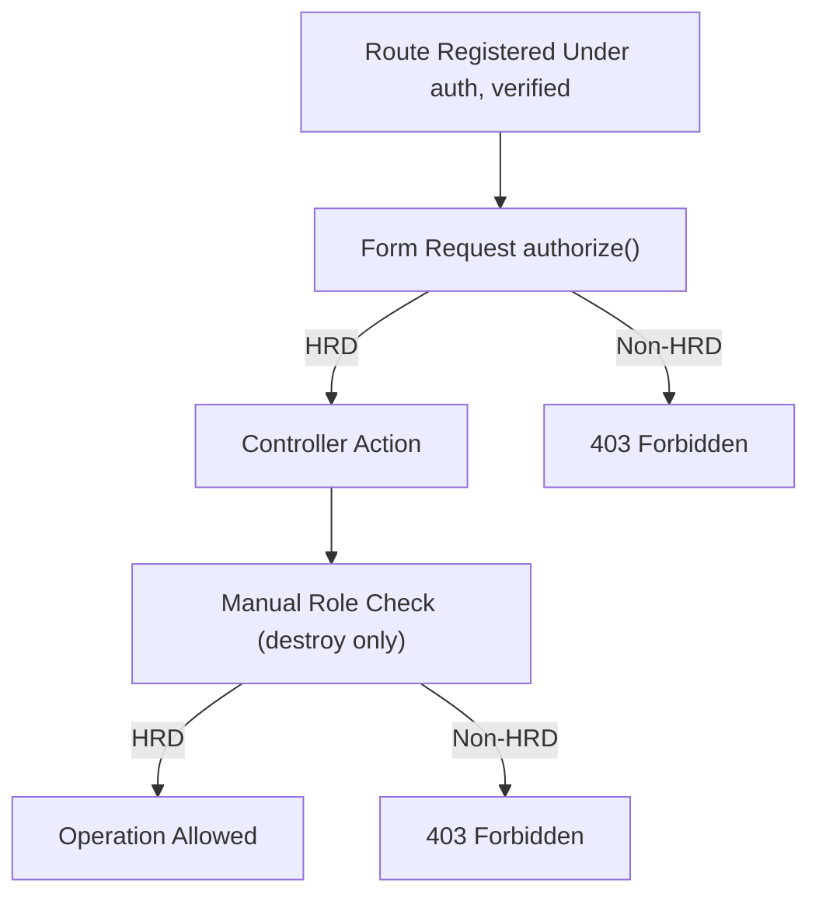

# Authorization & Access Control

<cite>
**Referenced Files in This Document**
- [JobPositionController.php](file://app/Http/Controllers/JobPositionController.php)
- [User.php](file://app/Models/User.php)
- [JobPosition.php](file://app/Models/JobPosition.php)
- [StoreJobPositionRequest.php](file://app/Http/Requests/StoreJobPositionRequest.php)
- [UpdateJobPositionRequest.php](file://app/Http/Requests/UpdateJobPositionRequest.php)
- [web.php](file://routes/web.php)
- [auth.php](file://config/auth.php)
- [HandleInertiaRequests.php](file://app/Http/Middleware/HandleInertiaRequests.php)
- [2026_06_24_164756_add_role_and_metadata_to_users_table.php](file://database/migrations/2026_06_24_164756_add_role_and_metadata_to_users_table.php)
- [2026_06_24_164755_create_job_positions_table.php](file://database/migrations/2026_06_24_164755_create_job_positions_table.php)
- [JobPositionTest.php](file://tests/Feature/JobPositionTest.php)
</cite>

## Table of Contents
1. [Introduction](#introduction)
2. [Project Structure](#project-structure)
3. [Core Components](#core-components)
4. [Architecture Overview](#architecture-overview)
5. [Detailed Component Analysis](#detailed-component-analysis)
6. [Dependency Analysis](#dependency-analysis)
7. [Performance Considerations](#performance-considerations)
8. [Troubleshooting Guide](#troubleshooting-guide)
9. [Conclusion](#conclusion)

## Introduction
This document explains the authorization and access control mechanisms for job position management, focusing on role-based access control (RBAC) where only HRD users can delete job positions. It documents the manual authorization checks in the controller, the relationship between users and job positions through the creator relationship, filtering of job positions by authorized users, and how the system prevents unauthorized access to job management functions. It also covers authorization middleware integration and custom authorization logic, along with security considerations and best practices.

## Project Structure
The authorization system spans several layers:
- Routes define protected access to job position resources.
- Controllers enforce authorization policies per action.
- Request classes provide early authorization gates for create/update operations.
- Models define relationships between users and job positions.
- Middleware ensures authenticated and verified sessions.
- Database migrations establish the role field and foreign key constraints.

**Diagram sources**
- [web.php:18-29](file://routes/web.php#L18-L29)
- [JobPositionController.php:12-54](file://app/Http/Controllers/JobPositionController.php#L12-L54)
- [StoreJobPositionRequest.php:8-34](file://app/Http/Requests/StoreJobPositionRequest.php#L8-L34)
- [UpdateJobPositionRequest.php:8-34](file://app/Http/Requests/UpdateJobPositionRequest.php#L8-L34)
- [User.php:32-61](file://app/Models/User.php#L32-L61)
- [JobPosition.php:10-38](file://app/Models/JobPosition.php#L10-L38)
- [2026_06_24_164755_create_job_positions_table.php:14-23](file://database/migrations/2026_06_24_164755_create_job_positions_table.php#L14-L23)
- [auth.php:40-44](file://config/auth.php#L40-L44)
- [HandleInertiaRequests.php:36-46](file://app/Http/Middleware/HandleInertiaRequests.php#L36-L46)

**Section sources**
- [web.php:18-29](file://routes/web.php#L18-L29)
- [auth.php:40-44](file://config/auth.php#L40-L44)
- [HandleInertiaRequests.php:36-46](file://app/Http/Middleware/HandleInertiaRequests.php#L36-L46)

## Core Components
- Role-based access control: Users have a role field with 'hrd' as the privileged role for deletion operations.
- Manual authorization in controller: The destroy method explicitly checks the authenticated user's role.
- Early authorization in form requests: Store and update requests reject non-HRD users before reaching the controller.
- Relationship modeling: JobPosition belongs to a creator (User) via created_by foreign key; User has many jobPositions.
- Route protection: Resource routes are registered under auth and verified middleware groups.
- Shared authentication state: Inertia middleware shares the authenticated user with the frontend.

**Section sources**
- [JobPositionController.php:44-53](file://app/Http/Controllers/JobPositionController.php#L44-L53)
- [StoreJobPositionRequest.php:13-16](file://app/Http/Requests/StoreJobPositionRequest.php#L13-L16)
- [UpdateJobPositionRequest.php:13-16](file://app/Http/Requests/UpdateJobPositionRequest.php#L13-L16)
- [User.php:57-60](file://app/Models/User.php#L57-L60)
- [JobPosition.php:29-32](file://app/Models/JobPosition.php#L29-L32)
- [web.php:23](file://routes/web.php#L23)
- [HandleInertiaRequests.php:41-43](file://app/Http/Middleware/HandleInertiaRequests.php#L41-L43)

## Architecture Overview
The authorization architecture combines middleware enforcement, early request gating, and controller-level checks:

**Diagram sources**
- [web.php:23](file://routes/web.php#L23)
- [auth.php:40-44](file://config/auth.php#L40-L44)
- [StoreJobPositionRequest.php:13-16](file://app/Http/Requests/StoreJobPositionRequest.php#L13-L16)
- [JobPositionController.php:22-27](file://app/Http/Controllers/JobPositionController.php#L22-L27)

## Detailed Component Analysis

### Role-Based Access Control (RBAC) Implementation
- Role field: The users table includes a role column with a default value for candidates and an additional metadata JSONB column.
- Privileged role: Deletion operations require the 'hrd' role.
- Enforcement points:
  - Controller destroy method performs a runtime role check.
  - Form requests prevent unauthorized users from submitting create/update forms.

**Diagram sources**
- [JobPositionController.php:46-48](file://app/Http/Controllers/JobPositionController.php#L46-L48)
- [StoreJobPositionRequest.php:15](file://app/Http/Requests/StoreJobPositionRequest.php#L15)
- [UpdateJobPositionRequest.php:15](file://app/Http/Requests/UpdateJobPositionRequest.php#L15)

**Section sources**
- [2026_06_24_164756_add_role_and_metadata_to_users_table.php:14-17](file://database/migrations/2026_06_24_164756_add_role_and_metadata_to_users_table.php#L14-L17)
- [JobPositionController.php:46-48](file://app/Http/Controllers/JobPositionController.php#L46-L48)
- [StoreJobPositionRequest.php:13-16](file://app/Http/Requests/StoreJobPositionRequest.php#L13-L16)
- [UpdateJobPositionRequest.php:13-16](file://app/Http/Requests/UpdateJobPositionRequest.php#L13-L16)

### Authorization Checks in JobPositionController
- Index and show: Load job positions with creator relationship; no explicit role check required for viewing.
- Store: Uses StoreJobPositionRequest which enforces HRD role before controller execution.
- Update: Uses UpdateJobPositionRequest which enforces HRD role before controller execution.
- Destroy: Manual authorization check verifies user role equals 'hrd'; otherwise returns 403.

**Diagram sources**
- [web.php:23](file://routes/web.php#L23)
- [auth.php:40-44](file://config/auth.php#L40-L44)
- [JobPositionController.php:44-53](file://app/Http/Controllers/JobPositionController.php#L44-L53)

**Section sources**
- [JobPositionController.php:14-20](file://app/Http/Controllers/JobPositionController.php#L14-L20)
- [JobPositionController.php:29-35](file://app/Http/Controllers/JobPositionController.php#L29-L35)
- [JobPositionController.php:37-42](file://app/Http/Controllers/JobPositionController.php#L37-L42)
- [JobPositionController.php:44-53](file://app/Http/Controllers/JobPositionController.php#L44-L53)

### Relationship Between Users and Job Positions
- Creator relationship: JobPosition belongs to a User via created_by foreign key.
- Ownership: User has many jobPositions owned by created_by.
- Database schema: Foreign key constraint ensures referential integrity and cascading deletes.

**Diagram sources**
- [2026_06_24_164755_create_job_positions_table.php:16](file://database/migrations/2026_06_24_164755_create_job_positions_table.php#L16)
- [JobPosition.php:29-32](file://app/Models/JobPosition.php#L29-L32)
- [User.php:57-60](file://app/Models/User.php#L57-L60)

**Section sources**
- [JobPosition.php:29-32](file://app/Models/JobPosition.php#L29-L32)
- [User.php:57-60](file://app/Models/User.php#L57-L60)
- [2026_06_24_164755_create_job_positions_table.php:16](file://database/migrations/2026_06_24_164755_create_job_positions_table.php#L16)

### Filtering by Authorized Users and Preventing Unauthorized Access
- Route protection: All job position routes are registered within auth and verified middleware, ensuring only authenticated and email-verified users can access them.
- Early rejection: StoreJobPositionRequest and UpdateJobPositionRequest reject non-HRD users before entering controller actions.
- Controller fallback: Destroy action includes a manual role check to block unauthorized deletions.
- Frontend awareness: HandleInertiaRequests shares the authenticated user with the frontend, enabling UI components to conditionally render controls.

**Diagram sources**
- [web.php:18-29](file://routes/web.php#L18-L29)
- [StoreJobPositionRequest.php:13-16](file://app/Http/Requests/StoreJobPositionRequest.php#L13-L16)
- [UpdateJobPositionRequest.php:13-16](file://app/Http/Requests/UpdateJobPositionRequest.php#L13-L16)
- [JobPositionController.php:46-48](file://app/Http/Controllers/JobPositionController.php#L46-L48)
- [HandleInertiaRequests.php:41-43](file://app/Http/Middleware/HandleInertiaRequests.php#L41-L43)

**Section sources**
- [web.php:18-29](file://routes/web.php#L18-L29)
- [StoreJobPositionRequest.php:13-16](file://app/Http/Requests/StoreJobPositionRequest.php#L13-L16)
- [UpdateJobPositionRequest.php:13-16](file://app/Http/Requests/UpdateJobPositionRequest.php#L13-L16)
- [JobPositionController.php:46-48](file://app/Http/Controllers/JobPositionController.php#L46-L48)
- [HandleInertiaRequests.php:41-43](file://app/Http/Middleware/HandleInertiaRequests.php#L41-L43)

### Examples of Authorization Middleware Integration and Custom Authorization Logic
- Middleware integration: Routes for job positions are grouped under auth and verified middleware, ensuring session-based authentication and email verification.
- Custom authorization logic:
  - Form requests implement authorize() to restrict create/update to HRD users.
  - Controller destroy action implements a manual role check for deletion.
- Test coverage: Feature tests verify that HRD users can create job positions while candidate users receive forbidden responses.

**Section sources**
- [web.php:18-29](file://routes/web.php#L18-L29)
- [StoreJobPositionRequest.php:13-16](file://app/Http/Requests/StoreJobPositionRequest.php#L13-L16)
- [UpdateJobPositionRequest.php:13-16](file://app/Http/Requests/UpdateJobPositionRequest.php#L13-L16)
- [JobPositionController.php:46-48](file://app/Http/Controllers/JobPositionController.php#L46-L48)
- [JobPositionTest.php:6-34](file://tests/Feature/JobPositionTest.php#L6-L34)

## Dependency Analysis
The authorization system depends on:
- Authentication guard configuration for session-based authentication.
- Middleware stack for enforcing auth and verified states.
- Request classes for early authorization gates.
- Controller actions for runtime authorization checks.
- Database schema for role storage and foreign key relationships.

```mermaid
graph LR
AuthConfig["auth.php"] --> Guard["web guard"]
Guard --> MWAuth["auth middleware"]
MWAuth --> MWVerified["verified middleware"]
MWVerified --> Routes["job-positions routes"]
Routes --> Requests["Store/Update Requests"]
Requests --> Controller["JobPositionController"]
Controller --> Models["User, JobPosition Models"]
Models --> DB["Database Schema"]
```

**Diagram sources**
- [auth.php:40-44](file://config/auth.php#L40-L44)
- [web.php:18-29](file://routes/web.php#L18-L29)
- [StoreJobPositionRequest.php:13-16](file://app/Http/Requests/StoreJobPositionRequest.php#L13-L16)
- [UpdateJobPositionRequest.php:13-16](file://app/Http/Requests/UpdateJobPositionRequest.php#L13-L16)
- [JobPositionController.php:22-27](file://app/Http/Controllers/JobPositionController.php#L22-L27)
- [User.php:57-60](file://app/Models/User.php#L57-L60)
- [JobPosition.php:29-32](file://app/Models/JobPosition.php#L29-L32)

**Section sources**
- [auth.php:40-44](file://config/auth.php#L40-L44)
- [web.php:18-29](file://routes/web.php#L18-L29)
- [StoreJobPositionRequest.php:13-16](file://app/Http/Requests/StoreJobPositionRequest.php#L13-L16)
- [UpdateJobPositionRequest.php:13-16](file://app/Http/Requests/UpdateJobPositionRequest.php#L13-L16)
- [JobPositionController.php:22-27](file://app/Http/Controllers/JobPositionController.php#L22-L27)
- [User.php:57-60](file://app/Models/User.php#L57-L60)
- [JobPosition.php:29-32](file://app/Models/JobPosition.php#L29-L32)

## Performance Considerations
- Minimize redundant checks: Since auth and verified middleware are applied globally to job position routes, additional middleware overhead is negligible compared to the benefits of enforced protection.
- Keep authorization logic concise: The manual role check in destroy is O(1) and occurs only for deletion operations.
- Leverage early gates: Using Form Request authorize() prevents unnecessary controller execution for invalid users.
- Database indexing: Ensure the users.role column is indexed if extended to frequent role-based queries beyond RBAC checks.

## Troubleshooting Guide
Common issues and resolutions:
- Unexpected 403 on deletion:
  - Verify the authenticated user's role is 'hrd'.
  - Confirm the request passes auth and verified middleware.
- Create/update blocked despite HRD role:
  - Check that StoreJobPositionRequest and UpdateJobPositionRequest authorize() logic is not overridden elsewhere.
- Relationship inconsistencies:
  - Ensure created_by foreign key exists and references a valid user ID.
- Frontend controls not reflecting permissions:
  - Confirm HandleInertiaRequests shares the authenticated user and that UI logic respects user.role.

**Section sources**
- [JobPositionController.php:46-48](file://app/Http/Controllers/JobPositionController.php#L46-L48)
- [web.php:18-29](file://routes/web.php#L18-L29)
- [StoreJobPositionRequest.php:13-16](file://app/Http/Requests/StoreJobPositionRequest.php#L13-L16)
- [UpdateJobPositionRequest.php:13-16](file://app/Http/Requests/UpdateJobPositionRequest.php#L13-L16)
- [HandleInertiaRequests.php:41-43](file://app/Http/Middleware/HandleInertiaRequests.php#L41-L43)

## Conclusion
The job position management system implements a layered authorization strategy:
- Global route protection via auth and verified middleware.
- Early authorization gates in form requests for create/update operations.
- Manual authorization in the controller for deletion operations.
- Clear role semantics with the 'hrd' role as the sole authority for destructive actions.
- Robust data modeling through the creator relationship and foreign keys.
This design minimizes risk by failing closed and leveraging multiple enforcement points, while maintaining simplicity and clarity for future maintenance and extension.