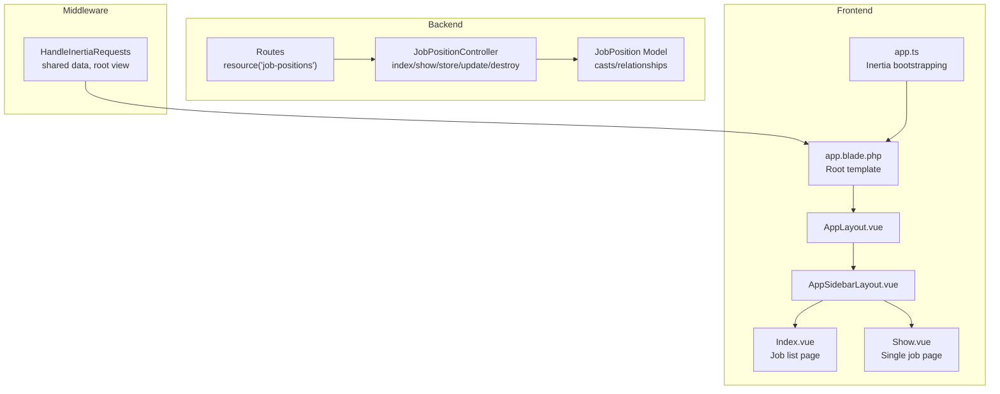
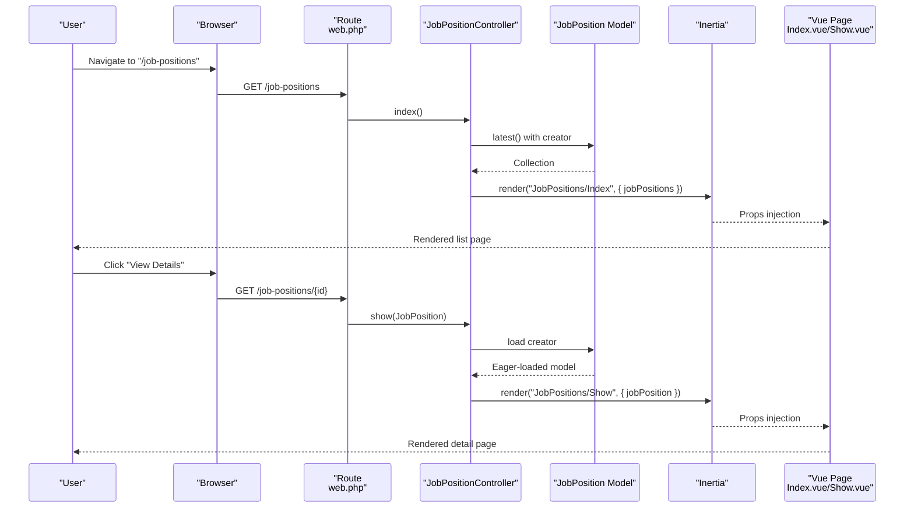
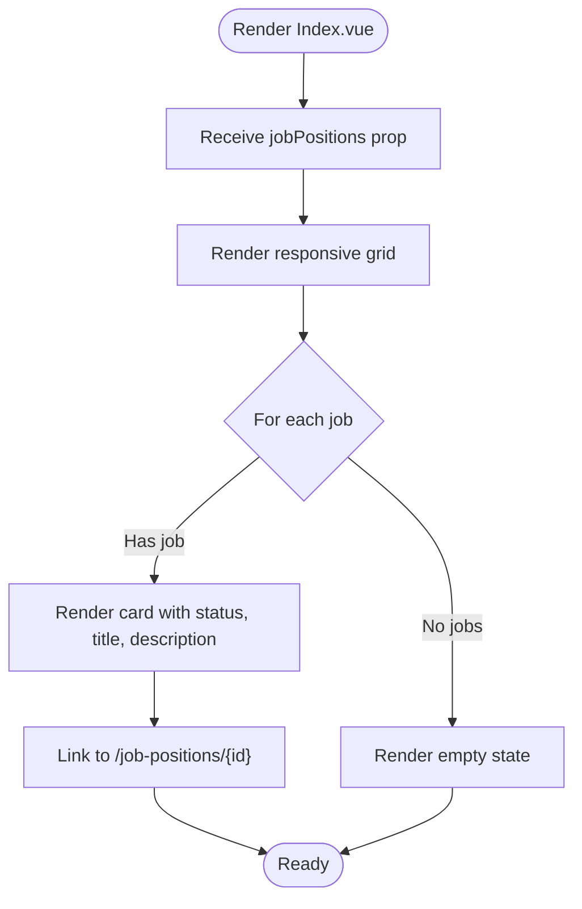
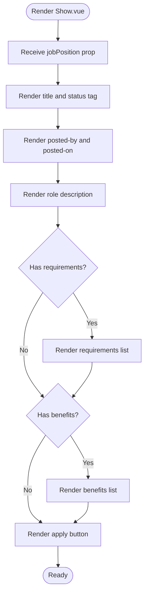
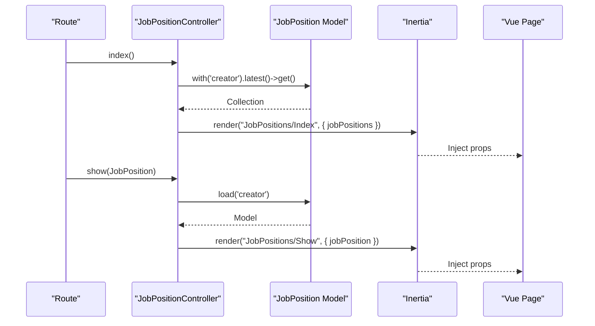
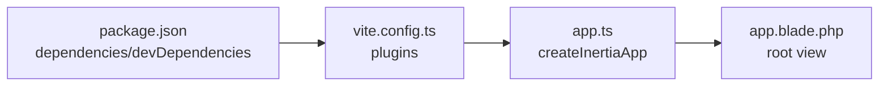

# Frontend Implementation & User Interface

<cite>
**Referenced Files in This Document**
- [Index.vue](file://resources/js/pages/JobPositions/Index.vue)
- [Show.vue](file://resources/js/pages/JobPositions/Show.vue)
- [JobPositionController.php](file://app/Http/Controllers/JobPositionController.php)
- [JobPosition.php](file://app/Models/JobPosition.php)
- [StoreJobPositionRequest.php](file://app/Http/Requests/StoreJobPositionRequest.php)
- [UpdateJobPositionRequest.php](file://app/Http/Requests/UpdateJobPositionRequest.php)
- [web.php](file://routes/web.php)
- [HandleInertiaRequests.php](file://app/Http/Middleware/HandleInertiaRequests.php)
- [app.blade.php](file://resources/views/app.blade.php)
- [app.ts](file://resources/js/app.ts)
- [AppLayout.vue](file://resources/js/layouts/AppLayout.vue)
- [AppSidebarLayout.vue](file://resources/js/layouts/app/AppSidebarLayout.vue)
- [index.ts](file://resources/js/components/ui/breadcrumb/index.ts)
- [package.json](file://package.json)
- [vite.config.ts](file://vite.config.ts)
</cite>

## Table of Contents
1. [Introduction](#introduction)
2. [Project Structure](#project-structure)
3. [Core Components](#core-components)
4. [Architecture Overview](#architecture-overview)
5. [Detailed Component Analysis](#detailed-component-analysis)
6. [Dependency Analysis](#dependency-analysis)
7. [Performance Considerations](#performance-considerations)
8. [Troubleshooting Guide](#troubleshooting-guide)
9. [Conclusion](#conclusion)

## Introduction
This document explains the frontend implementation for job position management, focusing on the Vue.js components used for listing and viewing job positions, and how they integrate with Laravel via Inertia.js for server-side rendering and client-side navigation. It covers the component structure, UI patterns, responsive design, data flow from backend controllers to frontend props, and user experience enhancements such as breadcrumbs, layout composition, and toast notifications.

## Project Structure
The job position feature spans three primary areas:
- Backend controllers and models handle data retrieval, validation, and authorization.
- Routes define the resource endpoints and restrict actions to authenticated, verified users.
- Frontend Vue pages render lists and individual job details, leveraging shared layouts and UI primitives.

**Diagram sources**
- [JobPositionController.php:14-53](file://app/Http/Controllers/JobPositionController.php#L14-L53)
- [JobPosition.php:12-37](file://app/Models/JobPosition.php#L12-L37)
- [web.php:23](file://routes/web.php#L23)
- [HandleInertiaRequests.php:17](file://app/Http/Middleware/HandleInertiaRequests.php#L17)
- [app.blade.php:39](file://resources/views/app.blade.php#L39)
- [app.ts:10-27](file://resources/js/app.ts#L10-L27)
- [AppLayout.vue:10-14](file://resources/js/layouts/AppLayout.vue#L10-L14)
- [AppSidebarLayout.vue:18-27](file://resources/js/layouts/app/AppSidebarLayout.vue#L18-L27)
- [Index.vue:26-78](file://resources/js/pages/JobPositions/Index.vue#L26-L78)
- [Show.vue:35-100](file://resources/js/pages/JobPositions/Show.vue#L35-L100)

**Section sources**
- [web.php:23](file://routes/web.php#L23)
- [JobPositionController.php:14-53](file://app/Http/Controllers/JobPositionController.php#L14-L53)
- [HandleInertiaRequests.php:17](file://app/Http/Middleware/HandleInertiaRequests.php#L17)
- [app.blade.php:39](file://resources/views/app.blade.php#L39)
- [app.ts:10-27](file://resources/js/app.ts#L10-L27)

## Core Components
- JobPositions/Index.vue: Renders a responsive grid of job cards with status badges, truncated descriptions, and links to individual views. Includes an empty-state placeholder when no positions exist.
- JobPositions/Show.vue: Displays detailed job information including role description, requirements, benefits, posted-by metadata, and a call-to-action button.
- Shared layout: AppLayout wraps AppSidebarLayout to provide breadcrumbs, sidebar, and toast notifications.

Key frontend capabilities:
- Responsive grid using Tailwind CSS classes for mobile-first design.
- Breadcrumb-driven navigation via per-page layout options.
- Inertia Link components for client-side navigation without full page reloads.
- Toast notifications initialized globally for flash messages.

**Section sources**
- [Index.vue:26-78](file://resources/js/pages/JobPositions/Index.vue#L26-L78)
- [Show.vue:35-100](file://resources/js/pages/JobPositions/Show.vue#L35-L100)
- [AppLayout.vue:5-7](file://resources/js/layouts/AppLayout.vue#L5-L7)
- [AppSidebarLayout.vue:18-27](file://resources/js/layouts/app/AppSidebarLayout.vue#L18-L27)
- [app.ts:32-33](file://resources/js/app.ts#L32-L33)

## Architecture Overview
The system follows an Inertia-driven architecture:
- Laravel routes delegate to JobPositionController methods.
- Controllers hydrate models and pass data to Inertia-rendered Vue pages.
- Vue pages consume props and render UI with Tailwind-based styling.
- Middleware shares global data (e.g., auth.user) and sets the root view.

**Diagram sources**
- [web.php:23](file://routes/web.php#L23)
- [JobPositionController.php:14-35](file://app/Http/Controllers/JobPositionController.php#L14-L35)
- [JobPosition.php:29-32](file://app/Models/JobPosition.php#L29-L32)
- [Index.vue:4-12](file://resources/js/pages/JobPositions/Index.vue#L4-L12)
- [Show.vue:4-17](file://resources/js/pages/JobPositions/Show.vue#L4-L17)

## Detailed Component Analysis

### JobPositions/Index.vue
Responsibilities:
- Accepts jobPositions prop (array of job objects).
- Defines page-level layout options for breadcrumbs.
- Renders a responsive grid of job cards with status, title, description, and a link to the detail view.
- Displays an empty state when no positions are present.

UI and responsiveness:
- Uses Tailwind utilities for spacing, typography, and responsive breakpoints (mobile-first grid).
- Cards include subtle shadows and rounded corners for depth.
- Empty state communicates next steps to the user.

Navigation:
- Uses Inertia Link to navigate to the job detail route.

Prop expectations:
- jobPositions: array of objects with id, title, description, status, created_at.

**Diagram sources**
- [Index.vue:4-12](file://resources/js/pages/JobPositions/Index.vue#L4-L12)
- [Index.vue:43-76](file://resources/js/pages/JobPositions/Index.vue#L43-L76)

**Section sources**
- [Index.vue:4-12](file://resources/js/pages/JobPositions/Index.vue#L4-L12)
- [Index.vue:26-78](file://resources/js/pages/JobPositions/Index.vue#L26-L78)

### JobPositions/Show.vue
Responsibilities:
- Accepts a single jobPosition prop (object with nested creator).
- Defines breadcrumbs with "Job Positions" and "Details".
- Displays role description, optional requirements and benefits lists, posted-by and posted-on metadata, and an action button.

Data handling:
- Formats created_at to a readable date.
- Conditionally renders requirements and benefits lists if present.

**Diagram sources**
- [Show.vue:4-17](file://resources/js/pages/JobPositions/Show.vue#L4-L17)
- [Show.vue:64-96](file://resources/js/pages/JobPositions/Show.vue#L64-L96)

**Section sources**
- [Show.vue:4-17](file://resources/js/pages/JobPositions/Show.vue#L4-L17)
- [Show.vue:35-100](file://resources/js/pages/JobPositions/Show.vue#L35-L100)

### Layout and Breadcrumb Integration
- AppLayout.vue accepts breadcrumbs and forwards them to AppSidebarLayout.vue.
- Each page defines its own breadcrumbs via defineOptions, ensuring contextual navigation.

Breadcrumb primitives:
- Breadcrumb components are exported via index.ts for potential reuse across pages.

**Section sources**
- [AppLayout.vue:5-7](file://resources/js/layouts/AppLayout.vue#L5-L7)
- [AppSidebarLayout.vue:9-15](file://resources/js/layouts/app/AppSidebarLayout.vue#L9-L15)
- [Index.vue:14-23](file://resources/js/pages/JobPositions/Index.vue#L14-L23)
- [Show.vue:19-32](file://resources/js/pages/JobPositions/Show.vue#L19-L32)
- [index.ts:1-8](file://resources/js/components/ui/breadcrumb/index.ts#L1-L8)

### Data Flow: Backend to Frontend
- Route resource binds GET /job-positions to index and GET /job-positions/{id} to show.
- Controller index loads latest job positions with creator relationship and passes to Inertia.
- Controller show eager-loads creator and renders the detail page.
- Vue pages receive typed props and render accordingly.

**Diagram sources**
- [web.php:23](file://routes/web.php#L23)
- [JobPositionController.php:14-35](file://app/Http/Controllers/JobPositionController.php#L14-L35)
- [JobPosition.php:29-32](file://app/Models/JobPosition.php#L29-L32)
- [Index.vue:4-12](file://resources/js/pages/JobPositions/Index.vue#L4-L12)
- [Show.vue:4-17](file://resources/js/pages/JobPositions/Show.vue#L4-L17)

**Section sources**
- [web.php:23](file://routes/web.php#L23)
- [JobPositionController.php:14-35](file://app/Http/Controllers/JobPositionController.php#L14-L35)
- [JobPosition.php:29-32](file://app/Models/JobPosition.php#L29-L32)

### Form Handling and Validation Feedback
- Creation and editing use dedicated FormRequest classes with authorization checks.
- StoreJobPositionRequest enforces required fields and acceptable status values; arrays for requirements and benefits.
- UpdateJobPositionRequest applies "sometimes" rules so partial updates are allowed.
- Controllers return redirects with success flashes; app.ts initializes flash toast to display messages.

Note: The current frontend pages do not include inline forms for creation/editing. Validation feedback is handled server-side via redirects and flash messages.

**Section sources**
- [StoreJobPositionRequest.php:13-32](file://app/Http/Requests/StoreJobPositionRequest.php#L13-L32)
- [UpdateJobPositionRequest.php:13-32](file://app/Http/Requests/UpdateJobPositionRequest.php#L13-L32)
- [JobPositionController.php:22-42](file://app/Http/Controllers/JobPositionController.php#L22-L42)
- [app.ts:32-33](file://resources/js/app.ts#L32-L33)

### Interactive Features and UX Enhancements
- Client-side navigation: Inertia Link components enable SPA-like navigation without full page reloads.
- Global toasts: Flash messages are surfaced via vue-sonner after initialization.
- Dark mode support: Root Blade template detects system preference and applies dark class.
- Typography and spacing: Consistent use of Tailwind utilities ensures readability and visual rhythm.

**Section sources**
- [app.blade.php:8-31](file://resources/views/app.blade.php#L8-L31)
- [app.ts:32-33](file://resources/js/app.ts#L32-L33)
- [Index.vue:38-40](file://resources/js/pages/JobPositions/Index.vue#L38-L40)
- [Show.vue:92-96](file://resources/js/pages/JobPositions/Show.vue#L92-L96)

## Dependency Analysis
External libraries and build configuration:
- Inertia.js for Vue integration and client-side navigation.
- Vite with Laravel plugin for asset bundling and hot module replacement.
- Tailwind CSS for utility-first styling.
- TypeScript and Vue 3 for type-safe components.

**Diagram sources**
- [package.json:36-51](file://package.json#L36-L51)
- [vite.config.ts:10-33](file://vite.config.ts#L10-L33)
- [app.ts:10-27](file://resources/js/app.ts#L10-L27)
- [app.blade.php:39](file://resources/views/app.blade.php#L39)

**Section sources**
- [package.json:36-51](file://package.json#L36-L51)
- [vite.config.ts:10-33](file://vite.config.ts#L10-L33)
- [app.ts:10-27](file://resources/js/app.ts#L10-L27)

## Performance Considerations
- Prefer lazy loading for heavy assets and defer non-critical scripts.
- Keep props minimal; avoid passing large datasets unnecessarily.
- Use responsive image handling and efficient Tailwind variants to reduce bundle size.
- Leverage Inertia’s progress indicator and client-side navigation to minimize perceived latency.

## Troubleshooting Guide
Common issues and resolutions:
- Missing breadcrumbs: Ensure each page defines breadcrumbs via defineOptions and AppLayout receives the prop.
- No toasts appearing: Verify flash toast initialization in app.ts and that controllers return redirects with flash data.
- Styling inconsistencies: Confirm Tailwind is properly configured and Vite rebuilds assets after changes.
- Unauthorized actions: Creation and updates require HRD role; check authorization logic in requests and controller guards.

**Section sources**
- [Index.vue:14-23](file://resources/js/pages/JobPositions/Index.vue#L14-L23)
- [Show.vue:19-32](file://resources/js/pages/JobPositions/Show.vue#L19-L32)
- [app.ts:32-33](file://resources/js/app.ts#L32-L33)
- [StoreJobPositionRequest.php:13-16](file://app/Http/Requests/StoreJobPositionRequest.php#L13-L16)
- [UpdateJobPositionRequest.php:13-16](file://app/Http/Requests/UpdateJobPositionRequest.php#L13-L16)
- [JobPositionController.php:46-48](file://app/Http/Controllers/JobPositionController.php#L46-L48)

## Conclusion
The job position management frontend leverages Inertia.js to seamlessly connect Laravel backend logic with Vue components. The Index and Show pages provide a responsive, accessible interface for browsing and reviewing job listings, while shared layouts and global toast notifications enhance usability. Data flows cleanly from controllers to Vue props, and validation and authorization are enforced server-side. Extending the feature with inline forms would complete the CRUD experience, building on the existing foundation.