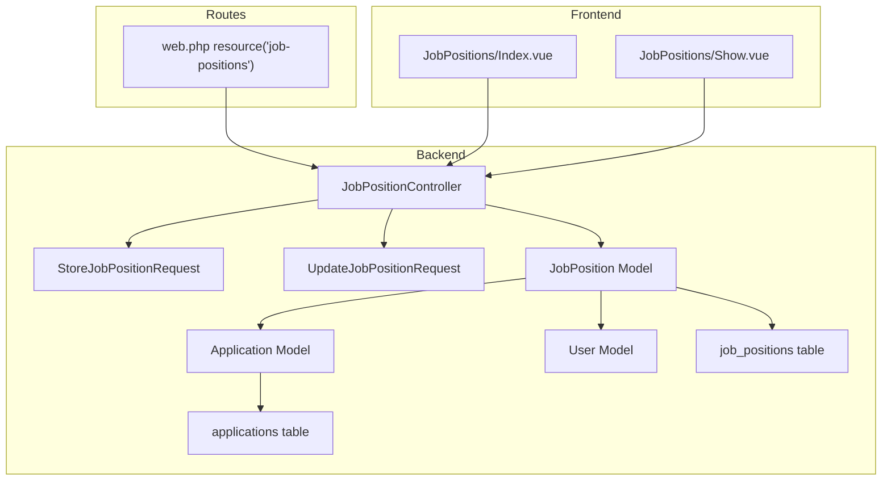
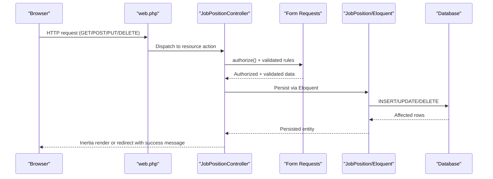
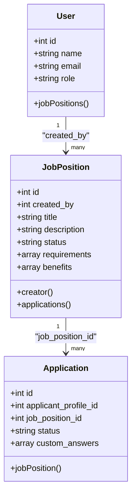
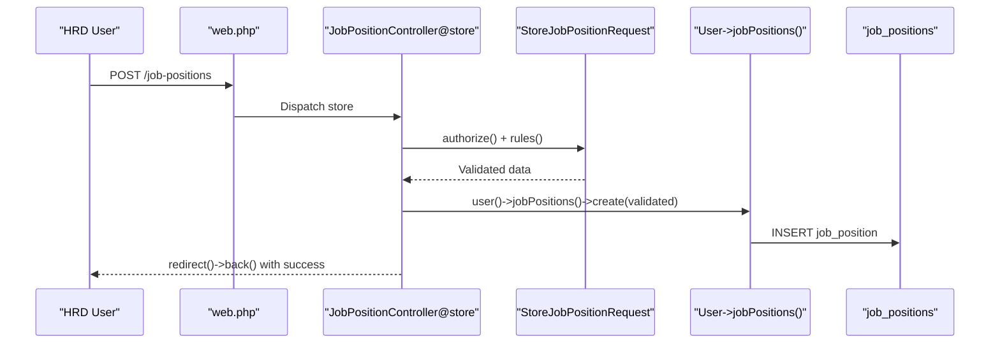
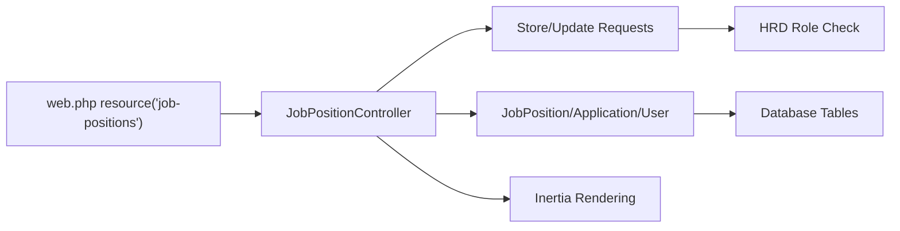

# Job Position CRUD Operations

<cite>
**Referenced Files in This Document**
- [JobPositionController.php](file://app/Http/Controllers/JobPositionController.php)
- [StoreJobPositionRequest.php](file://app/Http/Requests/StoreJobPositionRequest.php)
- [UpdateJobPositionRequest.php](file://app/Http/Requests/UpdateJobPositionRequest.php)
- [JobPosition.php](file://app/Models/JobPosition.php)
- [Application.php](file://app/Models/Application.php)
- [User.php](file://app/Models/User.php)
- [2026_06_24_164755_create_job_positions_table.php](file://database/migrations/2026_06_24_164755_create_job_positions_table.php)
- [2026_06_24_164755_create_applications_table.php](file://database/migrations/2026_06_24_164755_create_applications_table.php)
- [web.php](file://routes/web.php)
- [Index.vue](file://resources/js/pages/JobPositions/Index.vue)
- [Show.vue](file://resources/js/pages/JobPositions/Show.vue)
- [JobPositionTest.php](file://tests/Feature/JobPositionTest.php)
</cite>

## Table of Contents
1. [Introduction](#introduction)
2. [Project Structure](#project-structure)
3. [Core Components](#core-components)
4. [Architecture Overview](#architecture-overview)
5. [Detailed Component Analysis](#detailed-component-analysis)
6. [Dependency Analysis](#dependency-analysis)
7. [Performance Considerations](#performance-considerations)
8. [Troubleshooting Guide](#troubleshooting-guide)
9. [Conclusion](#conclusion)

## Introduction
This document provides comprehensive documentation for job position CRUD operations in SmartRecruit ATS. It covers the JobPositionController methods (index, store, show, update, and destroy), form request validation classes, Eloquent model relationships, database interactions, authorization checks, error handling, success messaging, and redirect patterns. It also explains how job positions connect to users (creators) and applications, and includes practical examples of job creation workflows and validation patterns.

## Project Structure
The job position feature spans backend controllers, requests, models, migrations, routes, and frontend Vue components:

- Backend
  - Controller: JobPositionController
  - Form Requests: StoreJobPositionRequest, UpdateJobPositionRequest
  - Models: JobPosition, Application, User
  - Migrations: job_positions, applications
  - Routes: resource route for job positions
- Frontend
  - Vue components: JobPositions/Index.vue, JobPositions/Show.vue

**Diagram sources**
- [web.php:23](file://routes/web.php#L23)
- [JobPositionController.php:12-55](file://app/Http/Controllers/JobPositionController.php#L12-L55)
- [StoreJobPositionRequest.php:8-34](file://app/Http/Requests/StoreJobPositionRequest.php#L8-L34)
- [UpdateJobPositionRequest.php:8-34](file://app/Http/Requests/UpdateJobPositionRequest.php#L8-L34)
- [JobPosition.php:10-39](file://app/Models/JobPosition.php#L10-L39)
- [Application.php:10-42](file://app/Models/Application.php#L10-L42)
- [User.php:32-62](file://app/Models/User.php#L32-L62)
- [2026_06_24_164755_create_job_positions_table.php:14-23](file://database/migrations/2026_06_24_164755_create_job_positions_table.php#L14-L23)
- [2026_06_24_164755_create_applications_table.php:14-22](file://database/migrations/2026_06_24_164755_create_applications_table.php#L14-L22)
- [Index.vue:1-79](file://resources/js/pages/JobPositions/Index.vue#L1-L79)
- [Show.vue:1-101](file://resources/js/pages/JobPositions/Show.vue#L1-L101)

**Section sources**
- [web.php:23](file://routes/web.php#L23)
- [JobPositionController.php:12-55](file://app/Http/Controllers/JobPositionController.php#L12-L55)
- [JobPosition.php:10-39](file://app/Models/JobPosition.php#L10-L39)
- [Application.php:10-42](file://app/Models/Application.php#L10-L42)
- [User.php:32-62](file://app/Models/User.php#L32-L62)
- [2026_06_24_164755_create_job_positions_table.php:14-23](file://database/migrations/2026_06_24_164755_create_job_positions_table.php#L14-L23)
- [2026_06_24_164755_create_applications_table.php:14-22](file://database/migrations/2026_06_24_164755_create_applications_table.php#L14-L22)
- [Index.vue:1-79](file://resources/js/pages/JobPositions/Index.vue#L1-L79)
- [Show.vue:1-101](file://resources/js/pages/JobPositions/Show.vue#L1-L101)

## Core Components
- JobPositionController: Implements index, store, show, update, and destroy actions with Inertia rendering and redirects.
- Form Request Classes: StoreJobPositionRequest and UpdateJobPositionRequest enforce authorization and validation rules.
- Models: JobPosition defines fillable attributes, casting for arrays, creator relationship, and applications relationship; Application links to JobPosition and ApplicantProfile; User has many JobPositions.
- Routes: Resource route for job positions configured in web.php.
- Frontend: Vue components render job lists and individual job details.

Key implementation highlights:
- Authorization: Both form requests restrict creation/update to HRD users.
- Validation: Strong typing for title, description, status, and optional arrays for requirements/benefits.
- Relationships: JobPosition belongs to User (creator) and has many Applications; Application belongs to JobPosition.
- Redirects: Success messages via flash data; redirects after store/update/delete.

**Section sources**
- [JobPositionController.php:14-53](file://app/Http/Controllers/JobPositionController.php#L14-L53)
- [StoreJobPositionRequest.php:13-32](file://app/Http/Requests/StoreJobPositionRequest.php#L13-L32)
- [UpdateJobPositionRequest.php:13-32](file://app/Http/Requests/UpdateJobPositionRequest.php#L13-L32)
- [JobPosition.php:12-37](file://app/Models/JobPosition.php#L12-L37)
- [Application.php:12-40](file://app/Models/Application.php#L12-L40)
- [User.php:57-60](file://app/Models/User.php#L57-L60)
- [web.php:23](file://routes/web.php#L23)

## Architecture Overview
The job position feature follows a resource-driven architecture with Inertia for server-rendered frontend components. The controller delegates validation to form requests and persists data via Eloquent models. Relationships enable navigation from job positions to creators and applications.

**Diagram sources**
- [web.php:23](file://routes/web.php#L23)
- [JobPositionController.php:22-53](file://app/Http/Controllers/JobPositionController.php#L22-L53)
- [StoreJobPositionRequest.php:13-32](file://app/Http/Requests/StoreJobPositionRequest.php#L13-L32)
- [UpdateJobPositionRequest.php:13-32](file://app/Http/Requests/UpdateJobPositionRequest.php#L13-L32)
- [JobPosition.php:12-37](file://app/Models/JobPosition.php#L12-L37)

## Detailed Component Analysis

### JobPositionController Methods
- index
  - Loads job positions with creator relationship, ordered by latest.
  - Renders JobPositions/Index with jobPositions prop.
- store
  - Validates via StoreJobPositionRequest (HRD authorization enforced).
  - Creates job position through current user's jobPositions relationship using validated data.
  - Redirects back with success message.
- show
  - Loads single job position and its creator.
  - Renders JobPositions/Show with jobPosition prop.
- update
  - Validates via UpdateJobPositionRequest (HRD authorization enforced).
  - Updates job position with validated data.
  - Redirects back with success message.
- destroy
  - Explicitly checks HRD role; aborts with 403 if unauthorized.
  - Deletes job position and redirects to index with success message.

Authorization and redirects:
- HRD-only operations enforced in store/update form requests and destroy method.
- Success messages delivered via redirect with flash data.

**Section sources**
- [JobPositionController.php:14-53](file://app/Http/Controllers/JobPositionController.php#L14-L53)
- [web.php:23](file://routes/web.php#L23)

### Form Request Validation Classes
- StoreJobPositionRequest
  - authorize(): Requires authenticated HRD user.
  - rules():
    - title: required, string, max length constraint.
    - description: required, string.
    - status: required, enum among open, closed, draft.
    - requirements: nullable, array.
    - benefits: nullable, array.
- UpdateJobPositionRequest
  - authorize(): Same HRD requirement.
  - rules(): Uses sometimes modifier for fields to allow partial updates while keeping validation strict when present.

Validation behavior:
- Store validates presence of required fields.
- Update allows selective field updates with validation applied only when fields are present.

**Section sources**
- [StoreJobPositionRequest.php:13-32](file://app/Http/Requests/StoreJobPositionRequest.php#L13-L32)
- [UpdateJobPositionRequest.php:13-32](file://app/Http/Requests/UpdateJobPositionRequest.php#L13-L32)

### Eloquent Model Relationships and Database Interactions
- JobPosition
  - Fillable: created_by, title, description, status, requirements, benefits.
  - Casts: requirements and benefits as arrays.
  - creator(): BelongsTo User via created_by foreign key.
  - applications(): HasMany Application.
- Application
  - Fillable includes job_position_id and applicant_profile_id linking to JobPosition and ApplicantProfile.
  - jobPosition(): BelongsTo JobPosition.
- User
  - jobPositions(): HasMany JobPosition via created_by foreign key.

Database schema:
- job_positions table includes created_by foreign key constrained to users with cascade delete, plus jsonb fields for requirements and benefits.
- applications table includes foreign keys to applicant_profiles and job_positions with cascade delete.

**Diagram sources**
- [JobPosition.php:12-37](file://app/Models/JobPosition.php#L12-L37)
- [Application.php:12-40](file://app/Models/Application.php#L12-L40)
- [User.php:57-60](file://app/Models/User.php#L57-L60)
- [2026_06_24_164755_create_job_positions_table.php:14-23](file://database/migrations/2026_06_24_164755_create_job_positions_table.php#L14-L23)
- [2026_06_24_164755_create_applications_table.php:14-22](file://database/migrations/2026_06_24_164755_create_applications_table.php#L14-L22)

**Section sources**
- [JobPosition.php:12-37](file://app/Models/JobPosition.php#L12-L37)
- [Application.php:12-40](file://app/Models/Application.php#L12-L40)
- [User.php:57-60](file://app/Models/User.php#L57-L60)
- [2026_06_24_164755_create_job_positions_table.php:14-23](file://database/migrations/2026_06_24_164755_create_job_positions_table.php#L14-L23)
- [2026_06_24_164755_create_applications_table.php:14-22](file://database/migrations/2026_06_24_164755_create_applications_table.php#L14-L22)

### Practical Examples and Workflows

#### Job Creation Workflow (HRD)
- Preconditions: User authenticated with role hrd.
- Steps:
  - Submit POST /job-positions with title, description, status, optional requirements, benefits.
  - StoreJobPositionRequest.authorize() verifies HRD.
  - StoreJobPositionRequest.rules() validates payload.
  - Controller creates job position via user.jobPositions()->create(validatedData).
  - Redirect back with success message.

**Diagram sources**
- [web.php:23](file://routes/web.php#L23)
- [JobPositionController.php:22-26](file://app/Http/Controllers/JobPositionController.php#L22-L26)
- [StoreJobPositionRequest.php:13-32](file://app/Http/Requests/StoreJobPositionRequest.php#L13-L32)
- [JobPosition.php:12-37](file://app/Models/JobPosition.php#L12-L37)

**Section sources**
- [JobPositionController.php:22-26](file://app/Http/Controllers/JobPositionController.php#L22-L26)
- [StoreJobPositionRequest.php:13-32](file://app/Http/Requests/StoreJobPositionRequest.php#L13-L32)
- [JobPositionTest.php:6-22](file://tests/Feature/JobPositionTest.php#L6-L22)

#### Data Validation Patterns
- Required fields enforced during creation.
- Optional arrays for requirements and benefits.
- Update uses sometimes modifier to validate only provided fields.

**Section sources**
- [StoreJobPositionRequest.php:25-31](file://app/Http/Requests/StoreJobPositionRequest.php#L25-L31)
- [UpdateJobPositionRequest.php:25-31](file://app/Http/Requests/UpdateJobPositionRequest.php#L25-L31)

#### Authorization Checks
- Store/Update: HRD role required via FormRequest::authorize().
- Destroy: Explicit HRD role check with 403 abort if not met.

**Section sources**
- [StoreJobPositionRequest.php:13-16](file://app/Http/Requests/StoreJobPositionRequest.php#L13-L16)
- [UpdateJobPositionRequest.php:13-16](file://app/Http/Requests/UpdateJobPositionRequest.php#L13-L16)
- [JobPositionController.php:46-48](file://app/Http/Controllers/JobPositionController.php#L46-L48)

#### Error Handling, Success Messaging, and Redirects
- Unauthorized attempts receive 403 in destroy and forbidden in tests for non-HRD users.
- Successful operations redirect back or to index with a success flash message.
- Frontend components consume props for rendering lists and details.

**Section sources**
- [JobPositionController.php:46-52](file://app/Http/Controllers/JobPositionController.php#L46-L52)
- [JobPositionTest.php:24-34](file://tests/Feature/JobPositionTest.php#L24-L34)
- [Index.vue:1-79](file://resources/js/pages/JobPositions/Index.vue#L1-L79)
- [Show.vue:1-101](file://resources/js/pages/JobPositions/Show.vue#L1-L101)

### Relationship Between Job Positions and Users (Creators)
- JobPosition belongs to User via created_by foreign key.
- User has many JobPositions.
- Controller loads creator relationship in index and show actions for display.

**Section sources**
- [JobPosition.php:29-32](file://app/Models/JobPosition.php#L29-L32)
- [User.php:57-60](file://app/Models/User.php#L57-L60)
- [JobPositionController.php:16](file://app/Http/Controllers/JobPositionController.php#L16)
- [JobPositionController.php:31](file://app/Http/Controllers/JobPositionController.php#L31)

### How Job Positions Connect to Applications
- JobPosition has many Applications.
- Application belongs to JobPosition.
- This enables tracking candidates applying to specific positions.

**Section sources**
- [JobPosition.php:34-37](file://app/Models/JobPosition.php#L34-L37)
- [Application.php:32-35](file://app/Models/Application.php#L32-L35)

## Dependency Analysis
- Controller depends on:
  - Form requests for authorization and validation.
  - JobPosition model for persistence and relationships.
  - Inertia for rendering views.
- Models depend on:
  - Eloquent relationships and casting.
  - Database schema defined in migrations.
- Routes define resource endpoints for job positions.

**Diagram sources**
- [JobPositionController.php:12-55](file://app/Http/Controllers/JobPositionController.php#L12-L55)
- [StoreJobPositionRequest.php:8-34](file://app/Http/Requests/StoreJobPositionRequest.php#L8-L34)
- [UpdateJobPositionRequest.php:8-34](file://app/Http/Requests/UpdateJobPositionRequest.php#L8-L34)
- [JobPosition.php:10-39](file://app/Models/JobPosition.php#L10-L39)
- [Application.php:10-42](file://app/Models/Application.php#L10-L42)
- [User.php:32-62](file://app/Models/User.php#L32-L62)
- [web.php:23](file://routes/web.php#L23)

**Section sources**
- [JobPositionController.php:12-55](file://app/Http/Controllers/JobPositionController.php#L12-L55)
- [web.php:23](file://routes/web.php#L23)

## Performance Considerations
- Use eager loading (with/loads) to avoid N+1 queries when displaying lists or details with related data.
- Keep validation rules minimal and precise to reduce overhead.
- Consider pagination for large job position lists.

## Troubleshooting Guide
- 403 Forbidden on destroy: Ensure the authenticated user has role hrD.
- Validation failures: Confirm required fields and enum values match rules.
- Redirect loops: Verify success flash handling in frontend components.
- Relationship issues: Confirm foreign keys and casts are correctly defined.

**Section sources**
- [JobPositionController.php:46-48](file://app/Http/Controllers/JobPositionController.php#L46-L48)
- [StoreJobPositionRequest.php:25-31](file://app/Http/Requests/StoreJobPositionRequest.php#L25-L31)
- [UpdateJobPositionRequest.php:25-31](file://app/Http/Requests/UpdateJobPositionRequest.php#L25-L31)

## Conclusion
The job position CRUD implementation in SmartRecruit ATS leverages Laravel's resource routing, form request validation, and Eloquent relationships to provide a secure and maintainable feature. HRD authorization is enforced consistently across creation, updates, and deletions. The frontend integrates seamlessly with Inertia to deliver responsive list and detail views, while robust relationships enable meaningful connections between job positions, users (creators), and applications.