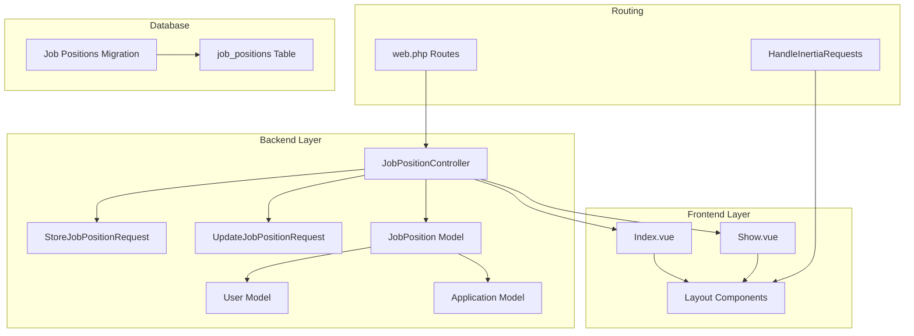
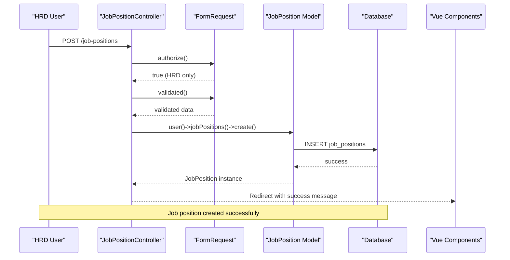
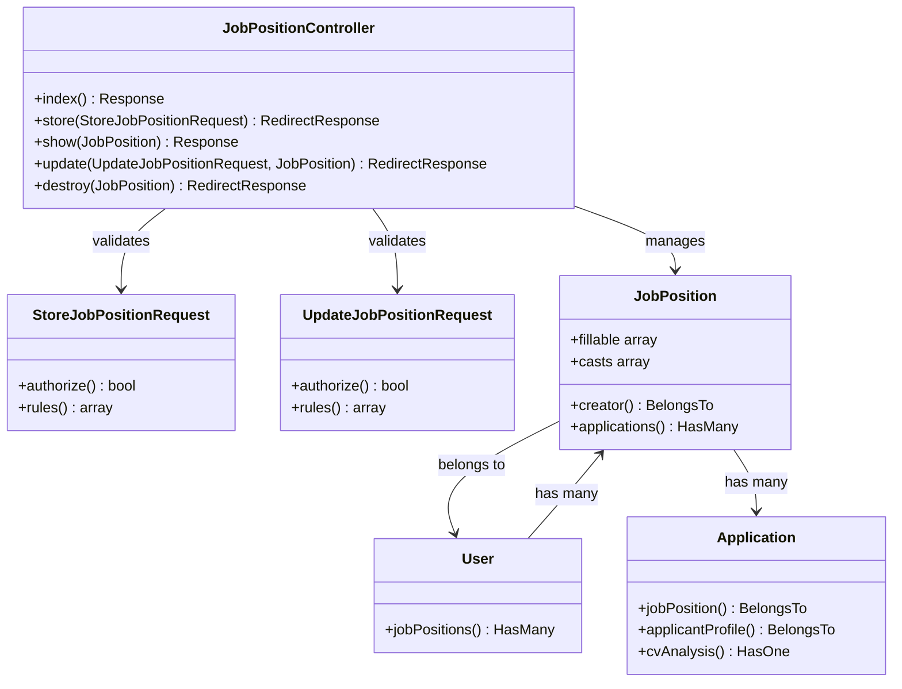
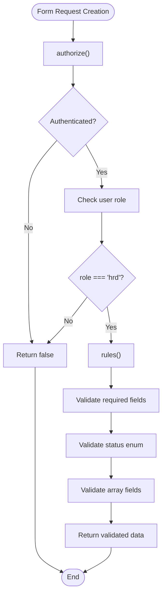
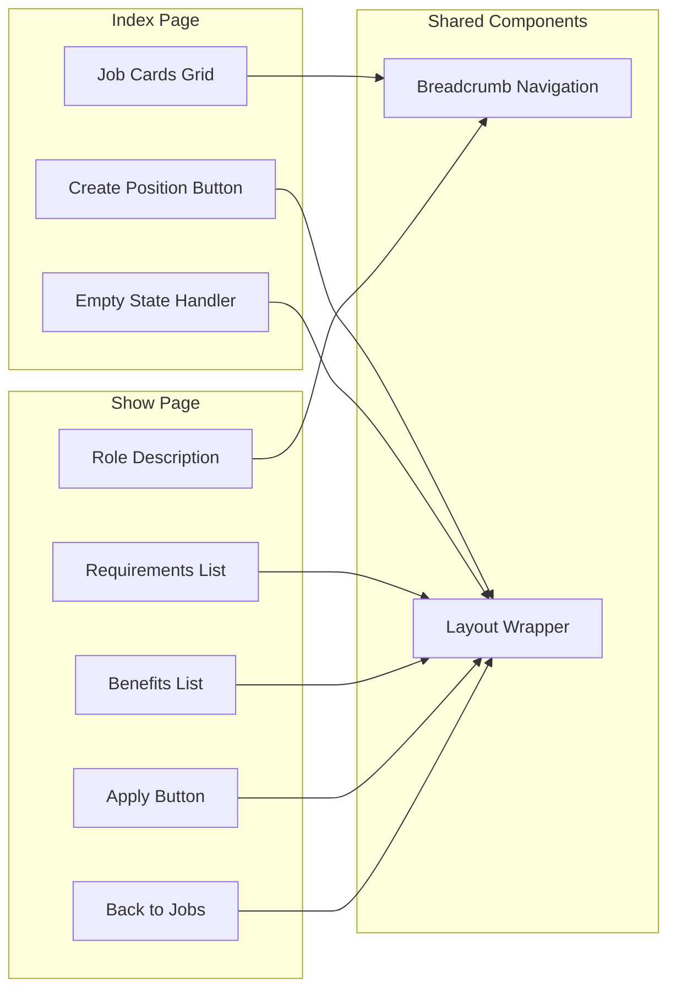
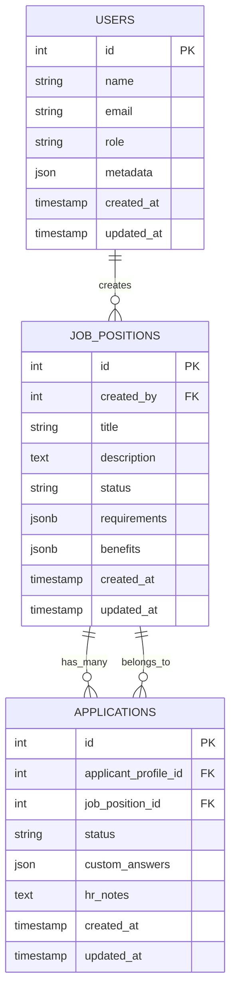
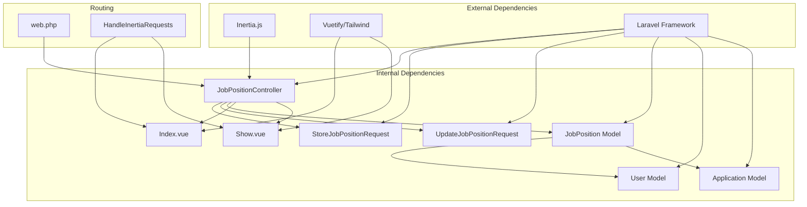

# Job Position Management

<cite>
**Referenced Files in This Document**
- [JobPositionController.php](file://app/Http/Controllers/JobPositionController.php)
- [StoreJobPositionRequest.php](file://app/Http/Requests/StoreJobPositionRequest.php)
- [UpdateJobPositionRequest.php](file://app/Http/Requests/UpdateJobPositionRequest.php)
- [JobPosition.php](file://app/Models/JobPosition.php)
- [Application.php](file://app/Models/Application.php)
- [User.php](file://app/Models/User.php)
- [2026_06_24_164755_create_job_positions_table.php](file://database/migrations/2026_06_24_164755_create_job_positions_table.php)
- [web.php](file://routes/web.php)
- [Index.vue](file://resources/js/pages/JobPositions/Index.vue)
- [Show.vue](file://resources/js/pages/JobPositions/Show.vue)
- [HandleInertiaRequests.php](file://app/Http/Middleware/HandleInertiaRequests.php)
- [JobPositionTest.php](file://tests/Feature/JobPositionTest.php)
</cite>

## Table of Contents
1. [Introduction](#introduction)
2. [Project Structure](#project-structure)
3. [Core Components](#core-components)
4. [Architecture Overview](#architecture-overview)
5. [Detailed Component Analysis](#detailed-component-analysis)
6. [Dependency Analysis](#dependency-analysis)
7. [Performance Considerations](#performance-considerations)
8. [Troubleshooting Guide](#troubleshooting-guide)
9. [Conclusion](#conclusion)

## Introduction
SmartRecruit ATS provides comprehensive job position management functionality enabling HRD users to create, manage, and track job openings. This system integrates Laravel backend controllers with Vue.js frontend components using Inertia.js for seamless single-page application experiences. The job position management module supports full CRUD operations with robust authorization controls, data validation, and real-time application tracking.

## Project Structure
The job position management system follows a clean MVC architecture with dedicated components for each layer:

**Diagram sources**
- [web.php:23](file://routes/web.php#L23)
- [JobPositionController.php:12](file://app/Http/Controllers/JobPositionController.php#L12)
- [JobPosition.php:10](file://app/Models/JobPosition.php#L10)

**Section sources**
- [web.php:18-29](file://routes/web.php#L18-L29)
- [JobPositionController.php:14-53](file://app/Http/Controllers/JobPositionController.php#L14-L53)

## Core Components

### Backend Controller Implementation
The JobPositionController serves as the primary interface for job position operations, implementing standard CRUD functionality with specialized authorization logic.

**Section sources**
- [JobPositionController.php:12-53](file://app/Http/Controllers/JobPositionController.php#L12-L53)

### Form Request Validation Classes
Two dedicated form request classes handle input validation and authorization:

**Section sources**
- [StoreJobPositionRequest.php:8-33](file://app/Http/Requests/StoreJobPositionRequest.php#L8-L33)
- [UpdateJobPositionRequest.php:8-33](file://app/Http/Requests/UpdateJobPositionRequest.php#L8-L33)

### Frontend Vue.js Components
The system provides two primary Vue.js components for displaying job position data:

**Section sources**
- [Index.vue:1-79](file://resources/js/pages/JobPositions/Index.vue#L1-L79)
- [Show.vue:1-101](file://resources/js/pages/JobPositions/Show.vue#L1-L101)

## Architecture Overview

**Diagram sources**
- [JobPositionController.php:22-27](file://app/Http/Controllers/JobPositionController.php#L22-L27)
- [StoreJobPositionRequest.php:13-16](file://app/Http/Requests/StoreJobPositionRequest.php#L13-L16)

The architecture ensures strict separation of concerns with clear data flow from user interaction through validation, persistence, and presentation layers.

## Detailed Component Analysis

### JobPositionController Implementation

The controller implements five standard CRUD operations with specialized authorization logic:

**Diagram sources**
- [JobPositionController.php:12-53](file://app/Http/Controllers/JobPositionController.php#L12-L53)
- [JobPosition.php:29-37](file://app/Models/JobPosition.php#L29-L37)
- [User.php:57-60](file://app/Models/User.php#L57-L60)

**Section sources**
- [JobPositionController.php:14-53](file://app/Http/Controllers/JobPositionController.php#L14-L53)

#### Authorization Enforcement
The controller implements dual-layer authorization:
1. **Route-level authorization** through form requests
2. **Runtime authorization** for delete operations requiring HRD role

**Section sources**
- [JobPositionController.php:46-48](file://app/Http/Controllers/JobPositionController.php#L46-L48)
- [StoreJobPositionRequest.php:13-16](file://app/Http/Requests/StoreJobPositionRequest.php#L13-L16)

#### Data Validation Patterns
Form requests enforce comprehensive validation rules:
- **Required fields**: title, description, status
- **Status validation**: restricted to open, closed, draft
- **Array handling**: requirements and benefits as JSON arrays
- **Length constraints**: title maximum 255 characters

**Section sources**
- [StoreJobPositionRequest.php:23-32](file://app/Http/Requests/StoreJobPositionRequest.php#L23-L32)
- [UpdateJobPositionRequest.php:23-32](file://app/Http/Requests/UpdateJobPositionRequest.php#L23-L32)

### Form Request Classes

Both form request classes implement identical authorization logic but differ in validation rules:

**Diagram sources**
- [StoreJobPositionRequest.php:13-16](file://app/Http/Requests/StoreJobPositionRequest.php#L13-L16)
- [StoreJobPositionRequest.php:23-32](file://app/Http/Requests/StoreJobPositionRequest.php#L23-L32)

**Section sources**
- [StoreJobPositionRequest.php:8-33](file://app/Http/Requests/StoreJobPositionRequest.php#L8-L33)
- [UpdateJobPositionRequest.php:8-33](file://app/Http/Requests/UpdateJobPositionRequest.php#L8-L33)

### Frontend Integration with Vue.js and Inertia.js

The frontend components provide responsive job position displays:

**Diagram sources**
- [Index.vue:26-79](file://resources/js/pages/JobPositions/Index.vue#L26-L79)
- [Show.vue:35-101](file://resources/js/pages/JobPositions/Show.vue#L35-L101)

**Section sources**
- [Index.vue:1-79](file://resources/js/pages/JobPositions/Index.vue#L1-L79)
- [Show.vue:1-101](file://resources/js/pages/JobPositions/Show.vue#L1-L101)

### Database Schema and Relationships

The job position system utilizes JSONB columns for flexible data storage:

**Diagram sources**
- [2026_06_24_164755_create_job_positions_table.php:14-23](file://database/migrations/2026_06_24_164755_create_job_positions_table.php#L14-L23)
- [JobPosition.php:29-37](file://app/Models/JobPosition.php#L29-L37)

**Section sources**
- [2026_06_24_164755_create_job_positions_table.php:1-34](file://database/migrations/2026_06_24_164755_create_job_positions_table.php#L1-L34)
- [JobPosition.php:12-37](file://app/Models/JobPosition.php#L12-L37)

## Dependency Analysis

The job position management system exhibits clean dependency relationships:

**Diagram sources**
- [web.php:23](file://routes/web.php#L23)
- [HandleInertiaRequests.php:8-47](file://app/Http/Middleware/HandleInertiaRequests.php#L8-L47)

**Section sources**
- [web.php:1-32](file://routes/web.php#L1-L32)
- [HandleInertiaRequests.php:36-46](file://app/Http/Middleware/HandleInertiaRequests.php#L36-L46)

## Performance Considerations

### Query Optimization
The system implements efficient data loading patterns:
- **Eager loading**: Creator relationships are loaded in index operations
- **Selective fetching**: Only necessary fields are retrieved for list views
- **Pagination-ready**: Collections support future pagination implementation

### Memory Management
- **JSONB storage**: Efficient array storage reduces database overhead
- **Lazy loading**: Relationship loading occurs only when accessed
- **Component isolation**: Vue components manage their own state efficiently

### Caching Opportunities
Potential improvements for production environments:
- **Redis caching**: Frequently accessed job lists could benefit from caching
- **Database indexing**: Status and created_by fields should be indexed
- **CDN optimization**: Static assets for job listings could leverage CDN

## Troubleshooting Guide

### Common Issues and Solutions

#### Authorization Failures
**Problem**: Non-HRD users receive 403 errors when accessing job position operations
**Solution**: Verify user role assignment and authentication status

**Section sources**
- [JobPositionController.php:46-48](file://app/Http/Controllers/JobPositionController.php#L46-L48)
- [StoreJobPositionRequest.php:13-16](file://app/Http/Requests/StoreJobPositionRequest.php#L13-L16)

#### Validation Errors
**Problem**: Form submissions fail validation with unclear error messages
**Solution**: Check field requirements and data types match validation rules

**Section sources**
- [StoreJobPositionRequest.php:23-32](file://app/Http/Requests/StoreJobPositionRequest.php#L23-L32)

#### Frontend Display Issues
**Problem**: Job positions not appearing in the UI despite successful database insertion
**Solution**: Verify Inertia response data structure and Vue prop definitions

**Section sources**
- [Index.vue:4-12](file://resources/js/pages/JobPositions/Index.vue#L4-L12)
- [Show.vue:4-17](file://resources/js/pages/JobPositions/Show.vue#L4-L17)

### Testing and Debugging

The system includes comprehensive test coverage for core functionality:

**Section sources**
- [JobPositionTest.php:6-34](file://tests/Feature/JobPositionTest.php#L6-L34)

## Conclusion

SmartRecruit ATS provides a robust foundation for job position management with clear architectural boundaries and comprehensive validation. The system successfully integrates Laravel's MVC pattern with modern frontend development practices through Inertia.js, creating a seamless user experience for HRD users managing recruitment workflows.

Key strengths of the implementation include:
- **Security-first design** with dual-layer authorization
- **Clean separation of concerns** across backend and frontend
- **Flexible data modeling** supporting dynamic job requirements
- **Responsive frontend** providing excellent user experience
- **Comprehensive testing** ensuring reliability

Future enhancements could include advanced filtering capabilities, bulk operations, and enhanced reporting features to further streamline HRD workflows and improve overall recruitment efficiency.