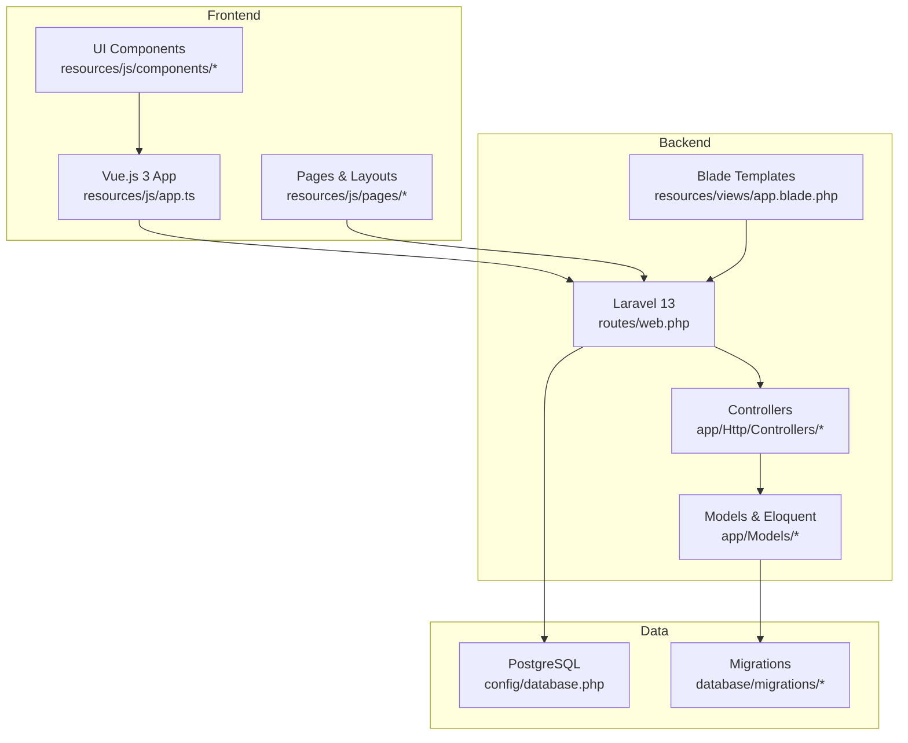
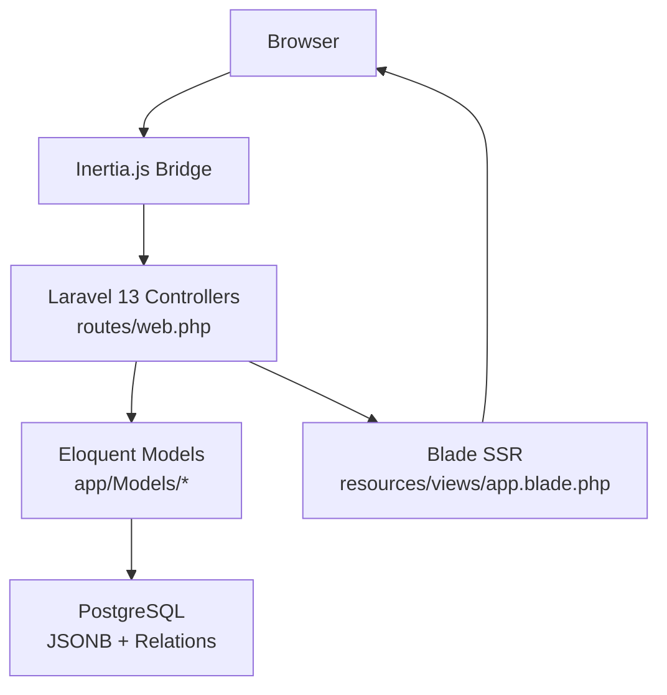
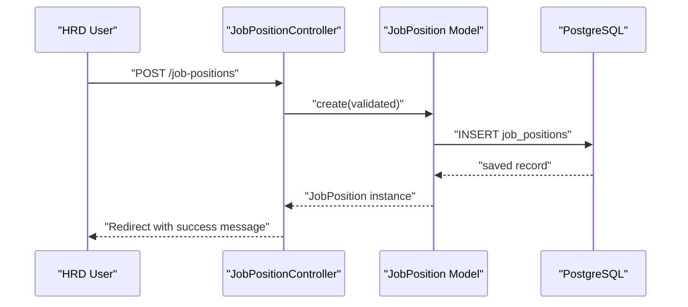
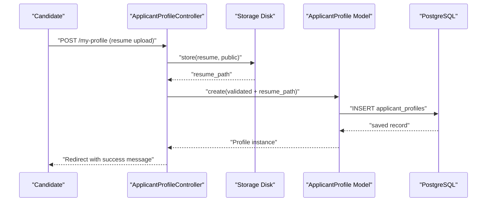
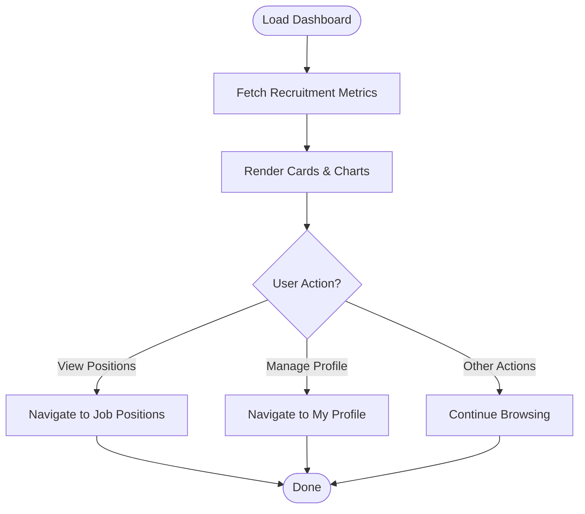
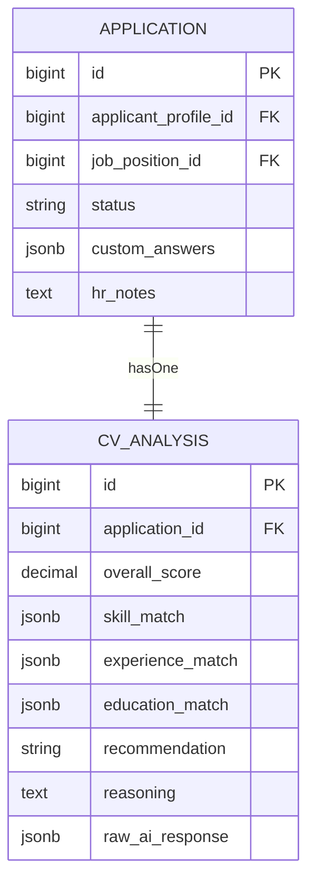
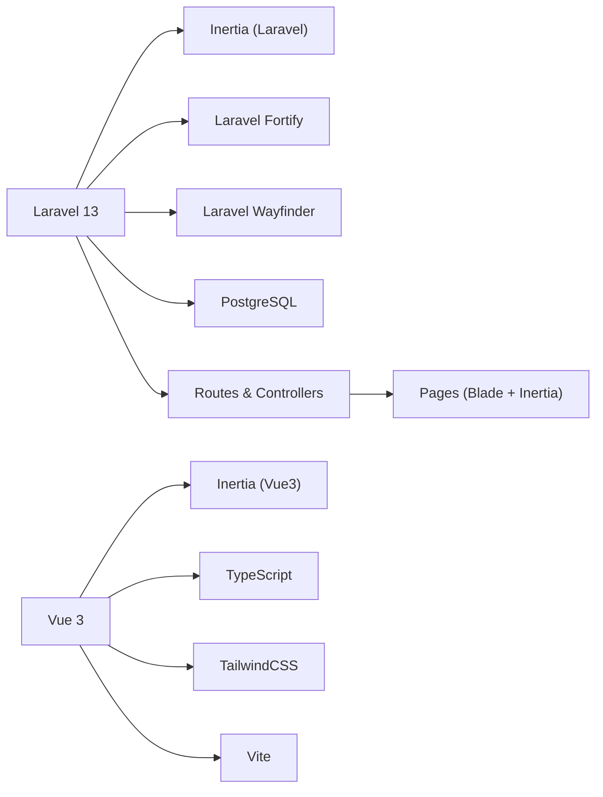

# Project Overview

<cite>
**Referenced Files in This Document**
- [composer.json](file://composer.json)
- [package.json](file://package.json)
- [resources/views/app.blade.php](file://resources/views/app.blade.php)
- [routes/web.php](file://routes/web.php)
- [config/inertia.php](file://config/inertia.php)
- [config/database.php](file://config/database.php)
- [resources/js/app.ts](file://resources/js/app.ts)
- [resources/js/layouts/AppLayout.vue](file://resources/js/layouts/AppLayout.vue)
- [resources/js/pages/Dashboard.vue](file://resources/js/pages/Dashboard.vue)
- [resources/js/pages/JobPositions/Index.vue](file://resources/js/pages/JobPositions/Index.vue)
- [resources/js/pages/ApplicantProfiles/Show.vue](file://resources/js/pages/ApplicantProfiles/Show.vue)
- [app/Http/Controllers/JobPositionController.php](file://app/Http/Controllers/JobPositionController.php)
- [app/Http/Controllers/ApplicantProfileController.php](file://app/Http/Controllers/ApplicantProfileController.php)
- [app/Models/JobPosition.php](file://app/Models/JobPosition.php)
- [app/Models/ApplicantProfile.php](file://app/Models/ApplicantProfile.php)
- [app/Models/Application.php](file://app/Models/Application.php)
- [app/Models/CvAnalysis.php](file://app/Models/CvAnalysis.php)
- [database/migrations/2026_06_24_164755_create_job_positions_table.php](file://database/migrations/2026_06_24_164755_create_job_positions_table.php)
- [database/migrations/2026_06_24_164755_create_applicant_profiles_table.php](file://database/migrations/2026_06_24_164755_create_applicant_profiles_table.php)
- [database/migrations/2026_06_24_164756_create_cv_analyses_table.php](file://database/migrations/2026_06_24_164756_create_cv_analyses_table.php)
</cite>

## Table of Contents
1. [Introduction](#introduction)
2. [Project Structure](#project-structure)
3. [Core Components](#core-components)
4. [Architecture Overview](#architecture-overview)
5. [Detailed Component Analysis](#detailed-component-analysis)
6. [Dependency Analysis](#dependency-analysis)
7. [Performance Considerations](#performance-considerations)
8. [Troubleshooting Guide](#troubleshooting-guide)
9. [Conclusion](#conclusion)

## Introduction
SmartRecruit ATS is an enterprise Applicant Tracking System designed to streamline recruitment workflows and enhance candidate evaluation processes. The platform targets Human Resource Directors (HRD) and hiring managers who need efficient tools to manage job openings, track applicants, and leverage automated insights for decision-making. It provides a modern, full-stack experience built on Laravel 13 with a Vue.js 3 frontend integrated via Inertia.js, delivering a seamless single-page application feel while maintaining server-driven rendering capabilities.

Key value propositions:
- Job Position Management: Create, update, and organize open roles with structured metadata for requirements and benefits.
- Applicant Profile Tracking: Centralized profiles for candidates with resume uploads, skills, experience, education, and portfolio links.
- CV Analysis Capabilities: Automated scoring and matching against job criteria, with structured reasoning and recommendations.
- ATS Dashboard Functionality: A responsive dashboard for monitoring recruitment KPIs and navigating core workflows.

Target audience:
- HRD and recruiters managing end-to-end hiring processes
- Hiring managers reviewing candidates and coordinating interviews
- Candidates submitting applications and updating personal profiles

## Project Structure
SmartRecruit ATS follows a layered full-stack architecture:
- Backend: Laravel 13 with Eloquent ORM, route-based controllers, and Blade templates for SSR and hydration.
- Frontend: Vue.js 3 SPA with Inertia.js for server-driven page rendering and client-side interactivity.
- Data: PostgreSQL-ready configuration with JSONB fields for flexible attributes and scalable schema evolution.
- Tooling: Vite for asset bundling, ESLint/Prettier/TailwindCSS for developer experience, and TypeScript for type safety.

**Diagram sources**
- [resources/js/app.ts:1-34](file://resources/js/app.ts#L1-L34)
- [routes/web.php:1-32](file://routes/web.php#L1-L32)
- [resources/views/app.blade.php:1-48](file://resources/views/app.blade.php#L1-L48)
- [config/database.php:1-185](file://config/database.php#L1-L185)
- [database/migrations/2026_06_24_164755_create_job_positions_table.php:1-34](file://database/migrations/2026_06_24_164755_create_job_positions_table.php#L1-L34)
- [database/migrations/2026_06_24_164755_create_applicant_profiles_table.php:1-34](file://database/migrations/2026_06_24_164755_create_applicant_profiles_table.php#L1-L34)
- [database/migrations/2026_06_24_164756_create_cv_analyses_table.php:1-36](file://database/migrations/2026_06_24_164756_create_cv_analyses_table.php#L1-L36)

**Section sources**
- [composer.json:11-19](file://composer.json#L11-L19)
- [package.json:36-52](file://package.json#L36-L52)
- [config/database.php:87-100](file://config/database.php#L87-L100)
- [resources/views/app.blade.php:1-48](file://resources/views/app.blade.php#L1-L48)
- [routes/web.php:1-32](file://routes/web.php#L1-L32)

## Core Components
- Inertia.js integration: Bridges Laravel backend and Vue frontend, enabling server-rendered pages with client-side navigation and reactive forms.
- Controllers: Route handlers for job positions and applicant profiles, leveraging Inertia responses and form requests.
- Models: Eloquent models for job positions, applicant profiles, applications, and CV analyses with JSON casting for flexible attributes.
- Pages and Layouts: Vue pages for dashboard, job positions listing, and candidate profile management, with shared layouts and UI components.
- Database: PostgreSQL-ready migrations with JSONB fields for requirements, benefits, skills, experience, education, and AI analysis outputs.

Practical examples:
- HRD creates a new job position with requirements and benefits; the system persists structured data and displays it in a searchable grid.
- Candidate updates their profile, uploads a resume, and saves skills/experience; the system validates and stores arrays of data.
- CV analysis generates a score and recommendation for each application; the ATS dashboard surfaces these insights for quick review.

**Section sources**
- [resources/js/app.ts:1-34](file://resources/js/app.ts#L1-L34)
- [config/inertia.php:1-71](file://config/inertia.php#L1-L71)
- [app/Http/Controllers/JobPositionController.php:1-55](file://app/Http/Controllers/JobPositionController.php#L1-L55)
- [app/Http/Controllers/ApplicantProfileController.php:1-59](file://app/Http/Controllers/ApplicantProfileController.php#L1-L59)
- [app/Models/JobPosition.php:1-39](file://app/Models/JobPosition.php#L1-L39)
- [app/Models/ApplicantProfile.php:1-41](file://app/Models/ApplicantProfile.php#L1-L41)
- [app/Models/Application.php:1-42](file://app/Models/Application.php#L1-L42)
- [app/Models/CvAnalysis.php:1-38](file://app/Models/CvAnalysis.php#L1-L38)
- [resources/js/pages/Dashboard.vue:1-48](file://resources/js/pages/Dashboard.vue#L1-L48)
- [resources/js/pages/JobPositions/Index.vue:1-79](file://resources/js/pages/JobPositions/Index.vue#L1-L79)
- [resources/js/pages/ApplicantProfiles/Show.vue:1-117](file://resources/js/pages/ApplicantProfiles/Show.vue#L1-L117)

## Architecture Overview
SmartRecruit ATS uses a full-stack Laravel-Vue.js architecture with Inertia.js to unify backend and frontend concerns:
- Laravel handles routing, middleware, controllers, and database operations.
- Vue.js renders pages and components, with Inertia managing page transitions and form submissions.
- Blade templates support SSR and hydration for improved SEO and perceived performance.
- PostgreSQL supports JSONB fields for flexible, schema-less attributes alongside relational joins.

**Diagram sources**
- [routes/web.php:1-32](file://routes/web.php#L1-L32)
- [resources/views/app.blade.php:1-48](file://resources/views/app.blade.php#L1-L48)
- [resources/js/app.ts:1-34](file://resources/js/app.ts#L1-L34)
- [config/database.php:87-100](file://config/database.php#L87-L100)

**Section sources**
- [composer.json:11-19](file://composer.json#L11-L19)
- [package.json:36-52](file://package.json#L36-L52)
- [config/inertia.php:1-71](file://config/inertia.php#L1-L71)
- [resources/views/app.blade.php:1-48](file://resources/views/app.blade.php#L1-L48)

## Detailed Component Analysis

### Job Position Management
The job position module enables HRD to define roles with structured metadata and track applications.

**Diagram sources**
- [routes/web.php:23-23](file://routes/web.php#L23-L23)
- [app/Http/Controllers/JobPositionController.php:22-27](file://app/Http/Controllers/JobPositionController.php#L22-L27)
- [app/Models/JobPosition.php:10-39](file://app/Models/JobPosition.php#L10-L39)
- [database/migrations/2026_06_24_164755_create_job_positions_table.php:14-23](file://database/migrations/2026_06_24_164755_create_job_positions_table.php#L14-L23)

Key capabilities:
- Create/update/delete job positions with title, description, status, and JSONB requirements/benefits.
- List positions with creator attribution and latest-first ordering.
- Restrict destructive actions to authorized users.

**Section sources**
- [routes/web.php:23-23](file://routes/web.php#L23-L23)
- [app/Http/Controllers/JobPositionController.php:14-53](file://app/Http/Controllers/JobPositionController.php#L14-L53)
- [app/Models/JobPosition.php:12-38](file://app/Models/JobPosition.php#L12-L38)
- [database/migrations/2026_06_24_164755_create_job_positions_table.php:14-23](file://database/migrations/2026_06_24_164755_create_job_positions_table.php#L14-L23)

### Applicant Profile Tracking
Candidate profiles centralize resume data and personal attributes for matching and evaluation.

**Diagram sources**
- [routes/web.php:26-28](file://routes/web.php#L26-L28)
- [app/Http/Controllers/ApplicantProfileController.php:24-36](file://app/Http/Controllers/ApplicantProfileController.php#L24-L36)
- [app/Models/ApplicantProfile.php:10-41](file://app/Models/ApplicantProfile.php#L10-L41)
- [database/migrations/2026_06_24_164755_create_applicant_profiles_table.php:14-23](file://database/migrations/2026_06_24_164755_create_applicant_profiles_table.php#L14-L23)

Key capabilities:
- Upload and replace resumes stored on the public disk.
- Persist skills, experience, education, and portfolio URLs as arrays.
- Enforce ownership checks for profile updates.

**Section sources**
- [routes/web.php:26-28](file://routes/web.php#L26-L28)
- [app/Http/Controllers/ApplicantProfileController.php:15-57](file://app/Http/Controllers/ApplicantProfileController.php#L15-L57)
- [app/Models/ApplicantProfile.php:12-40](file://app/Models/ApplicantProfile.php#L12-L40)
- [database/migrations/2026_06_24_164755_create_applicant_profiles_table.php:14-23](file://database/migrations/2026_06_24_164755_create_applicant_profiles_table.php#L14-L23)

### ATS Dashboard Functionality
The dashboard provides a unified view for monitoring recruitment activities and navigating workflows.

**Diagram sources**
- [resources/js/pages/Dashboard.vue:1-48](file://resources/js/pages/Dashboard.vue#L1-L48)
- [resources/js/layouts/AppLayout.vue:1-15](file://resources/js/layouts/AppLayout.vue#L1-L15)

**Section sources**
- [resources/js/pages/Dashboard.vue:1-48](file://resources/js/pages/Dashboard.vue#L1-L48)
- [resources/js/layouts/AppLayout.vue:1-15](file://resources/js/layouts/AppLayout.vue#L1-L15)

### CV Analysis Capabilities
CV analysis captures AI-driven insights per application, including scores and match breakdowns.

**Diagram sources**
- [app/Models/Application.php:10-42](file://app/Models/Application.php#L10-L42)
- [app/Models/CvAnalysis.php:9-38](file://app/Models/CvAnalysis.php#L9-L38)
- [database/migrations/2026_06_24_164756_create_cv_analyses_table.php:14-25](file://database/migrations/2026_06_24_164756_create_cv_analyses_table.php#L14-L25)

**Section sources**
- [app/Models/Application.php:37-40](file://app/Models/Application.php#L37-L40)
- [app/Models/CvAnalysis.php:11-31](file://app/Models/CvAnalysis.php#L11-L31)
- [database/migrations/2026_06_24_164756_create_cv_analyses_table.php:14-25](file://database/migrations/2026_06_24_164756_create_cv_analyses_table.php#L14-L25)

## Dependency Analysis
Technology stack summary:
- Backend: Laravel 13, Inertia for Laravel, Laravel Fortify for authentication, Laravel Wayfinder for routing helpers.
- Frontend: Vue 3, Inertia for Vue, Vite for build tooling, TailwindCSS for styling, TypeScript for type safety.
- Database: PostgreSQL driver configured; migrations define JSONB fields for flexible attributes.
- Dev tooling: ESLint, Prettier, Vue TSC, and Laravel Sail/Sail-compatible scripts.

**Diagram sources**
- [composer.json:11-19](file://composer.json#L11-L19)
- [package.json:36-52](file://package.json#L36-L52)
- [config/database.php:87-100](file://config/database.php#L87-L100)
- [resources/views/app.blade.php:39-42](file://resources/views/app.blade.php#L39-L42)

**Section sources**
- [composer.json:11-19](file://composer.json#L11-L19)
- [package.json:15-52](file://package.json#L15-L52)
- [config/database.php:20-100](file://config/database.php#L20-L100)

## Performance Considerations
- Use JSONB fields judiciously; index only when queries require filtering on nested attributes.
- Leverage Eager Loading (e.g., creator and applications) to reduce N+1 queries in listings.
- Enable SSR via Inertia to improve initial page load performance and SEO.
- Keep frontend assets optimized with Vite and TailwindCSS purging for production builds.
- Consider background jobs for heavy operations like resume parsing or AI analysis offloading.

## Troubleshooting Guide
Common issues and resolutions:
- Database connection mismatch: Ensure the default connection aligns with your environment; PostgreSQL is supported and configured.
- Asset pipeline errors: Verify Vite dev/build scripts and plugin versions match the project’s package configuration.
- Inertia SSR bundle: Confirm the SSR server URL is reachable if SSR is enabled.
- Role-based restrictions: Some actions (e.g., deleting job positions) require specific roles; verify user role assignment.

**Section sources**
- [config/database.php:20-100](file://config/database.php#L20-L100)
- [package.json:5-14](file://package.json#L5-L14)
- [config/inertia.php:18-23](file://config/inertia.php#L18-L23)
- [app/Http/Controllers/JobPositionController.php:46-48](file://app/Http/Controllers/JobPositionController.php#L46-L48)

## Conclusion
SmartRecruit ATS delivers a modern, scalable ATS tailored for HRD and hiring teams. Its Laravel-Vue.js architecture with Inertia.js provides a smooth, server-rendered SPA experience, while PostgreSQL and JSONB fields enable flexible, future-proof data modeling. The system’s core modules—job position management, applicant profile tracking, CV analysis, and dashboard functionality—work together to automate recruitment workflows and support data-driven candidate evaluation.