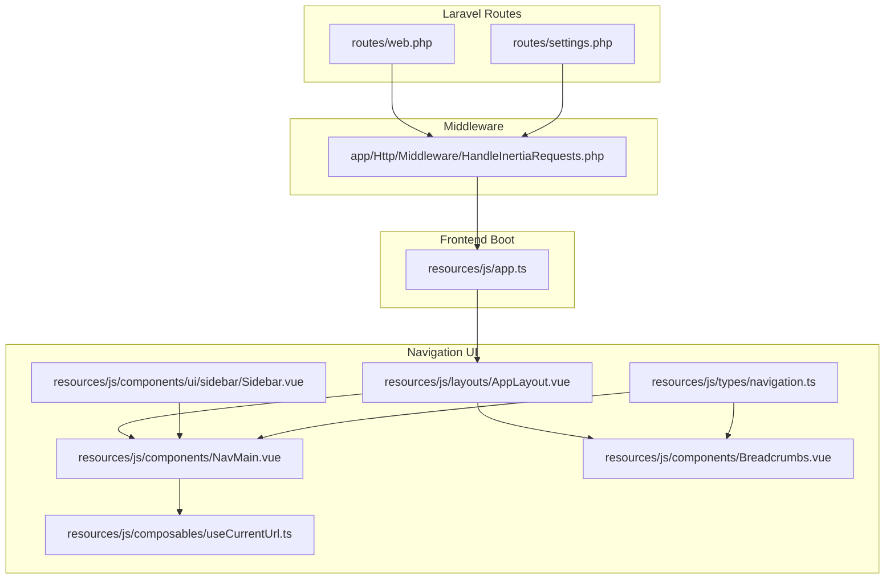
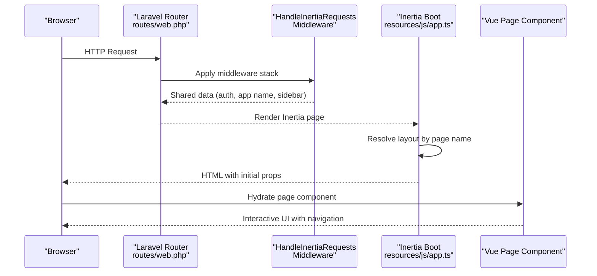
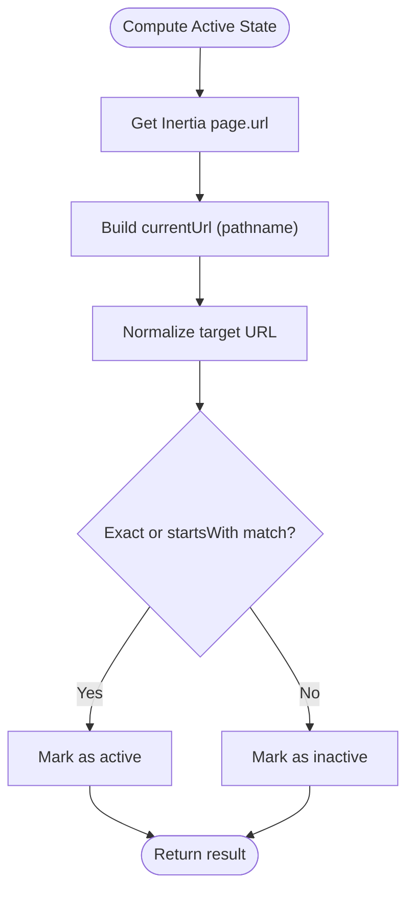
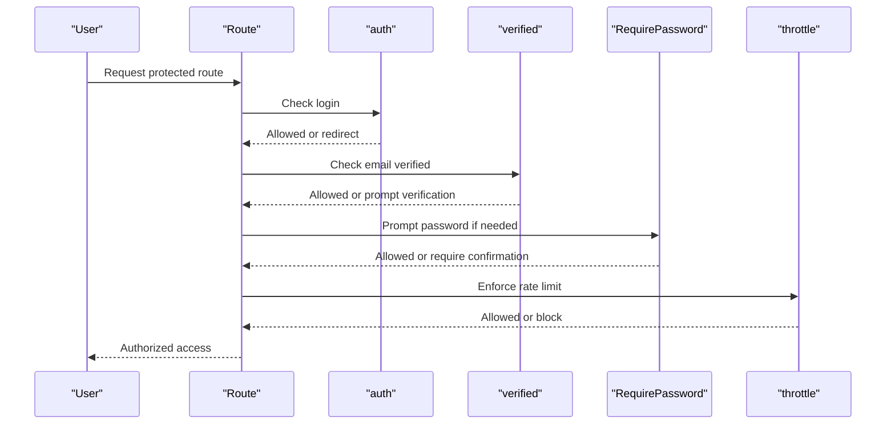
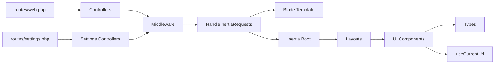

# Routing & Navigation

<cite>
**Referenced Files in This Document**
- [web.php](file://routes/web.php)
- [settings.php](file://routes/settings.php)
- [HandleInertiaRequests.php](file://app/Http/Middleware/HandleInertiaRequests.php)
- [app.ts](file://resources/js/app.ts)
- [navigation.ts](file://resources/js/types/navigation.ts)
- [NavMain.vue](file://resources/js/components/NavMain.vue)
- [Breadcrumbs.vue](file://resources/js/components/Breadcrumbs.vue)
- [AppLayout.vue](file://resources/js/layouts/AppLayout.vue)
- [Sidebar.vue](file://resources/js/components/ui/sidebar/Sidebar.vue)
- [useCurrentUrl.ts](file://resources/js/composables/useCurrentUrl.ts)
- [Login.vue](file://resources/js/pages/auth/Login.vue)
- [Dashboard.vue](file://resources/js/pages/Dashboard.vue)
- [Index.vue](file://resources/js/pages/JobPositions/Index.vue)
- [Profile.vue](file://resources/js/pages/settings/Profile.vue)
</cite>

## Table of Contents
1. [Introduction](#introduction)
2. [Project Structure](#project-structure)
3. [Core Components](#core-components)
4. [Architecture Overview](#architecture-overview)
5. [Detailed Component Analysis](#detailed-component-analysis)
6. [Dependency Analysis](#dependency-analysis)
7. [Performance Considerations](#performance-considerations)
8. [Troubleshooting Guide](#troubleshooting-guide)
9. [Conclusion](#conclusion)
10. [Appendices](#appendices)

## Introduction
This document explains the routing and navigation architecture of SmartRecruit ATS, focusing on Laravel route definitions, middleware integration, and frontend navigation powered by Inertia.js and Vue Router. It covers URL patterns, protected routes, navigation state management, breadcrumbs, active menu highlighting, and responsive navigation patterns. It also provides guidance for extending routes and enhancing navigation with accessibility and mobile-first design.

## Project Structure
SmartRecruit ATS separates backend routing from frontend navigation:
- Backend routes are defined in Laravel route files under routes/.
- Frontend navigation is handled via Inertia.js and Vue Router, with shared data and layout selection configured in the Inertia bootstrapper.
- Navigation UI components (sidebar, breadcrumbs, and active state helpers) live in resources/js/components and resources/js/composables.

**Diagram sources**
- [web.php:1-32](file://routes/web.php#L1-L32)
- [settings.php:1-35](file://routes/settings.php#L1-L35)
- [HandleInertiaRequests.php:1-48](file://app/Http/Middleware/HandleInertiaRequests.php#L1-L48)
- [app.ts:1-34](file://resources/js/app.ts#L1-L34)
- [navigation.ts:1-15](file://resources/js/types/navigation.ts#L1-L15)
- [NavMain.vue:1-39](file://resources/js/components/NavMain.vue#L1-L39)
- [Breadcrumbs.vue:1-39](file://resources/js/components/Breadcrumbs.vue#L1-L39)
- [Sidebar.vue:1-97](file://resources/js/components/ui/sidebar/Sidebar.vue#L1-L97)
- [useCurrentUrl.ts:1-83](file://resources/js/composables/useCurrentUrl.ts#L1-L83)
- [AppLayout.vue:1-15](file://resources/js/layouts/AppLayout.vue#L1-L15)

**Section sources**
- [web.php:1-32](file://routes/web.php#L1-L32)
- [settings.php:1-35](file://routes/settings.php#L1-L35)
- [HandleInertiaRequests.php:1-48](file://app/Http/Middleware/HandleInertiaRequests.php#L1-L48)
- [app.ts:1-34](file://resources/js/app.ts#L1-L34)
- [navigation.ts:1-15](file://resources/js/types/navigation.ts#L1-L15)
- [NavMain.vue:1-39](file://resources/js/components/NavMain.vue#L1-L39)
- [Breadcrumbs.vue:1-39](file://resources/js/components/Breadcrumbs.vue#L1-L39)
- [Sidebar.vue:1-97](file://resources/js/components/ui/sidebar/Sidebar.vue#L1-L97)
- [useCurrentUrl.ts:1-83](file://resources/js/composables/useCurrentUrl.ts#L1-L83)
- [AppLayout.vue:1-15](file://resources/js/layouts/AppLayout.vue#L1-L15)

## Core Components
- Laravel Web Routes: Public and authenticated routes, including resource routes for job positions and a dedicated applicant profile route set.
- Settings Routes: Profile, security, and appearance endpoints with layered middleware and passkey endpoints.
- Inertia Middleware: Shares application-wide data (auth, app name, sidebar state) and sets the root template.
- Frontend Boot: Configures Inertia’s layout resolution, page titles, and progress bar.
- Navigation Types: Strongly typed breadcrumb and nav item structures.
- Navigation Components: Sidebar menu with active state detection, breadcrumbs, and responsive sidebar behavior.
- Active URL Detection: Composable to compute current URL and match active links.

**Section sources**
- [web.php:9-29](file://routes/web.php#L9-L29)
- [settings.php:8-27](file://routes/settings.php#L8-L27)
- [HandleInertiaRequests.php:36-46](file://app/Http/Middleware/HandleInertiaRequests.php#L36-L46)
- [app.ts:10-27](file://resources/js/app.ts#L10-L27)
- [navigation.ts:4-14](file://resources/js/types/navigation.ts#L4-L14)
- [NavMain.vue:13-37](file://resources/js/components/NavMain.vue#L13-L37)
- [Breadcrumbs.vue:13-37](file://resources/js/components/Breadcrumbs.vue#L13-L37)
- [Sidebar.vue:20-21](file://resources/js/components/ui/sidebar/Sidebar.vue#L20-L21)
- [useCurrentUrl.ts:25-59](file://resources/js/composables/useCurrentUrl.ts#L25-L59)

## Architecture Overview
The routing and navigation pipeline connects Laravel routes to Inertia-rendered Vue pages, applying middleware for authentication and verification, and enriching the frontend with shared data and layout selection.

**Diagram sources**
- [web.php:18-29](file://routes/web.php#L18-L29)
- [HandleInertiaRequests.php:36-46](file://app/Http/Middleware/HandleInertiaRequests.php#L36-L46)
- [app.ts:10-27](file://resources/js/app.ts#L10-L27)

## Detailed Component Analysis

### Laravel Route Definitions
- Home and Dashboard: Unauthenticated home page; authenticated dashboard behind middleware requiring login and verified email.
- Job Positions: Resource controller with RESTful actions excluding create/edit.
- Applicant Profile: Dedicated routes for show/store/update under authenticated and verified groups.
- Settings: Redirect from settings to profile; profile edit/update; verified-only delete; security edit gated by password; throttled password update; appearance page via Inertia helper; passkey endpoints under .well-known.

URL Patterns and Guards
- Public: Home route.
- Authenticated: Dashboard, job-positions resource, my-profile routes.
- Verified: Profile deletion, security editing, password updates, appearance.
- Special: .well-known/passkey-endpoints returning JSON with enrollment/manage endpoints.

Parameter Handling
- Resource routes derive model IDs from URL segments.
- My profile routes accept an explicit slug parameter for the profile record.

Route Groups and Middleware
- auth: Ensures login.
- verified: Ensures email verification.
- RequirePassword: Enforces password confirmation for sensitive actions.
- throttle: Limits rate of password updates.

**Section sources**
- [web.php:9-29](file://routes/web.php#L9-L29)
- [settings.php:8-27](file://routes/settings.php#L8-L27)

### Middleware Integration
- HandleInertiaRequests:
  - Root template: app.blade.php.
  - Shared data: app name, authenticated user, sidebar open state from cookie.
  - Asset versioning inherited from Inertia base class.

**Section sources**
- [HandleInertiaRequests.php:17-46](file://app/Http/Middleware/HandleInertiaRequests.php#L17-L46)

### Frontend Navigation with Inertia.js and Vue Router
- Inertia Boot:
  - Title composition: page title + app name.
  - Layout resolution: null for Welcome, AuthLayout for auth/*, dual AppLayout + SettingsLayout for settings/*, otherwise AppLayout.
  - Progress indicator color configured.
- Layout Composition:
  - AppLayout wraps the sidebar layout and accepts optional breadcrumbs.
- Navigation Types:
  - BreadcrumbItem and NavItem define strongly typed navigation structures.

**Section sources**
- [app.ts:10-27](file://resources/js/app.ts#L10-L27)
- [AppLayout.vue:5-14](file://resources/js/layouts/AppLayout.vue#L5-L14)
- [navigation.ts:4-14](file://resources/js/types/navigation.ts#L4-L14)

### Navigation Components and Active State Management
- NavMain:
  - Renders a sidebar menu from NavItem[].
  - Uses useCurrentUrl to compute active state and tooltips.
- Breadcrumbs:
  - Renders breadcrumb trail with active last page and navigable previous items.
- Sidebar:
  - Responsive behavior: offcanvas on mobile, persistent on desktop.
  - Mobile sheet toggles via composable state.
- Active URL Detection:
  - Computes current pathname from Inertia page URL.
  - Supports absolute URLs, substring matching, and conditional returns.

**Diagram sources**
- [useCurrentUrl.ts:25-59](file://resources/js/composables/useCurrentUrl.ts#L25-L59)

**Section sources**
- [NavMain.vue:13-37](file://resources/js/components/NavMain.vue#L13-L37)
- [Breadcrumbs.vue:13-37](file://resources/js/components/Breadcrumbs.vue#L13-L37)
- [Sidebar.vue:20-52](file://resources/js/components/ui/sidebar/Sidebar.vue#L20-L52)
- [useCurrentUrl.ts:25-81](file://resources/js/composables/useCurrentUrl.ts#L25-L81)

### Navigation State Management and Layout Selection
- Sidebar Open State:
  - Shared via middleware from cookie sidebar_state; defaults to open when absent.
- Layout Resolution:
  - Dynamic layout selection based on page name enables distinct layouts for auth and settings contexts.
- Breadcrumb Propagation:
  - Pages declare breadcrumbs in their defineOptions layout metadata; AppLayout forwards to Breadcrumbs component.

**Section sources**
- [HandleInertiaRequests.php:44-45](file://app/Http/Middleware/HandleInertiaRequests.php#L44-L45)
- [app.ts:12-22](file://resources/js/app.ts#L12-L22)
- [AppLayout.vue:5-7](file://resources/js/layouts/AppLayout.vue#L5-L7)
- [Dashboard.vue:6-15](file://resources/js/pages/Dashboard.vue#L6-L15)
- [Profile.vue:15-24](file://resources/js/pages/settings/Profile.vue#L15-L24)

### Protected Sections and Route Guards
- Authentication:
  - auth middleware ensures login; applied to settings/profile and all authenticated routes.
- Email Verification:
  - verified middleware protects sensitive actions (profile delete, security edit, password update).
- Password Confirmation:
  - RequirePassword middleware secures security.edit.
- Rate Limiting:
  - throttle middleware limits password update attempts.

**Diagram sources**
- [settings.php:8-27](file://routes/settings.php#L8-L27)

**Section sources**
- [settings.php:8-27](file://routes/settings.php#L8-L27)

### URL Patterns, Parameter Handling, and Route Guards
- Home: GET /
- Dashboard: GET /dashboard (auth, verified)
- Job Positions: 
  - GET /job-positions (index)
  - POST /job-positions (store)
  - GET /job-positions/{id} (show)
  - PUT/PATCH /job-positions/{id} (update)
  - DELETE /job-positions/{id} (destroy)
  - Excluded: create, edit
- Applicant Profile:
  - GET /my-profile (show)
  - POST /my-profile (store)
  - PUT/PATCH /my-profile/{applicantProfile} (update)
- Settings:
  - Redirect: settings -> /settings/profile
  - GET /settings/profile (edit)
  - PATCH /settings/profile (update)
  - DELETE /settings/profile (destroy; verified)
  - GET /settings/security (edit; auth, verified)
  - PUT /settings/password (update; auth, verified, throttle)
  - INERTIA GET /settings/appearance (edit; auth)
  - GET /.well-known/passkey-endpoints (JSON with enrollment/manage routes)

**Section sources**
- [web.php:18-29](file://routes/web.php#L18-L29)
- [settings.php:8-34](file://routes/settings.php#L8-L34)

### Frontend Navigation Patterns and Accessibility
- Keyboard Navigation:
  - Inputs and interactive elements use tabindex attributes for logical tab order.
  - Focus management on form fields (autofocus on email).
- Screen Reader Support:
  - Semantic headings and sr-only labels for assistive technologies.
- Mobile Responsiveness:
  - Offcanvas sidebar on mobile; persistent desktop sidebar.
  - Responsive grid layouts for content areas.
- Seamless Transitions:
  - Inertia progress bar color configured for visual feedback.

**Section sources**
- [Login.vue:54-108](file://resources/js/pages/auth/Login.vue#L54-L108)
- [Sidebar.vue:33-52](file://resources/js/components/ui/sidebar/Sidebar.vue#L33-L52)
- [app.ts:24-26](file://resources/js/app.ts#L24-L26)

### Examples and Best Practices
- Creating a New Route:
  - Add a named route in routes/web.php or routes/settings.php with appropriate middleware.
  - Example pattern: group under auth or auth, verified depending on protection needs.
- Enhancing Navigation:
  - Extend NavItem[] with icons and titles; use useCurrentUrl for active highlighting.
  - Provide breadcrumbs in page layout metadata for consistent UX.
- Integrating with Authentication Flows:
  - Use RequirePassword for sensitive settings edits.
  - Apply throttle to high-risk endpoints like password updates.
  - Respect sidebar_state cookie for restoring user preference.

**Section sources**
- [web.php:18-29](file://routes/web.php#L18-L29)
- [settings.php:15-27](file://routes/settings.php#L15-L27)
- [NavMain.vue:17-28](file://resources/js/components/NavMain.vue#L17-L28)
- [useCurrentUrl.ts:36-81](file://resources/js/composables/useCurrentUrl.ts#L36-L81)
- [Dashboard.vue:8-15](file://resources/js/pages/Dashboard.vue#L8-L15)
- [Profile.vue:15-24](file://resources/js/pages/settings/Profile.vue#L15-L24)

## Dependency Analysis
- Routes depend on controllers and middleware; controllers depend on models and requests.
- Inertia middleware depends on the root template and shared data.
- Frontend components depend on shared types and composables for navigation state.

**Diagram sources**
- [web.php:4-6](file://routes/web.php#L4-L6)
- [settings.php:3-5](file://routes/settings.php#L3-L5)
- [HandleInertiaRequests.php:17-46](file://app/Http/Middleware/HandleInertiaRequests.php#L17-L46)
- [app.ts:10-27](file://resources/js/app.ts#L10-L27)
- [navigation.ts:1-15](file://resources/js/types/navigation.ts#L1-L15)
- [useCurrentUrl.ts:1-83](file://resources/js/composables/useCurrentUrl.ts#L1-L83)

**Section sources**
- [web.php:4-6](file://routes/web.php#L4-L6)
- [settings.php:3-5](file://routes/settings.php#L3-L5)
- [HandleInertiaRequests.php:17-46](file://app/Http/Middleware/HandleInertiaRequests.php#L17-L46)
- [app.ts:10-27](file://resources/js/app.ts#L10-L27)
- [navigation.ts:1-15](file://resources/js/types/navigation.ts#L1-L15)
- [useCurrentUrl.ts:1-83](file://resources/js/composables/useCurrentUrl.ts#L1-L83)

## Performance Considerations
- Prefer resource routes for CRUD to reduce route duplication and improve maintainability.
- Use middleware grouping to minimize repeated checks.
- Keep shared data minimal; avoid heavy computations in shared props.
- Leverage Inertia progress indicators to communicate loading states effectively.

## Troubleshooting Guide
- Active Menu Highlighting Not Working:
  - Ensure useCurrentUrl receives the correct href and that normalize logic matches your URL scheme.
- Breadcrumbs Missing:
  - Verify page layout metadata declares breadcrumbs and AppLayout forwards them to Breadcrumbs.
- Sidebar Not Respecting Cookie:
  - Confirm sidebar_state cookie presence and value; middleware shares this state to the frontend.
- Protected Route Access Issues:
  - Check middleware order: auth, verified, RequirePassword, throttle.
- Mobile Sidebar Not Opening:
  - Inspect useSidebar state and Sheet bindings in Sidebar component.

**Section sources**
- [useCurrentUrl.ts:36-81](file://resources/js/composables/useCurrentUrl.ts#L36-L81)
- [AppLayout.vue:5-14](file://resources/js/layouts/AppLayout.vue#L5-L14)
- [HandleInertiaRequests.php:44-45](file://app/Http/Middleware/HandleInertiaRequests.php#L44-L45)
- [Sidebar.vue:20-52](file://resources/js/components/ui/sidebar/Sidebar.vue#L20-L52)
- [settings.php:8-27](file://routes/settings.php#L8-L27)

## Conclusion
SmartRecruit ATS integrates Laravel routes with Inertia.js and Vue to deliver a cohesive navigation experience. Authentication and verification middleware protect sensitive sections, while frontend components manage active states, breadcrumbs, and responsive layouts. Following the patterns documented here ensures consistent navigation behavior, strong accessibility, and maintainable extensions.

## Appendices
- Example Route Creation Steps:
  - Define route in routes/web.php or routes/settings.php with name and middleware.
  - Create controller action and Blade or Inertia page.
  - Add navigation items and breadcrumbs in the page layout metadata.
  - Test active state with useCurrentUrl and verify mobile responsiveness.