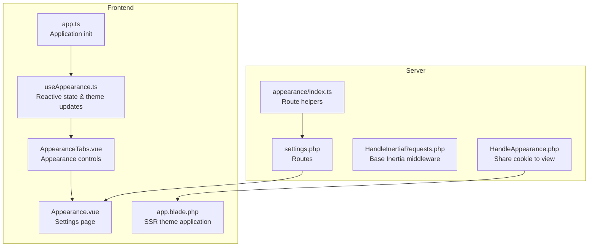
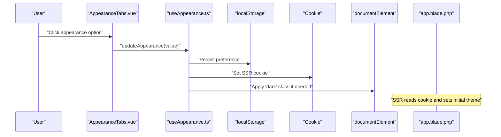
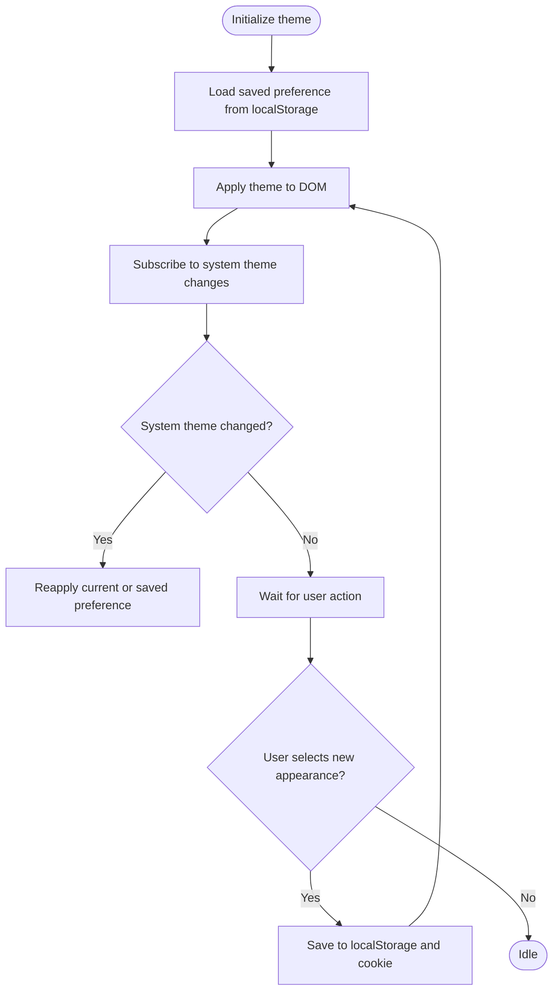
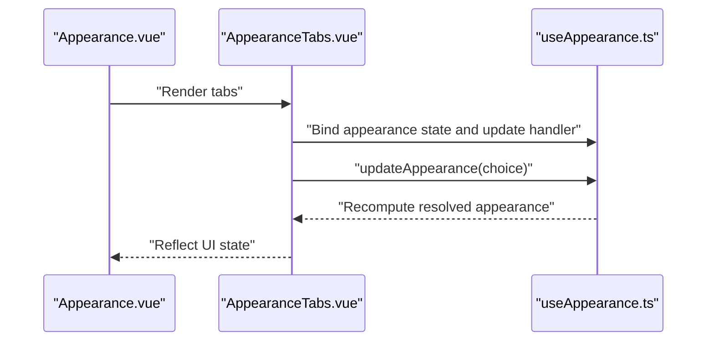
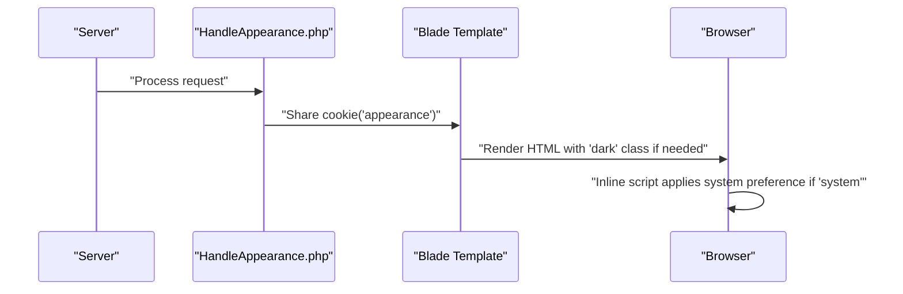
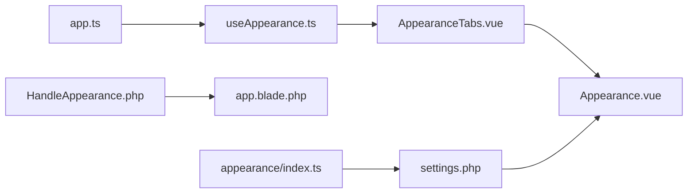

# Appearance Preferences

<cite>
**Referenced Files in This Document**
- [useAppearance.ts](file://resources/js/composables/useAppearance.ts)
- [Appearance.vue](file://resources/js/pages/settings/Appearance.vue)
- [AppearanceTabs.vue](file://resources/js/components/AppearanceTabs.vue)
- [HandleAppearance.php](file://app/Http/Middleware/HandleAppearance.php)
- [HandleInertiaRequests.php](file://app/Http/Middleware/HandleInertiaRequests.php)
- [app.ts](file://resources/js/app.ts)
- [app.blade.php](file://resources/views/app.blade.php)
- [ui.ts](file://resources/js/types/ui.ts)
- [settings.php](file://routes/settings.php)
- [appearance/index.ts](file://resources/js/routes/appearance/index.ts)
</cite>

## Table of Contents
1. [Introduction](#introduction)
2. [Project Structure](#project-structure)
3. [Core Components](#core-components)
4. [Architecture Overview](#architecture-overview)
5. [Detailed Component Analysis](#detailed-component-analysis)
6. [Dependency Analysis](#dependency-analysis)
7. [Performance Considerations](#performance-considerations)
8. [Troubleshooting Guide](#troubleshooting-guide)
9. [Conclusion](#conclusion)

## Introduction
This document explains the appearance and theme customization system used to manage user interface preferences, including dark/light mode toggles, system preference detection, and persistent layout customization. It covers the reactive state management via a Vue composable, browser storage persistence, server-side preference synchronization, and responsive design considerations. Practical workflows demonstrate theme switching, preference persistence across sessions, and accessibility-friendly behavior.

## Project Structure
The appearance system spans front-end composables, UI components, server middleware, and routing. The key elements are:
- Front-end composable for reactive state and theme updates
- UI component for appearance controls
- Server middleware to share appearance preferences with the view layer
- Blade template applying initial theme state
- Application initialization hook to apply theme on load
- Routes for the appearance settings page

**Diagram sources**
- [useAppearance.ts:1-125](file://resources/js/composables/useAppearance.ts#L1-L125)
- [AppearanceTabs.vue:1-34](file://resources/js/components/AppearanceTabs.vue#L1-L34)
- [Appearance.vue:1-33](file://resources/js/pages/settings/Appearance.vue#L1-L33)
- [app.ts:1-34](file://resources/js/app.ts#L1-L34)
- [app.blade.php:1-48](file://resources/views/app.blade.php#L1-L48)
- [HandleAppearance.php:1-24](file://app/Http/Middleware/HandleAppearance.php#L1-L24)
- [HandleInertiaRequests.php:1-48](file://app/Http/Middleware/HandleInertiaRequests.php#L1-L48)
- [settings.php:1-35](file://routes/settings.php#L1-L35)
- [appearance/index.ts:1-84](file://resources/js/routes/appearance/index.ts#L1-L84)

**Section sources**
- [useAppearance.ts:1-125](file://resources/js/composables/useAppearance.ts#L1-L125)
- [AppearanceTabs.vue:1-34](file://resources/js/components/AppearanceTabs.vue#L1-L34)
- [Appearance.vue:1-33](file://resources/js/pages/settings/Appearance.vue#L1-L33)
- [app.ts:1-34](file://resources/js/app.ts#L1-L34)
- [app.blade.php:1-48](file://resources/views/app.blade.php#L1-L48)
- [HandleAppearance.php:1-24](file://app/Http/Middleware/HandleAppearance.php#L1-L24)
- [HandleInertiaRequests.php:1-48](file://app/Http/Middleware/HandleInertiaRequests.php#L1-L48)
- [settings.php:1-35](file://routes/settings.php#L1-L35)
- [appearance/index.ts:1-84](file://resources/js/routes/appearance/index.ts#L1-L84)

## Core Components
- Reactive appearance state and resolution:
  - The composable exposes a reactive appearance value and a resolved appearance derived from either explicit light/dark or system preference combined with OS-level dark mode detection.
- Theme application:
  - A dedicated function toggles the "dark" class on the document element depending on the resolved theme.
- Persistence:
  - Updates are stored in local storage for client-side persistence and in a cookie for server-side rendering compatibility.
- Initialization:
  - On application startup, the theme is initialized from saved preferences or defaults to system, and listens for OS-level theme changes.

Key implementation references:
- Reactive state and resolution: [useAppearance.ts:88-124](file://resources/js/composables/useAppearance.ts#L88-L124)
- Theme application: [useAppearance.ts:13-31](file://resources/js/composables/useAppearance.ts#L13-L31)
- Persistence and SSR sync: [useAppearance.ts:107-117](file://resources/js/composables/useAppearance.ts#L107-L117)
- Initialization: [useAppearance.ts:73-84](file://resources/js/composables/useAppearance.ts#L73-L84)

**Section sources**
- [useAppearance.ts:1-125](file://resources/js/composables/useAppearance.ts#L1-L125)
- [ui.ts:1-10](file://resources/js/types/ui.ts#L1-L10)

## Architecture Overview
The appearance system integrates three layers:
- Frontend reactive layer: Vue composable manages state and applies theme changes.
- UI layer: A tabbed control allows users to choose among light, dark, or system modes.
- Server layer: Middleware shares the user's appearance preference with the Blade template for initial SSR rendering.

**Diagram sources**
- [AppearanceTabs.vue:1-34](file://resources/js/components/AppearanceTabs.vue#L1-L34)
- [useAppearance.ts:107-117](file://resources/js/composables/useAppearance.ts#L107-L117)
- [app.blade.php:1-48](file://resources/views/app.blade.php#L1-L48)

**Section sources**
- [AppearanceTabs.vue:1-34](file://resources/js/components/AppearanceTabs.vue#L1-L34)
- [useAppearance.ts:1-125](file://resources/js/composables/useAppearance.ts#L1-L125)
- [app.blade.php:1-48](file://resources/views/app.blade.php#L1-L48)

## Detailed Component Analysis

### useAppearance composable
Responsibilities:
- Manage reactive appearance state and derive resolved theme
- Apply theme to the DOM by toggling the "dark" class on the root element
- Persist selections to local storage and cookies
- Initialize theme on mount and react to system theme changes

Implementation highlights:
- Reactive state and computed resolution: [useAppearance.ts:88-105](file://resources/js/composables/useAppearance.ts#L88-L105)
- Theme application logic: [useAppearance.ts:13-31](file://resources/js/composables/useAppearance.ts#L13-L31)
- Persistence and SSR synchronization: [useAppearance.ts:107-117](file://resources/js/composables/useAppearance.ts#L107-L117)
- Initialization and system listener: [useAppearance.ts:73-84](file://resources/js/composables/useAppearance.ts#L73-L84)

**Diagram sources**
- [useAppearance.ts:73-117](file://resources/js/composables/useAppearance.ts#L73-L117)

**Section sources**
- [useAppearance.ts:1-125](file://resources/js/composables/useAppearance.ts#L1-L125)
- [ui.ts:1-10](file://resources/js/types/ui.ts#L1-L10)

### Appearance settings page and controls
- Settings page:
  - Presents the appearance settings UI within the settings layout and includes breadcrumbs.
  - References the appearance route helpers for navigation.
- Appearance controls:
  - Provides a tabbed interface with options for light, dark, and system modes.
  - Uses icons and dynamic classes to reflect the selected mode and improve accessibility.

References:
- Settings page: [Appearance.vue:1-33](file://resources/js/pages/settings/Appearance.vue#L1-L33)
- Controls component: [AppearanceTabs.vue:1-34](file://resources/js/components/AppearanceTabs.vue#L1-L34)

**Diagram sources**
- [Appearance.vue:1-33](file://resources/js/pages/settings/Appearance.vue#L1-L33)
- [AppearanceTabs.vue:1-34](file://resources/js/components/AppearanceTabs.vue#L1-L34)
- [useAppearance.ts:88-124](file://resources/js/composables/useAppearance.ts#L88-L124)

**Section sources**
- [Appearance.vue:1-33](file://resources/js/pages/settings/Appearance.vue#L1-L33)
- [AppearanceTabs.vue:1-34](file://resources/js/components/AppearanceTabs.vue#L1-L34)

### Server-side preference synchronization
- Middleware sharing:
  - The appearance preference is shared with the view layer via a cookie value, defaulting to "system".
- Blade template:
  - Applies the "dark" class on the HTML element based on the resolved preference.
  - Includes an inline script to detect and apply system preference immediately during SSR.
- Inertia base middleware:
  - Ensures the root view is correctly set for SSR rendering.

References:
- Middleware: [HandleAppearance.php:17-22](file://app/Http/Middleware/HandleAppearance.php#L17-L22)
- Blade template: [app.blade.php:1-48](file://resources/views/app.blade.php#L1-L48)
- Inertia base middleware: [HandleInertiaRequests.php:17](file://app/Http/Middleware/HandleInertiaRequests.php#L17)

**Diagram sources**
- [HandleAppearance.php:17-22](file://app/Http/Middleware/HandleAppearance.php#L17-L22)
- [app.blade.php:1-48](file://resources/views/app.blade.php#L1-L48)

**Section sources**
- [HandleAppearance.php:1-24](file://app/Http/Middleware/HandleAppearance.php#L1-L24)
- [app.blade.php:1-48](file://resources/views/app.blade.php#L1-L48)
- [HandleInertiaRequests.php:1-48](file://app/Http/Middleware/HandleInertiaRequests.php#L1-L48)

### Application initialization
- The application initializes the theme on startup by calling the initialization function, ensuring immediate application of the saved or system preference.
- This prevents a flash of incorrect theme on first render.

Reference:
- [app.ts:29-30](file://resources/js/app.ts#L29-L30)

**Section sources**
- [app.ts:1-34](file://resources/js/app.ts#L1-L34)

### Routing and navigation
- The appearance settings page is exposed via an Inertia route under the settings namespace.
- Route helpers provide strongly-typed access to the settings/appearance endpoint.

References:
- Route registration: [settings.php:26](file://routes/settings.php#L26)
- Route helpers: [appearance/index.ts:7-15](file://resources/js/routes/appearance/index.ts#L7-L15)

**Section sources**
- [settings.php:1-35](file://routes/settings.php#L1-L35)
- [appearance/index.ts:1-84](file://resources/js/routes/appearance/index.ts#L1-L84)

## Dependency Analysis
The appearance system exhibits low coupling and clear separation of concerns:
- Frontend composable encapsulates state and persistence
- UI component depends only on the composable
- Server middleware depends on request cookies and view sharing
- Blade template depends on server-provided data
- Application initialization ties the frontend and server together

**Diagram sources**
- [useAppearance.ts:1-125](file://resources/js/composables/useAppearance.ts#L1-L125)
- [AppearanceTabs.vue:1-34](file://resources/js/components/AppearanceTabs.vue#L1-L34)
- [Appearance.vue:1-33](file://resources/js/pages/settings/Appearance.vue#L1-L33)
- [app.ts:1-34](file://resources/js/app.ts#L1-L34)
- [HandleAppearance.php:1-24](file://app/Http/Middleware/HandleAppearance.php#L1-L24)
- [app.blade.php:1-48](file://resources/views/app.blade.php#L1-L48)
- [settings.php:1-35](file://routes/settings.php#L1-L35)
- [appearance/index.ts:1-84](file://resources/js/routes/appearance/index.ts#L1-L84)

**Section sources**
- [useAppearance.ts:1-125](file://resources/js/composables/useAppearance.ts#L1-L125)
- [AppearanceTabs.vue:1-34](file://resources/js/components/AppearanceTabs.vue#L1-L34)
- [Appearance.vue:1-33](file://resources/js/pages/settings/Appearance.vue#L1-L33)
- [app.ts:1-34](file://resources/js/app.ts#L1-L34)
- [HandleAppearance.php:1-24](file://app/Http/Middleware/HandleAppearance.php#L1-L24)
- [app.blade.php:1-48](file://resources/views/app.blade.php#L1-L48)
- [settings.php:1-35](file://routes/settings.php#L1-L35)
- [appearance/index.ts:1-84](file://resources/js/routes/appearance/index.ts#L1-L84)

## Performance Considerations
- Efficient DOM updates: The theme is applied by toggling a single class on the root element, minimizing reflows.
- Minimal overhead: Local storage and cookie writes occur only on user actions, avoiding frequent IO.
- SSR-first rendering: The server applies the initial theme based on the cookie, reducing perceived flicker.
- Event listeners: System theme change listener is attached once during initialization and removed automatically by the media query mechanism.

## Troubleshooting Guide
Common issues and resolutions:
- Theme does not persist after refresh:
  - Verify that the cookie is being set and that the composable persists to local storage on updates.
  - Confirm the server middleware shares the cookie value to the view.
  - References: [useAppearance.ts:107-117](file://resources/js/composables/useAppearance.ts#L107-L117), [HandleAppearance.php:17-22](file://app/Http/Middleware/HandleAppearance.php#L17-L22)
- System preference not respected:
  - Ensure the composable initializes from saved preference and subscribes to system theme changes.
  - Confirm the inline script in the Blade template applies the "dark" class when the preference is "system".
  - References: [useAppearance.ts:73-84](file://resources/js/composables/useAppearance.ts#L73-L84), [app.blade.php:7-20](file://resources/views/app.blade.php#L7-L20)
- UI does not reflect current selection:
  - Check that the UI component binds to the reactive appearance value and triggers the update handler.
  - Reference: [AppearanceTabs.vue:5](file://resources/js/components/AppearanceTabs.vue#L5)
- SSR renders incorrect theme:
  - Validate that the cookie value is present and defaults to "system" if absent.
  - Reference: [HandleAppearance.php:19](file://app/Http/Middleware/HandleAppearance.php#L19)

**Section sources**
- [useAppearance.ts:73-117](file://resources/js/composables/useAppearance.ts#L73-L117)
- [HandleAppearance.php:17-22](file://app/Http/Middleware/HandleAppearance.php#L17-L22)
- [app.blade.php:7-20](file://resources/views/app.blade.php#L7-L20)
- [AppearanceTabs.vue:5](file://resources/js/components/AppearanceTabs.vue#L5)

## Conclusion
The appearance and theme customization system combines a reactive Vue composable, a simple UI control, and server-side synchronization to deliver a seamless, persistent, and accessible theming experience. Users can switch between light, dark, and system modes, with preferences stored locally and synchronized via cookies for SSR. The design minimizes performance overhead while ensuring a smooth first-paint experience and responsive behavior across devices.