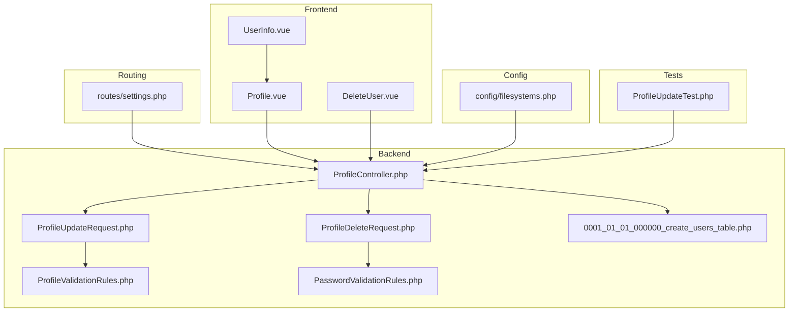
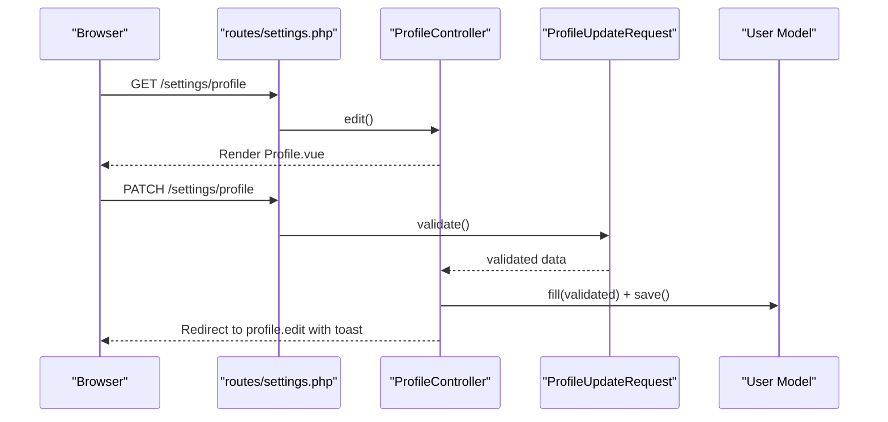
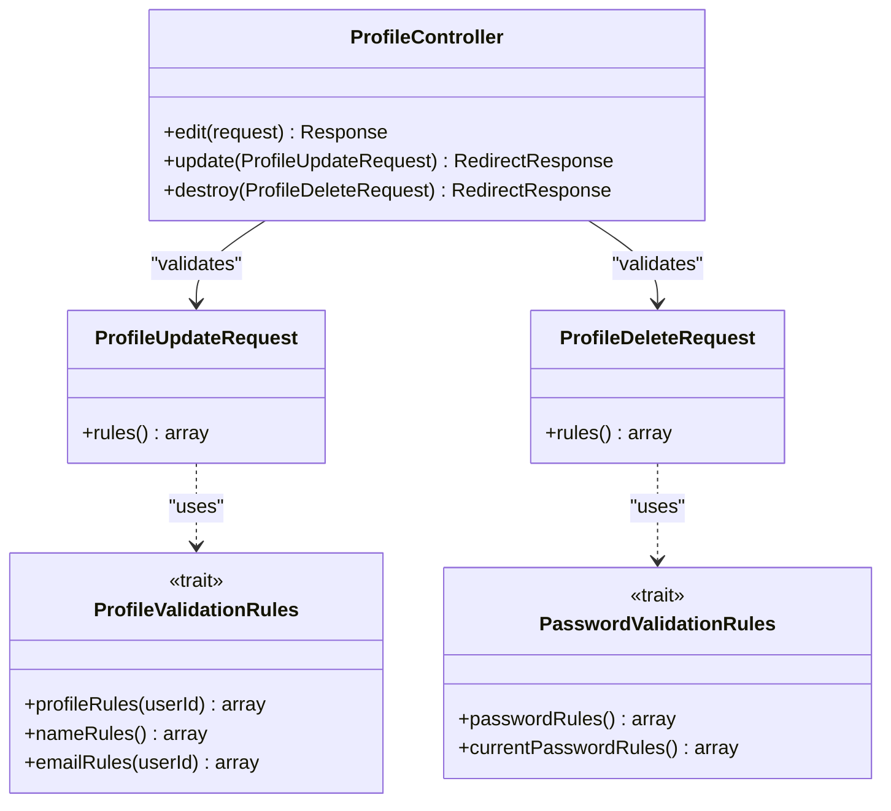
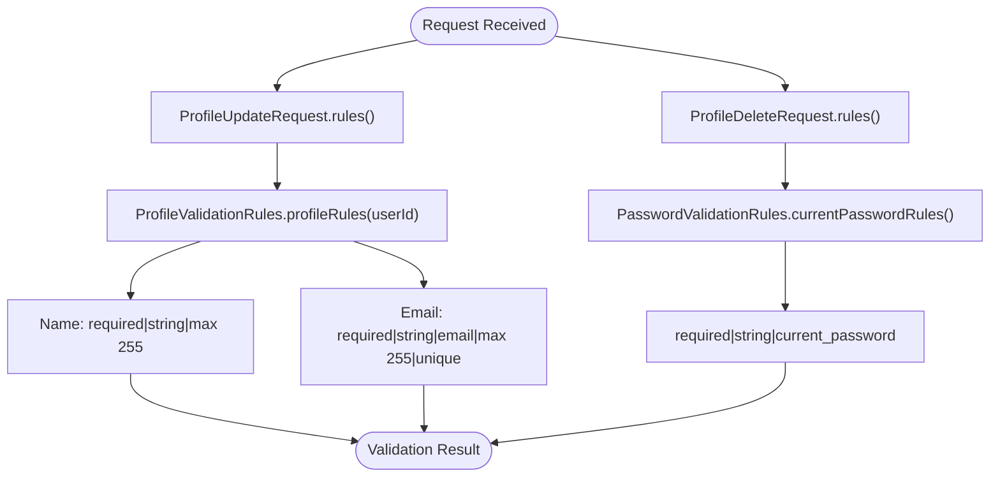
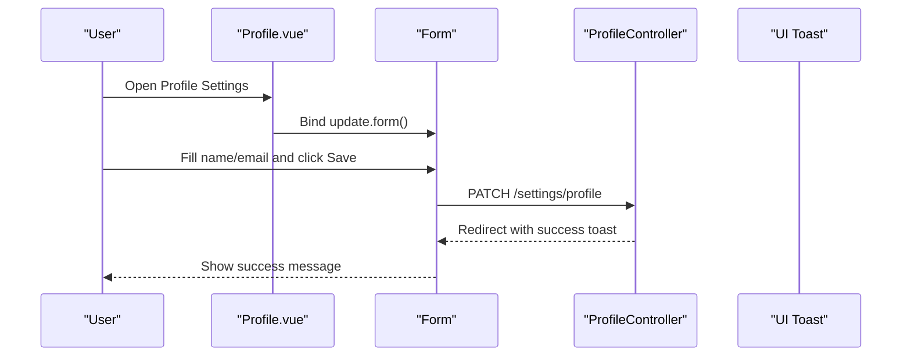
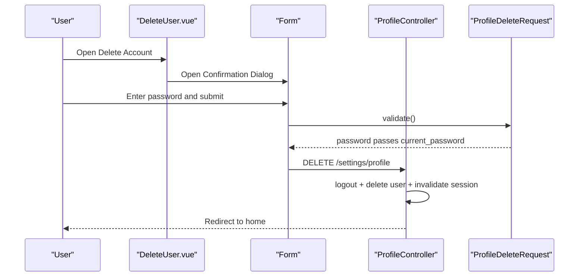
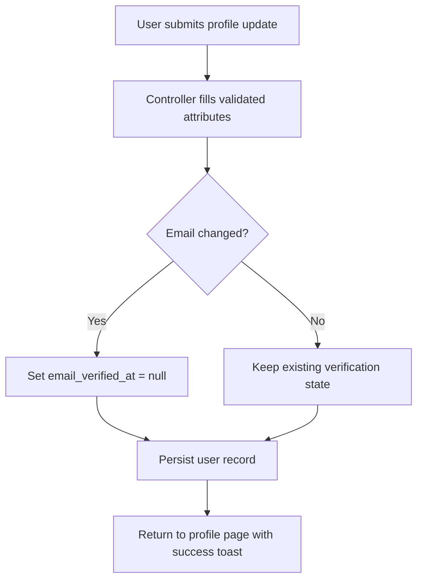
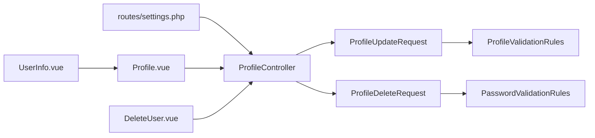

# Profile Settings

<cite>
**Referenced Files in This Document**
- [ProfileController.php](file://app/Http/Controllers/Settings/ProfileController.php)
- [ProfileUpdateRequest.php](file://app/Http/Requests/Settings/ProfileUpdateRequest.php)
- [ProfileDeleteRequest.php](file://app/Http/Requests/Settings/ProfileDeleteRequest.php)
- [ProfileValidationRules.php](file://app/Concerns/ProfileValidationRules.php)
- [PasswordValidationRules.php](file://app/Concerns/PasswordValidationRules.php)
- [Profile.vue](file://resources/js/pages/settings/Profile.vue)
- [DeleteUser.vue](file://resources/js/components/DeleteUser.vue)
- [UserInfo.vue](file://resources/js/components/UserInfo.vue)
- [settings.php](file://routes/settings.php)
- [ProfileUpdateTest.php](file://tests/Feature/Settings/ProfileUpdateTest.php)
- [0001_01_01_000000_create_users_table.php](file://database/migrations/0001_01_01_000000_create_users_table.php)
- [filesystems.php](file://config/filesystems.php)
</cite>

## Table of Contents
1. [Introduction](#introduction)
2. [Project Structure](#project-structure)
3. [Core Components](#core-components)
4. [Architecture Overview](#architecture-overview)
5. [Detailed Component Analysis](#detailed-component-analysis)
6. [Dependency Analysis](#dependency-analysis)
7. [Performance Considerations](#performance-considerations)
8. [Troubleshooting Guide](#troubleshooting-guide)
9. [Conclusion](#conclusion)

## Introduction
This document describes the profile settings management system, focusing on the ProfileController implementation for updating personal information, handling account deletion, and the supporting validation classes. It also covers the frontend profile editing interface, including form components, validation feedback, and user experience patterns. Privacy settings and data persistence are addressed, along with practical update scenarios, error handling, and security considerations for sensitive data modification.

## Project Structure
The profile settings system spans backend controllers and requests, frontend pages and components, routing, and tests. The backend uses Laravel FormRequest classes for validation and Inertia for server-rendered Vue pages. The frontend leverages reusable UI components and form helpers.

**Diagram sources**
- [ProfileController.php:1-63](file://app/Http/Controllers/Settings/ProfileController.php#L1-L63)
- [ProfileUpdateRequest.php:1-23](file://app/Http/Requests/Settings/ProfileUpdateRequest.php#L1-L23)
- [ProfileDeleteRequest.php:1-25](file://app/Http/Requests/Settings/ProfileDeleteRequest.php#L1-L25)
- [ProfileValidationRules.php:1-52](file://app/Concerns/ProfileValidationRules.php#L1-L52)
- [PasswordValidationRules.php:1-30](file://app/Concerns/PasswordValidationRules.php#L1-L30)
- [Profile.vue:1-106](file://resources/js/pages/settings/Profile.vue#L1-L106)
- [DeleteUser.vue:1-114](file://resources/js/components/DeleteUser.vue#L1-L114)
- [UserInfo.vue:1-39](file://resources/js/components/UserInfo.vue#L1-L39)
- [settings.php:1-35](file://routes/settings.php#L1-L35)
- [ProfileUpdateTest.php:1-85](file://tests/Feature/Settings/ProfileUpdateTest.php#L1-L85)
- [0001_01_01_000000_create_users_table.php:1-50](file://database/migrations/0001_01_01_000000_create_users_table.php#L1-L50)
- [filesystems.php:1-80](file://config/filesystems.php#L1-L80)

**Section sources**
- [settings.php:1-35](file://routes/settings.php#L1-L35)
- [ProfileController.php:1-63](file://app/Http/Controllers/Settings/ProfileController.php#L1-L63)

## Core Components
- ProfileController: Handles rendering the profile settings page, updating user profile information, and deleting the user account.
- ProfileUpdateRequest: Validates profile updates using shared validation rules.
- ProfileDeleteRequest: Validates account deletion with current password confirmation.
- ProfileValidationRules: Provides reusable validation rules for name and email.
- PasswordValidationRules: Provides reusable validation rules for current password checks.
- Frontend Profile Page: Presents editable fields for name and email, verification messaging, and a delete account section.
- DeleteUser Component: Encapsulates the destructive action with confirmation dialog and password prompt.
- UserInfo Component: Renders user identity with avatar fallback and optional email.

**Section sources**
- [ProfileController.php:15-61](file://app/Http/Controllers/Settings/ProfileController.php#L15-L61)
- [ProfileUpdateRequest.php:9-22](file://app/Http/Requests/Settings/ProfileUpdateRequest.php#L9-L22)
- [ProfileDeleteRequest.php:9-24](file://app/Http/Requests/Settings/ProfileDeleteRequest.php#L9-L24)
- [ProfileValidationRules.php:9-51](file://app/Concerns/ProfileValidationRules.php#L9-L51)
- [PasswordValidationRules.php:8-29](file://app/Concerns/PasswordValidationRules.php#L8-L29)
- [Profile.vue:1-106](file://resources/js/pages/settings/Profile.vue#L1-L106)
- [DeleteUser.vue:1-114](file://resources/js/components/DeleteUser.vue#L1-L114)
- [UserInfo.vue:1-39](file://resources/js/components/UserInfo.vue#L1-L39)

## Architecture Overview
The profile settings feature follows a layered architecture:
- Routes define endpoints for profile edit, update, and delete actions.
- Controllers orchestrate request handling, invoking validation and persistence.
- Requests encapsulate validation logic and leverage shared traits for consistent rules.
- Frontend pages and components render forms and handle user interactions via Inertia.

**Diagram sources**
- [settings.php:8-16](file://routes/settings.php#L8-L16)
- [ProfileController.php:20-44](file://app/Http/Controllers/Settings/ProfileController.php#L20-L44)
- [ProfileUpdateRequest.php:18-21](file://app/Http/Requests/Settings/ProfileUpdateRequest.php#L18-L21)
- [ProfileValidationRules.php:16-22](file://app/Concerns/ProfileValidationRules.php#L16-L22)

## Detailed Component Analysis

### Backend Controller: ProfileController
Responsibilities:
- Render the profile settings page with verification status and session messages.
- Apply profile updates with automatic email verification reset when email changes.
- Delete the user account after logout, session invalidation, and CSRF token regeneration.

Key behaviors:
- Edit action passes mustVerifyEmail and status to the frontend.
- Update action persists validated attributes and triggers a success toast.
- Destroy action enforces verified middleware and password confirmation via dedicated request.

**Diagram sources**
- [ProfileController.php:15-61](file://app/Http/Controllers/Settings/ProfileController.php#L15-L61)
- [ProfileUpdateRequest.php:9-22](file://app/Http/Requests/Settings/ProfileUpdateRequest.php#L9-L22)
- [ProfileDeleteRequest.php:9-24](file://app/Http/Requests/Settings/ProfileDeleteRequest.php#L9-L24)
- [ProfileValidationRules.php:9-51](file://app/Concerns/ProfileValidationRules.php#L9-L51)
- [PasswordValidationRules.php:8-29](file://app/Concerns/PasswordValidationRules.php#L8-L29)

**Section sources**
- [ProfileController.php:20-61](file://app/Http/Controllers/Settings/ProfileController.php#L20-L61)

### Validation Classes: ProfileUpdateRequest and ProfileDeleteRequest
- ProfileUpdateRequest: Applies profileRules via ProfileValidationRules, ensuring name and email follow defined constraints and uniqueness per user.
- ProfileDeleteRequest: Enforces current password validation using PasswordValidationRules.

Validation specifics:
- Name: required, string, max length constraint.
- Email: required, string, email format, max length, unique constraint excluding the current user’s ID.
- Current password: required, must match the stored password.

**Diagram sources**
- [ProfileUpdateRequest.php:18-21](file://app/Http/Requests/Settings/ProfileUpdateRequest.php#L18-L21)
- [ProfileValidationRules.php:16-50](file://app/Concerns/ProfileValidationRules.php#L16-L50)
- [ProfileDeleteRequest.php:18-23](file://app/Http/Requests/Settings/ProfileDeleteRequest.php#L18-L23)
- [PasswordValidationRules.php:25-28](file://app/Concerns/PasswordValidationRules.php#L25-L28)

**Section sources**
- [ProfileUpdateRequest.php:18-21](file://app/Http/Requests/Settings/ProfileUpdateRequest.php#L18-L21)
- [ProfileDeleteRequest.php:18-23](file://app/Http/Requests/Settings/ProfileDeleteRequest.php#L18-L23)
- [ProfileValidationRules.php:16-50](file://app/Concerns/ProfileValidationRules.php#L16-L50)
- [PasswordValidationRules.php:25-28](file://app/Concerns/PasswordValidationRules.php#L25-L28)

### Frontend Profile Editing Interface
- Profile.vue: Displays editable name and email fields, shows verification messaging when applicable, and renders the DeleteUser component.
- DeleteUser.vue: Implements a confirmation dialog requiring password input to proceed with account deletion.
- UserInfo.vue: Renders user identity with avatar fallback and optional email display.

User experience highlights:
- Real-time validation feedback via InputError components bound to form errors.
- Disabled submit button during processing to prevent duplicate submissions.
- Clear warning messaging and destructive button styling for account deletion.
- Avatar fallback using initials when no image is present.

**Diagram sources**
- [Profile.vue:42-101](file://resources/js/pages/settings/Profile.vue#L42-L101)
- [ProfileController.php:31-44](file://app/Http/Controllers/Settings/ProfileController.php#L31-L44)

**Section sources**
- [Profile.vue:1-106](file://resources/js/pages/settings/Profile.vue#L1-L106)
- [DeleteUser.vue:1-114](file://resources/js/components/DeleteUser.vue#L1-L114)
- [UserInfo.vue:1-39](file://resources/js/components/UserInfo.vue#L1-L39)

### Account Deletion Workflow
The deletion flow requires verified authentication and password confirmation:
- Verified middleware ensures the user has verified their email before allowing deletion.
- ProfileDeleteRequest validates the current password using current_password rule.
- On success, the controller logs out the user, deletes the record, invalidates the session, regenerates the CSRF token, and redirects to home.

**Diagram sources**
- [DeleteUser.vue:46-108](file://resources/js/components/DeleteUser.vue#L46-L108)
- [ProfileDeleteRequest.php:18-23](file://app/Http/Requests/Settings/ProfileDeleteRequest.php#L18-L23)
- [ProfileController.php:49-61](file://app/Http/Controllers/Settings/ProfileController.php#L49-L61)
- [settings.php:15-16](file://routes/settings.php#L15-L16)

**Section sources**
- [settings.php:15-16](file://routes/settings.php#L15-L16)
- [ProfileDeleteRequest.php:18-23](file://app/Http/Requests/Settings/ProfileDeleteRequest.php#L18-L23)
- [ProfileController.php:49-61](file://app/Http/Controllers/Settings/ProfileController.php#L49-L61)

### Data Persistence and Privacy Settings
- User model schema supports name, email, email verification timestamp, and password fields.
- Profile updates persist validated attributes; changing the email resets email_verified_at to null automatically.
- Account deletion removes the user record and logs out the session.

Privacy considerations:
- Email uniqueness prevents duplicate accounts.
- Verified middleware on deletion protects against unauthorized deletions.
- Session invalidation and token regeneration mitigate session fixation risks post-deletion.

**Diagram sources**
- [ProfileController.php:31-44](file://app/Http/Controllers/Settings/ProfileController.php#L31-L44)
- [ProfileValidationRules.php:16-22](file://app/Concerns/ProfileValidationRules.php#L16-L22)
- [0001_01_01_000000_create_users_table.php:14-22](file://database/migrations/0001_01_01_000000_create_users_table.php#L14-L22)

**Section sources**
- [ProfileController.php:31-44](file://app/Http/Controllers/Settings/ProfileController.php#L31-L44)
- [0001_01_01_000000_create_users_table.php:14-22](file://database/migrations/0001_01_01_000000_create_users_table.php#L14-L22)

### Practical Update Scenarios and Error Handling
Common scenarios:
- Successful profile update: name and email updated; email verification reset when email changes.
- Unchanged email: verification timestamp remains set.
- Account deletion: requires correct password; failure returns errors and keeps the user active.

Error handling:
- Validation failures surface via InputError components in the frontend.
- Tests assert correct behavior for successful updates, unchanged verification, and password-required deletion.

**Section sources**
- [ProfileUpdateTest.php:15-68](file://tests/Feature/Settings/ProfileUpdateTest.php#L15-L68)
- [Profile.vue:58-73](file://resources/js/pages/settings/Profile.vue#L58-L73)
- [DeleteUser.vue:81-82](file://resources/js/components/DeleteUser.vue#L81-L82)

## Dependency Analysis
The system exhibits low coupling and high cohesion:
- Controllers depend on FormRequest classes for validation.
- Validation traits encapsulate reusable rules.
- Frontend components depend on Inertia form bindings and shared UI primitives.
- Routing isolates endpoint definitions from controller logic.

**Diagram sources**
- [settings.php:8-16](file://routes/settings.php#L8-L16)
- [ProfileController.php:31-61](file://app/Http/Controllers/Settings/ProfileController.php#L31-L61)
- [ProfileUpdateRequest.php:18-21](file://app/Http/Requests/Settings/ProfileUpdateRequest.php#L18-L21)
- [ProfileDeleteRequest.php:18-23](file://app/Http/Requests/Settings/ProfileDeleteRequest.php#L18-L23)
- [ProfileValidationRules.php:16-50](file://app/Concerns/ProfileValidationRules.php#L16-L50)
- [PasswordValidationRules.php:25-28](file://app/Concerns/PasswordValidationRules.php#L25-L28)
- [Profile.vue:42-101](file://resources/js/pages/settings/Profile.vue#L42-L101)
- [DeleteUser.vue:46-108](file://resources/js/components/DeleteUser.vue#L46-L108)
- [UserInfo.vue:1-39](file://resources/js/components/UserInfo.vue#L1-L39)

**Section sources**
- [settings.php:8-16](file://routes/settings.php#L8-L16)
- [ProfileController.php:31-61](file://app/Http/Controllers/Settings/ProfileController.php#L31-L61)

## Performance Considerations
- Minimal ORM operations: updates use fill() and save() with dirty detection to avoid unnecessary writes.
- Single redirect after update to reduce round trips.
- Verified middleware on deletion avoids redundant password checks by leveraging session state.

## Troubleshooting Guide
Common issues and resolutions:
- Validation errors on update: ensure name and email meet constraints; verify unique email per user.
- Email verification reset unexpectedly: occurs only when email changes; confirm the submitted email differs from the stored value.
- Deletion fails with password error: ensure the current password matches the stored hash.
- Frontend shows stale state: rely on redirect-based navigation to refresh props; avoid manual state mutations.

**Section sources**
- [ProfileUpdateTest.php:36-85](file://tests/Feature/Settings/ProfileUpdateTest.php#L36-L85)
- [ProfileController.php:35-39](file://app/Http/Controllers/Settings/ProfileController.php#L35-L39)

## Conclusion
The profile settings system provides a secure, maintainable, and user-friendly mechanism for managing personal information and account lifecycle. Backend validation is centralized in reusable traits, while the frontend offers clear feedback and safe destructive actions. Adhering to the outlined patterns ensures consistent behavior, robust error handling, and strong privacy protections.