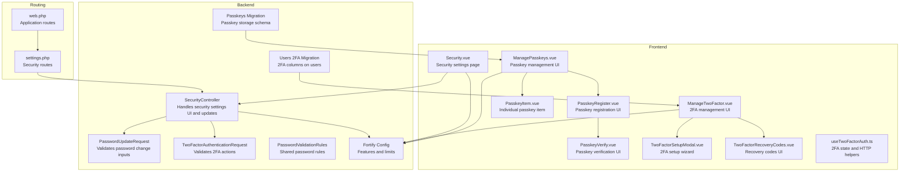
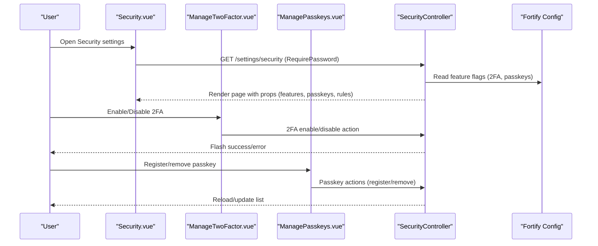
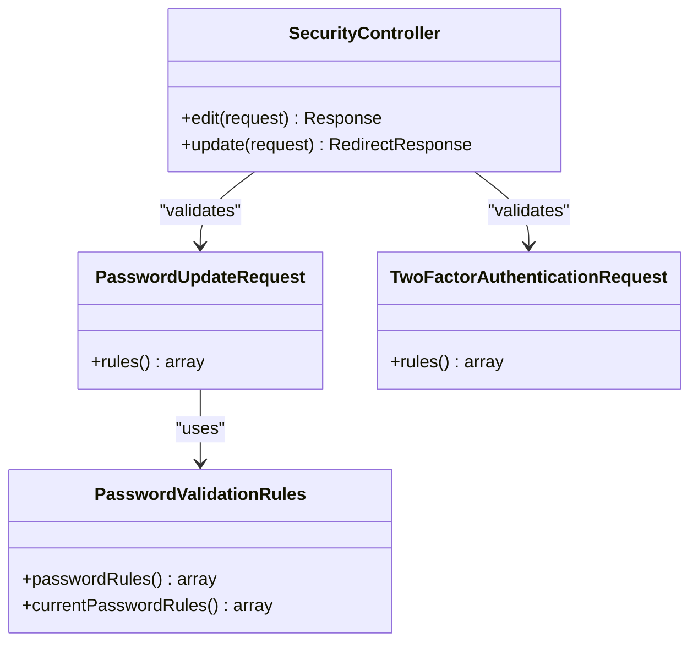
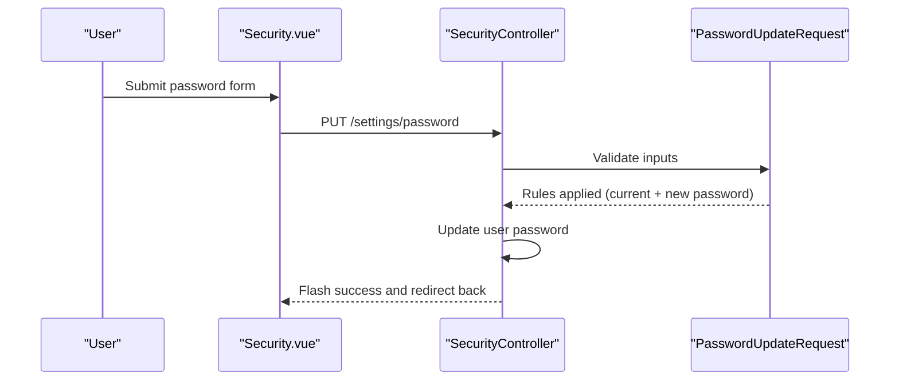
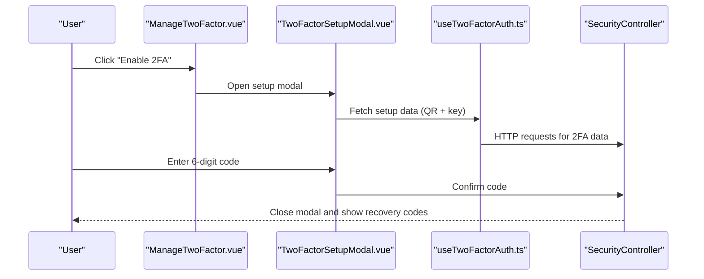
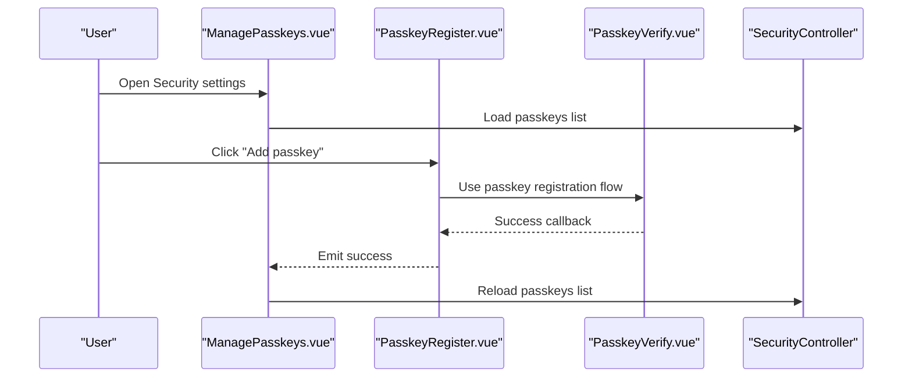
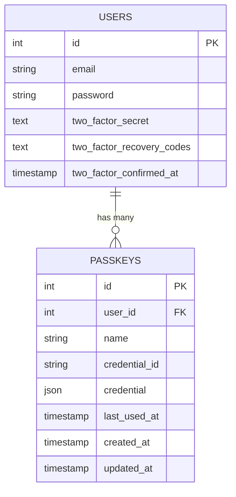
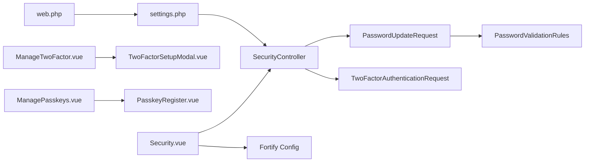

# Security Settings

<cite>
**Referenced Files in This Document**
- [SecurityController.php](file://app/Http/Controllers/Settings/SecurityController.php)
- [PasswordUpdateRequest.php](file://app/Http/Requests/Settings/PasswordUpdateRequest.php)
- [TwoFactorAuthenticationRequest.php](file://app/Http/Requests/Settings/TwoFactorAuthenticationRequest.php)
- [PasswordValidationRules.php](file://app/Concerns/PasswordValidationRules.php)
- [Security.vue](file://resources/js/pages/settings/Security.vue)
- [ManageTwoFactor.vue](file://resources/js/components/ManageTwoFactor.vue)
- [ManagePasskeys.vue](file://resources/js/components/ManagePasskeys.vue)
- [PasskeyRegister.vue](file://resources/js/components/PasskeyRegister.vue)
- [PasskeyVerify.vue](file://resources/js/components/PasskeyVerify.vue)
- [PasskeyItem.vue](file://resources/js/components/PasskeyItem.vue)
- [TwoFactorSetupModal.vue](file://resources/js/components/TwoFactorSetupModal.vue)
- [TwoFactorRecoveryCodes.vue](file://resources/js/components/TwoFactorRecoveryCodes.vue)
- [useTwoFactorAuth.ts](file://resources/js/composables/useTwoFactorAuth.ts)
- [fortify.php](file://config/fortify.php)
- [settings.php](file://routes/settings.php)
- [web.php](file://routes/web.php)
- [2024_01_01_000000_create_passkeys_table.php](file://database/migrations/2024_01_01_000000_create_passkeys_table.php)
- [2025_08_14_170933_add_two_factor_columns_to_users_table.php](file://database/migrations/2025_08_14_170933_add_two_factor_columns_to_users_table.php)
</cite>

## Table of Contents
1. [Introduction](#introduction)
2. [Project Structure](#project-structure)
3. [Core Components](#core-components)
4. [Architecture Overview](#architecture-overview)
5. [Detailed Component Analysis](#detailed-component-analysis)
6. [Dependency Analysis](#dependency-analysis)
7. [Performance Considerations](#performance-considerations)
8. [Troubleshooting Guide](#troubleshooting-guide)
9. [Conclusion](#conclusion)
10. [Appendices](#appendices)

## Introduction
This document explains the security settings management system, focusing on password changes, two-factor authentication (2FA), and passkey administration. It covers backend controller logic, validation classes, frontend interfaces, and supporting infrastructure such as rate limiting, feature toggles, and database schema. Practical workflows, error handling, and best practices for secure credential management are included.

## Project Structure
The security settings feature spans backend controllers and requests, frontend Vue components, configuration, routes, and database migrations.

**Diagram sources**
- [SecurityController.php:14-66](file://app/Http/Controllers/Settings/SecurityController.php#L14-L66)
- [PasswordUpdateRequest.php:9-25](file://app/Http/Requests/Settings/PasswordUpdateRequest.php#L9-L25)
- [TwoFactorAuthenticationRequest.php:9-22](file://app/Http/Requests/Settings/TwoFactorAuthenticationRequest.php#L9-L22)
- [PasswordValidationRules.php:8-29](file://app/Concerns/PasswordValidationRules.php#L8-L29)
- [Security.vue:1-120](file://resources/js/pages/settings/Security.vue#L1-L120)
- [ManageTwoFactor.vue:1-94](file://resources/js/components/ManageTwoFactor.vue#L1-L94)
- [ManagePasskeys.vue:1-66](file://resources/js/components/ManagePasskeys.vue#L1-L66)
- [PasskeyRegister.vue:1-95](file://resources/js/components/PasskeyRegister.vue#L1-L95)
- [PasskeyVerify.vue:1-74](file://resources/js/components/PasskeyVerify.vue#L1-L74)
- [PasskeyItem.vue:1-96](file://resources/js/components/PasskeyItem.vue#L1-L96)
- [TwoFactorSetupModal.vue:1-299](file://resources/js/components/TwoFactorSetupModal.vue#L1-L299)
- [TwoFactorRecoveryCodes.vue:1-124](file://resources/js/components/TwoFactorRecoveryCodes.vue#L1-L124)
- [useTwoFactorAuth.ts:1-113](file://resources/js/composables/useTwoFactorAuth.ts#L1-L113)
- [fortify.php:163-175](file://config/fortify.php#L163-L175)
- [settings.php:8-27](file://routes/settings.php#L8-L27)
- [web.php:31-32](file://routes/web.php#L31-L32)
- [2024_01_01_000000_create_passkeys_table.php:14-24](file://database/migrations/2024_01_01_000000_create_passkeys_table.php#L14-L24)
- [2025_08_14_170933_add_two_factor_columns_to_users_table.php:14-18](file://database/migrations/2025_08_14_170933_add_two_factor_columns_to_users_table.php#L14-L18)

**Section sources**
- [SecurityController.php:14-66](file://app/Http/Controllers/Settings/SecurityController.php#L14-L66)
- [Security.vue:1-120](file://resources/js/pages/settings/Security.vue#L1-L120)
- [ManageTwoFactor.vue:1-94](file://resources/js/components/ManageTwoFactor.vue#L1-L94)
- [ManagePasskeys.vue:1-66](file://resources/js/components/ManagePasskeys.vue#L1-L66)
- [PasskeyRegister.vue:1-95](file://resources/js/components/PasskeyRegister.vue#L1-L95)
- [PasskeyVerify.vue:1-74](file://resources/js/components/PasskeyVerify.vue#L1-L74)
- [PasskeyItem.vue:1-96](file://resources/js/components/PasskeyItem.vue#L1-L96)
- [TwoFactorSetupModal.vue:1-299](file://resources/js/components/TwoFactorSetupModal.vue#L1-L299)
- [TwoFactorRecoveryCodes.vue:1-124](file://resources/js/components/TwoFactorRecoveryCodes.vue#L1-L124)
- [useTwoFactorAuth.ts:1-113](file://resources/js/composables/useTwoFactorAuth.ts#L1-L113)
- [PasswordUpdateRequest.php:9-25](file://app/Http/Requests/Settings/PasswordUpdateRequest.php#L9-L25)
- [TwoFactorAuthenticationRequest.php:9-22](file://app/Http/Requests/Settings/TwoFactorAuthenticationRequest.php#L9-L22)
- [PasswordValidationRules.php:8-29](file://app/Concerns/PasswordValidationRules.php#L8-L29)
- [fortify.php:163-175](file://config/fortify.php#L163-L175)
- [settings.php:8-27](file://routes/settings.php#L8-L27)
- [web.php:31-32](file://routes/web.php#L31-L32)
- [2024_01_01_000000_create_passkeys_table.php:14-24](file://database/migrations/2024_01_01_000000_create_passkeys_table.php#L14-L24)
- [2025_08_14_170933_add_two_factor_columns_to_users_table.php:14-18](file://database/migrations/2025_08_14_170933_add_two_factor_columns_to_users_table.php#L14-L18)

## Core Components
- SecurityController: Renders the security settings page and handles password updates. It reads feature flags for 2FA and passkeys, prepares passkey metadata, and enforces password rules.
- PasswordUpdateRequest: Validates current and new password inputs using shared password rules.
- TwoFactorAuthenticationRequest: Provides request-level hooks for 2FA state handling.
- PasswordValidationRules: Supplies reusable validation rules for current and new passwords.
- Frontend components: Provide UI for password changes, 2FA enable/disable, passkey registration and removal, and recovery codes management.

**Section sources**
- [SecurityController.php:19-65](file://app/Http/Controllers/Settings/SecurityController.php#L19-L65)
- [PasswordUpdateRequest.php:18-24](file://app/Http/Requests/Settings/PasswordUpdateRequest.php#L18-L24)
- [TwoFactorAuthenticationRequest.php:18-21](file://app/Http/Requests/Settings/TwoFactorAuthenticationRequest.php#L18-L21)
- [PasswordValidationRules.php:15-28](file://app/Concerns/PasswordValidationRules.php#L15-L28)
- [Security.vue:39-118](file://resources/js/pages/settings/Security.vue#L39-L118)

## Architecture Overview
The security settings feature integrates Laravel backend controllers and Inertia-driven Vue frontend. Fortify configuration controls feature availability and security policies. Routes enforce authentication and optional password confirmation for sensitive operations.

**Diagram sources**
- [Security.vue:13-31](file://resources/js/pages/settings/Security.vue#L13-L31)
- [ManageTwoFactor.vue:48-82](file://resources/js/components/ManageTwoFactor.vue#L48-L82)
- [ManagePasskeys.vue:20-29](file://resources/js/components/ManagePasskeys.vue#L20-L29)
- [SecurityController.php:19-51](file://app/Http/Controllers/Settings/SecurityController.php#L19-L51)
- [fortify.php:163-175](file://config/fortify.php#L163-L175)

## Detailed Component Analysis

### SecurityController Implementation
Responsibilities:
- Render security settings page with feature flags and passkey list.
- Enforce password confirmation requirement via RequirePassword middleware.
- Update user password after validation.

Key behaviors:
- Reads Fortify feature flags for 2FA and passkeys.
- Builds passkey metadata for display (name, timestamps, authenticator).
- Exposes password rules string to frontend for client-side hints.
- Ensures 2FA state is valid before rendering.

**Diagram sources**
- [SecurityController.php:14-66](file://app/Http/Controllers/Settings/SecurityController.php#L14-L66)
- [PasswordUpdateRequest.php:9-25](file://app/Http/Requests/Settings/PasswordUpdateRequest.php#L9-L25)
- [TwoFactorAuthenticationRequest.php:9-22](file://app/Http/Requests/Settings/TwoFactorAuthenticationRequest.php#L9-L22)
- [PasswordValidationRules.php:8-29](file://app/Concerns/PasswordValidationRules.php#L8-L29)

**Section sources**
- [SecurityController.php:19-65](file://app/Http/Controllers/Settings/SecurityController.php#L19-L65)

### Password Change Workflow
End-to-end flow:
- User submits current and new password on the Security settings page.
- Backend validates using PasswordUpdateRequest and shared password rules.
- On success, the controller updates the user’s password and flashes a success message.

**Diagram sources**
- [Security.vue:46-106](file://resources/js/pages/settings/Security.vue#L46-L106)
- [SecurityController.php:56-65](file://app/Http/Controllers/Settings/SecurityController.php#L56-L65)
- [PasswordUpdateRequest.php:18-24](file://app/Http/Requests/Settings/PasswordUpdateRequest.php#L18-L24)
- [PasswordValidationRules.php:15-28](file://app/Concerns/PasswordValidationRules.php#L15-L28)
- [settings.php:22-24](file://routes/settings.php#L22-L24)

**Section sources**
- [Security.vue:46-106](file://resources/js/pages/settings/Security.vue#L46-L106)
- [SecurityController.php:56-65](file://app/Http/Controllers/Settings/SecurityController.php#L56-L65)
- [PasswordUpdateRequest.php:18-24](file://app/Http/Requests/Settings/PasswordUpdateRequest.php#L18-L24)
- [PasswordValidationRules.php:15-28](file://app/Concerns/PasswordValidationRules.php#L15-L28)
- [settings.php:22-24](file://routes/settings.php#L22-L24)

### Two-Factor Authentication Management
Capabilities:
- Enable/disable 2FA with optional confirmation.
- View and regenerate recovery codes.
- Setup via QR code or manual setup key.

**Diagram sources**
- [ManageTwoFactor.vue:48-82](file://resources/js/components/ManageTwoFactor.vue#L48-L82)
- [TwoFactorSetupModal.vue:38-94](file://resources/js/components/TwoFactorSetupModal.vue#L38-L94)
- [useTwoFactorAuth.ts:33-96](file://resources/js/composables/useTwoFactorAuth.ts#L33-L96)
- [SecurityController.php:43-48](file://app/Http/Controllers/Settings/SecurityController.php#L43-L48)

**Section sources**
- [ManageTwoFactor.vue:30-92](file://resources/js/components/ManageTwoFactor.vue#L30-L92)
- [TwoFactorSetupModal.vue:154-294](file://resources/js/components/TwoFactorSetupModal.vue#L154-L294)
- [TwoFactorRecoveryCodes.vue:21-38](file://resources/js/components/TwoFactorRecoveryCodes.vue#L21-L38)
- [useTwoFactorAuth.ts:30-112](file://resources/js/composables/useTwoFactorAuth.ts#L30-L112)
- [SecurityController.php:43-48](file://app/Http/Controllers/Settings/SecurityController.php#L43-L48)

### Passkey Administration
Capabilities:
- Register new passkeys with automatic device/browser detection.
- List existing passkeys with creation and last-used timestamps.
- Remove passkeys with confirmation.

**Diagram sources**
- [ManagePasskeys.vue:20-29](file://resources/js/components/ManagePasskeys.vue#L20-L29)
- [PasskeyRegister.vue:30-46](file://resources/js/components/PasskeyRegister.vue#L30-L46)
- [PasskeyVerify.vue:23-35](file://resources/js/components/PasskeyVerify.vue#L23-L35)
- [SecurityController.php:24-39](file://app/Http/Controllers/Settings/SecurityController.php#L24-L39)

**Section sources**
- [ManagePasskeys.vue:32-64](file://resources/js/components/ManagePasskeys.vue#L32-L64)
- [PasskeyRegister.vue:13-51](file://resources/js/components/PasskeyRegister.vue#L13-L51)
- [PasskeyItem.vue:34-94](file://resources/js/components/PasskeyItem.vue#L34-L94)
- [PasskeyVerify.vue:23-35](file://resources/js/components/PasskeyVerify.vue#L23-L35)
- [SecurityController.php:24-39](file://app/Http/Controllers/Settings/SecurityController.php#L24-L39)

### Data Models and Storage
Passkeys and 2FA data are persisted in dedicated tables.

**Diagram sources**
- [2024_01_01_000000_create_passkeys_table.php:14-24](file://database/migrations/2024_01_01_000000_create_passkeys_table.php#L14-L24)
- [2025_08_14_170933_add_two_factor_columns_to_users_table.php:14-18](file://database/migrations/2025_08_14_170933_add_two_factor_columns_to_users_table.php#L14-L18)

**Section sources**
- [2024_01_01_000000_create_passkeys_table.php:14-24](file://database/migrations/2024_01_01_000000_create_passkeys_table.php#L14-L24)
- [2025_08_14_170933_add_two_factor_columns_to_users_table.php:14-18](file://database/migrations/2025_08_14_170933_add_two_factor_columns_to_users_table.php#L14-L18)

## Dependency Analysis
- Controllers depend on requests for validation and on Fortify features for capability checks.
- Frontend components depend on composables for HTTP interactions and on routes for endpoints.
- Routes enforce middleware for authentication, email verification, and optional password confirmation.

**Diagram sources**
- [SecurityController.php:6-12](file://app/Http/Controllers/Settings/SecurityController.php#L6-L12)
- [PasswordUpdateRequest.php:5-11](file://app/Http/Requests/Settings/PasswordUpdateRequest.php#L5-L11)
- [TwoFactorAuthenticationRequest.php:7](file://app/Http/Requests/Settings/TwoFactorAuthenticationRequest.php#L7)
- [PasswordValidationRules.php:5-11](file://app/Concerns/PasswordValidationRules.php#L5-L11)
- [Security.vue:1-14](file://resources/js/pages/settings/Security.vue#L1-L14)
- [ManageTwoFactor.vue:1-10](file://resources/js/components/ManageTwoFactor.vue#L1-L10)
- [ManagePasskeys.vue:1-8](file://resources/js/components/ManagePasskeys.vue#L1-L8)
- [PasskeyRegister.vue:1-8](file://resources/js/components/PasskeyRegister.vue#L1-L8)
- [settings.php:8-27](file://routes/settings.php#L8-L27)
- [web.php:31-32](file://routes/web.php#L31-L32)

**Section sources**
- [SecurityController.php:6-12](file://app/Http/Controllers/Settings/SecurityController.php#L6-L12)
- [PasswordUpdateRequest.php:5-11](file://app/Http/Requests/Settings/PasswordUpdateRequest.php#L5-L11)
- [TwoFactorAuthenticationRequest.php:7](file://app/Http/Requests/Settings/TwoFactorAuthenticationRequest.php#L7)
- [PasswordValidationRules.php:5-11](file://app/Concerns/PasswordValidationRules.php#L5-L11)
- [Security.vue:1-14](file://resources/js/pages/settings/Security.vue#L1-L14)
- [ManageTwoFactor.vue:1-10](file://resources/js/components/ManageTwoFactor.vue#L1-L10)
- [ManagePasskeys.vue:1-8](file://resources/js/components/ManagePasskeys.vue#L1-L8)
- [PasskeyRegister.vue:1-8](file://resources/js/components/PasskeyRegister.vue#L1-L8)
- [settings.php:8-27](file://routes/settings.php#L8-L27)
- [web.php:31-32](file://routes/web.php#L31-L32)

## Performance Considerations
- Use server-side validation to prevent unnecessary frontend retries.
- Batch 2FA setup data fetching to reduce round trips.
- Cache feature flags on the frontend to avoid repeated config fetches.
- Apply rate limiting for sensitive endpoints (already configured in routes and Fortify).

## Troubleshooting Guide
Common issues and resolutions:
- Password change fails validation:
  - Ensure current password matches and new password satisfies rules.
  - Check throttling limits for password updates.
- 2FA setup fails:
  - Verify authenticator app compatibility and correct code entry.
  - Confirm recovery codes are generated and visible.
- Passkey registration unsupported:
  - Confirm browser supports WebAuthn and site origin is allowed.
  - Check passkey endpoints discovery endpoint availability.

**Section sources**
- [PasswordUpdateRequest.php:18-24](file://app/Http/Requests/Settings/PasswordUpdateRequest.php#L18-L24)
- [settings.php:22-24](file://routes/settings.php#L22-L24)
- [TwoFactorRecoveryCodes.vue:21-38](file://resources/js/components/TwoFactorRecoveryCodes.vue#L21-L38)
- [PasskeyRegister.vue:55-57](file://resources/js/components/PasskeyRegister.vue#L55-L57)
- [settings.php:29-34](file://routes/settings.php#L29-L34)

## Conclusion
The security settings system combines robust backend validation, feature-aware UI, and secure storage for credentials. It provides a cohesive experience for password updates, 2FA management, and passkey administration, with clear separation of concerns between controllers, requests, and frontend components.

## Appendices

### Security Workflows Summary
- Password change: Validate current/new password, update securely, flash feedback.
- 2FA setup: Generate QR/setup key, prompt for 6-digit code, optionally confirm with password.
- Passkey registration: Detect device/browser, register credential, list and remove passkeys.

### Best Practices
- Enforce RequirePassword middleware for sensitive settings routes.
- Keep Fortify feature flags aligned with deployment policy.
- Educate users on storing recovery codes and managing passkeys safely.
- Monitor rate limiters and adjust as needed.