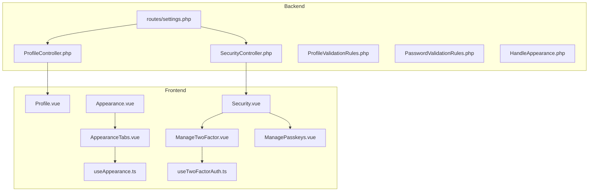
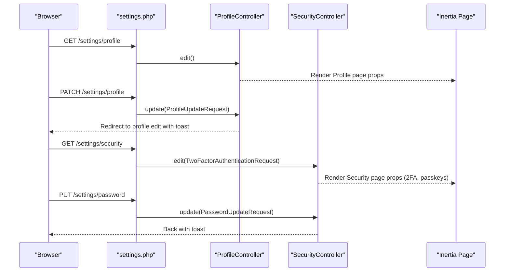
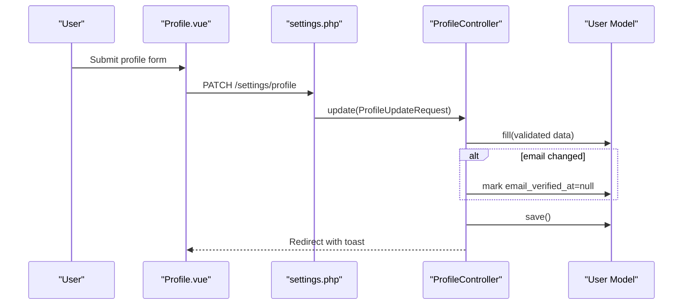
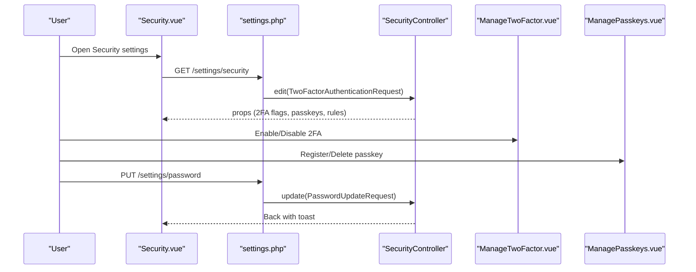
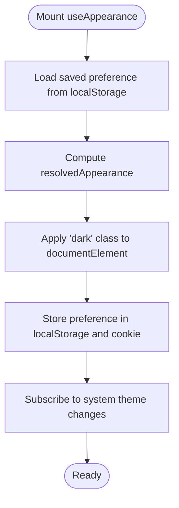
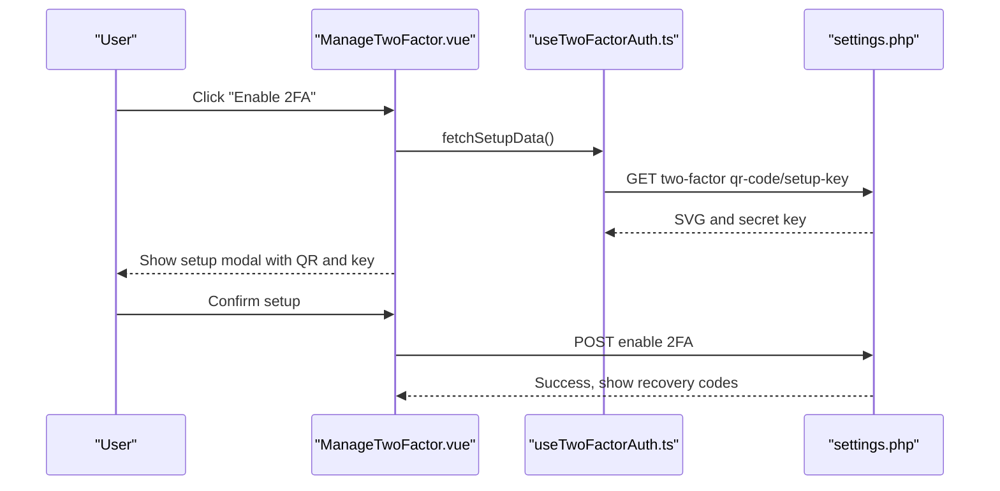
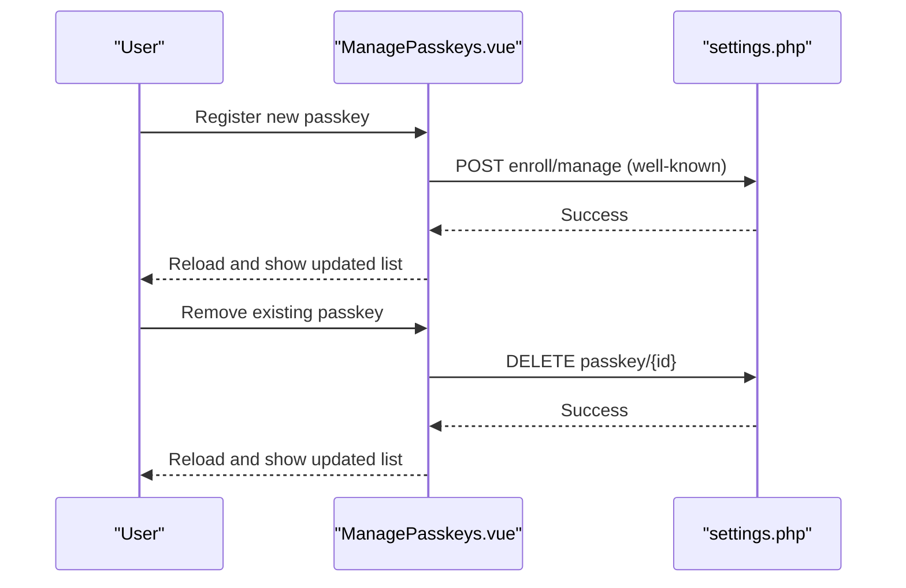
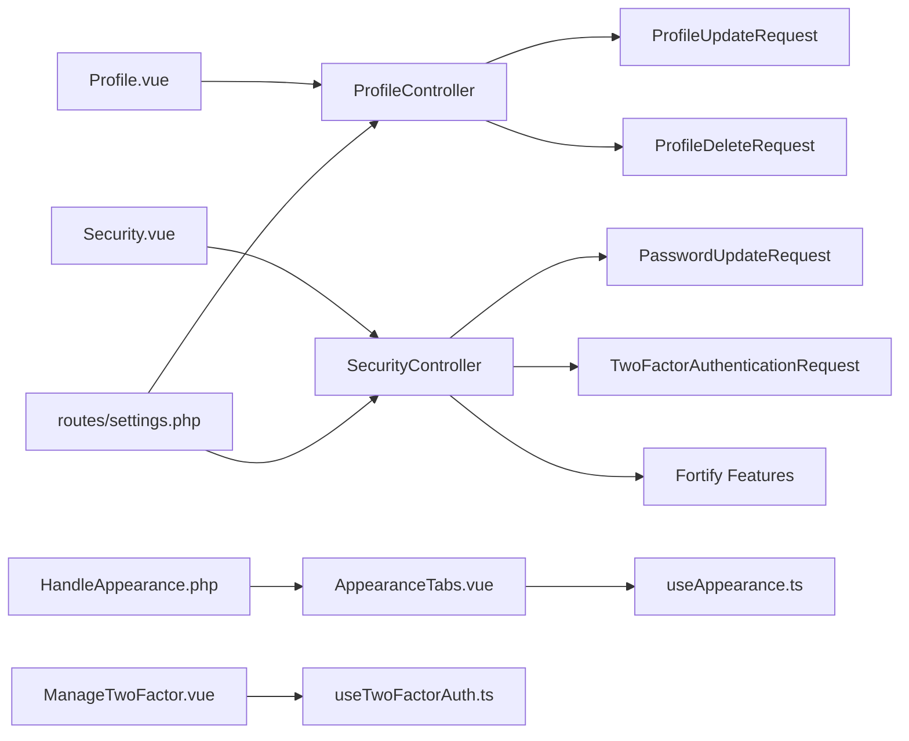

# Settings & Configuration

<cite>
**Referenced Files in This Document**
- [ProfileController.php](file://app/Http/Controllers/Settings/ProfileController.php)
- [SecurityController.php](file://app/Http/Controllers/Settings/SecurityController.php)
- [ProfileUpdateRequest.php](file://app/Http/Requests/Settings/ProfileUpdateRequest.php)
- [ProfileDeleteRequest.php](file://app/Http/Requests/Settings/ProfileDeleteRequest.php)
- [PasswordUpdateRequest.php](file://app/Http/Requests/Settings/PasswordUpdateRequest.php)
- [TwoFactorAuthenticationRequest.php](file://app/Http/Requests/Settings/TwoFactorAuthenticationRequest.php)
- [ProfileValidationRules.php](file://app/Concerns/ProfileValidationRules.php)
- [PasswordValidationRules.php](file://app/Concerns/PasswordValidationRules.php)
- [HandleAppearance.php](file://app/Http/Middleware/HandleAppearance.php)
- [useAppearance.ts](file://resources/js/composables/useAppearance.ts)
- [AppearanceTabs.vue](file://resources/js/components/AppearanceTabs.vue)
- [Profile.vue](file://resources/js/pages/settings/Profile.vue)
- [Security.vue](file://resources/js/pages/settings/Security.vue)
- [Appearance.vue](file://resources/js/pages/settings/Appearance.vue)
- [ManageTwoFactor.vue](file://resources/js/components/ManageTwoFactor.vue)
- [ManagePasskeys.vue](file://resources/js/components/ManagePasskeys.vue)
- [useTwoFactorAuth.ts](file://resources/js/composables/useTwoFactorAuth.ts)
- [settings.php](file://routes/settings.php)
</cite>

## Table of Contents
1. [Introduction](#introduction)
2. [Project Structure](#project-structure)
3. [Core Components](#core-components)
4. [Architecture Overview](#architecture-overview)
5. [Detailed Component Analysis](#detailed-component-analysis)
6. [Dependency Analysis](#dependency-analysis)
7. [Performance Considerations](#performance-considerations)
8. [Troubleshooting Guide](#troubleshooting-guide)
9. [Conclusion](#conclusion)
10. [Appendices](#appendices)

## Introduction
This document explains the user settings and system configuration functionality. It covers:
- Profile updates and deletion
- Security configuration including password changes, two-factor authentication (2FA), and passkey management
- Appearance customization with theme switching and persistent preferences
- Practical workflows, validation patterns, and preference persistence
- Frontend interfaces for settings management

## Project Structure
The settings system spans backend controllers and requests, middleware for SSR appearance, and Vue-based frontend pages and composables.

**Diagram sources**
- [settings.php:1-35](file://routes/settings.php#L1-L35)
- [ProfileController.php:1-63](file://app/Http/Controllers/Settings/ProfileController.php#L1-L63)
- [SecurityController.php:1-67](file://app/Http/Controllers/Settings/SecurityController.php#L1-L67)
- [Profile.vue:1-106](file://resources/js/pages/settings/Profile.vue#L1-L106)
- [Security.vue:1-120](file://resources/js/pages/settings/Security.vue#L1-L120)
- [Appearance.vue:1-33](file://resources/js/pages/settings/Appearance.vue#L1-L33)
- [AppearanceTabs.vue:1-34](file://resources/js/components/AppearanceTabs.vue#L1-L34)
- [ManageTwoFactor.vue:1-94](file://resources/js/components/ManageTwoFactor.vue#L1-L94)
- [ManagePasskeys.vue:1-66](file://resources/js/components/ManagePasskeys.vue#L1-L66)
- [useAppearance.ts:1-125](file://resources/js/composables/useAppearance.ts#L1-L125)
- [useTwoFactorAuth.ts:1-113](file://resources/js/composables/useTwoFactorAuth.ts#L1-L113)
- [HandleAppearance.php:1-24](file://app/Http/Middleware/HandleAppearance.php#L1-L24)

**Section sources**
- [settings.php:1-35](file://routes/settings.php#L1-L35)
- [ProfileController.php:1-63](file://app/Http/Controllers/Settings/ProfileController.php#L1-L63)
- [SecurityController.php:1-67](file://app/Http/Controllers/Settings/SecurityController.php#L1-L67)
- [Profile.vue:1-106](file://resources/js/pages/settings/Profile.vue#L1-L106)
- [Security.vue:1-120](file://resources/js/pages/settings/Security.vue#L1-L120)
- [Appearance.vue:1-33](file://resources/js/pages/settings/Appearance.vue#L1-L33)
- [AppearanceTabs.vue:1-34](file://resources/js/components/AppearanceTabs.vue#L1-L34)
- [ManageTwoFactor.vue:1-94](file://resources/js/components/ManageTwoFactor.vue#L1-L94)
- [ManagePasskeys.vue:1-66](file://resources/js/components/ManagePasskeys.vue#L1-L66)
- [useAppearance.ts:1-125](file://resources/js/composables/useAppearance.ts#L1-L125)
- [useTwoFactorAuth.ts:1-113](file://resources/js/composables/useTwoFactorAuth.ts#L1-L113)
- [HandleAppearance.php:1-24](file://app/Http/Middleware/HandleAppearance.php#L1-L24)

## Core Components
- ProfileController: Renders and updates user profile, handles email verification state, and deletes the user account after logout and session invalidation.
- SecurityController: Renders security settings, exposes passkeys and 2FA metadata, and updates passwords with throttled rate limiting.
- Validation traits and requests: Centralized validation rules for profile updates, password changes, and current password confirmation.
- Appearance system: Composable and UI tab component to switch themes and persist preferences via localStorage and cookies.
- Two-factor and passkey management: Dedicated components and composables to manage 2FA lifecycle and passkey registration/removal.

**Section sources**
- [ProfileController.php:15-62](file://app/Http/Controllers/Settings/ProfileController.php#L15-L62)
- [SecurityController.php:14-66](file://app/Http/Controllers/Settings/SecurityController.php#L14-L66)
- [ProfileUpdateRequest.php:9-22](file://app/Http/Requests/Settings/ProfileUpdateRequest.php#L9-L22)
- [ProfileDeleteRequest.php:9-24](file://app/Http/Requests/Settings/ProfileDeleteRequest.php#L9-L24)
- [PasswordUpdateRequest.php:9-25](file://app/Http/Requests/Settings/PasswordUpdateRequest.php#L9-L25)
- [ProfileValidationRules.php:9-51](file://app/Concerns/ProfileValidationRules.php#L9-L51)
- [PasswordValidationRules.php:8-29](file://app/Concerns/PasswordValidationRules.php#L8-L29)
- [useAppearance.ts:88-124](file://resources/js/composables/useAppearance.ts#L88-L124)
- [AppearanceTabs.vue:1-34](file://resources/js/components/AppearanceTabs.vue#L1-L34)
- [ManageTwoFactor.vue:1-94](file://resources/js/components/ManageTwoFactor.vue#L1-L94)
- [ManagePasskeys.vue:1-66](file://resources/js/components/ManagePasskeys.vue#L1-L66)

## Architecture Overview
The settings architecture follows a layered pattern:
- Routes define entry points and middleware gating (auth, verified, throttle).
- Controllers orchestrate data fetching and rendering for Inertia pages.
- Request classes encapsulate validation rules.
- Frontend pages bind to controller actions and composables for reactive behavior.

**Diagram sources**
- [settings.php:8-27](file://routes/settings.php#L8-L27)
- [ProfileController.php:20-44](file://app/Http/Controllers/Settings/ProfileController.php#L20-L44)
- [SecurityController.php:19-65](file://app/Http/Controllers/Settings/SecurityController.php#L19-L65)
- [ProfileUpdateRequest.php:18-21](file://app/Http/Requests/Settings/ProfileUpdateRequest.php#L18-L21)
- [PasswordUpdateRequest.php:18-24](file://app/Http/Requests/Settings/PasswordUpdateRequest.php#L18-L24)
- [TwoFactorAuthenticationRequest.php:18-21](file://app/Http/Requests/Settings/TwoFactorAuthenticationRequest.php#L18-L21)

## Detailed Component Analysis

### Profile Management
- Controller responsibilities:
  - Edit: passes mustVerifyEmail and status to the profile page.
  - Update: validates and persists profile changes; resets email verification when email changes; flashes a success toast.
  - Destroy: logs out, deletes the user, invalidates session, and redirects home.
- Validation:
  - Name and email rules enforced via ProfileValidationRules trait.
  - Email uniqueness respects the current user ID to avoid self-lock.
- Frontend:
  - Profile page renders a form bound to the controller’s update action, displays verification prompts, and integrates a delete component.

**Diagram sources**
- [Profile.vue:42-101](file://resources/js/pages/settings/Profile.vue#L42-L101)
- [settings.php:11-13](file://routes/settings.php#L11-L13)
- [ProfileController.php:31-44](file://app/Http/Controllers/Settings/ProfileController.php#L31-L44)
- [ProfileUpdateRequest.php:18-21](file://app/Http/Requests/Settings/ProfileUpdateRequest.php#L18-L21)
- [ProfileValidationRules.php:16-22](file://app/Concerns/ProfileValidationRules.php#L16-L22)

**Section sources**
- [ProfileController.php:15-62](file://app/Http/Controllers/Settings/ProfileController.php#L15-L62)
- [ProfileUpdateRequest.php:9-22](file://app/Http/Requests/Settings/ProfileUpdateRequest.php#L9-L22)
- [ProfileDeleteRequest.php:9-24](file://app/Http/Requests/Settings/ProfileDeleteRequest.php#L9-L24)
- [ProfileValidationRules.php:9-51](file://app/Concerns/ProfileValidationRules.php#L9-L51)
- [Profile.vue:1-106](file://resources/js/pages/settings/Profile.vue#L1-L106)

### Security Configuration
- Password updates:
  - Controlled by PasswordUpdateRequest with current password and new password rules.
  - Rate-limited endpoint prevents brute force attempts.
- Two-factor authentication:
  - SecurityController prepares 2FA flags and passkey lists when enabled.
  - Frontend manages enabling/disabling 2FA and displays recovery codes.
- Passkeys:
  - Lists registered passkeys and supports removal and registration.
  - Exposes a well-known endpoint for passkey discovery.

**Diagram sources**
- [Security.vue:1-120](file://resources/js/pages/settings/Security.vue#L1-L120)
- [settings.php:18-27](file://routes/settings.php#L18-L27)
- [SecurityController.php:19-65](file://app/Http/Controllers/Settings/SecurityController.php#L19-L65)
- [ManageTwoFactor.vue:1-94](file://resources/js/components/ManageTwoFactor.vue#L1-L94)
- [ManagePasskeys.vue:1-66](file://resources/js/components/ManagePasskeys.vue#L1-L66)
- [PasswordUpdateRequest.php:18-24](file://app/Http/Requests/Settings/PasswordUpdateRequest.php#L18-L24)

**Section sources**
- [SecurityController.php:14-66](file://app/Http/Controllers/Settings/SecurityController.php#L14-L66)
- [PasswordUpdateRequest.php:9-25](file://app/Http/Requests/Settings/PasswordUpdateRequest.php#L9-L25)
- [TwoFactorAuthenticationRequest.php:9-22](file://app/Http/Requests/Settings/TwoFactorAuthenticationRequest.php#L9-L22)
- [ManageTwoFactor.vue:1-94](file://resources/js/components/ManageTwoFactor.vue#L1-L94)
- [ManagePasskeys.vue:1-66](file://resources/js/components/ManagePasskeys.vue#L1-L66)
- [settings.php:29-34](file://routes/settings.php#L29-L34)

### Appearance Customization
- Composable behavior:
  - Tracks current appearance preference and resolves effective theme.
  - Updates DOM class for dark mode and stores preference in localStorage and a server cookie.
  - Listens to system theme changes and reinitializes on mount.
- UI component:
  - Provides three appearance options: light, dark, and system.
- SSR integration:
  - Middleware shares the stored appearance cookie with the view layer.

**Diagram sources**
- [useAppearance.ts:88-124](file://resources/js/composables/useAppearance.ts#L88-L124)
- [AppearanceTabs.vue:1-34](file://resources/js/components/AppearanceTabs.vue#L1-L34)
- [HandleAppearance.php:17-22](file://app/Http/Middleware/HandleAppearance.php#L17-L22)

**Section sources**
- [useAppearance.ts:1-125](file://resources/js/composables/useAppearance.ts#L1-L125)
- [AppearanceTabs.vue:1-34](file://resources/js/components/AppearanceTabs.vue#L1-L34)
- [HandleAppearance.php:1-24](file://app/Http/Middleware/HandleAppearance.php#L1-L24)
- [Appearance.vue:1-33](file://resources/js/pages/settings/Appearance.vue#L1-L33)

### Two-Factor Authentication Management
- Lifecycle:
  - Fetch QR code and manual setup key via composables.
  - Enable/disable 2FA through dedicated routes.
  - Display and persist recovery codes.
- Frontend:
  - Modal-driven setup flow with success triggers.
  - Clear state on component unmount.

**Diagram sources**
- [ManageTwoFactor.vue:1-94](file://resources/js/components/ManageTwoFactor.vue#L1-L94)
- [useTwoFactorAuth.ts:30-96](file://resources/js/composables/useTwoFactorAuth.ts#L30-L96)
- [settings.php:18-27](file://routes/settings.php#L18-L27)

**Section sources**
- [ManageTwoFactor.vue:1-94](file://resources/js/components/ManageTwoFactor.vue#L1-L94)
- [useTwoFactorAuth.ts:1-113](file://resources/js/composables/useTwoFactorAuth.ts#L1-L113)

### Passkey Administration
- Registration:
  - Triggers a reload upon success to refresh passkey listings.
- Management:
  - Lists passkeys with remove actions and empty-state guidance.
  - Integrates with a passkey enrollment endpoint exposed under a well-known path.

**Diagram sources**
- [ManagePasskeys.vue:1-66](file://resources/js/components/ManagePasskeys.vue#L1-L66)
- [settings.php:29-34](file://routes/settings.php#L29-L34)

**Section sources**
- [ManagePasskeys.vue:1-66](file://resources/js/components/ManagePasskeys.vue#L1-L66)
- [settings.php:29-34](file://routes/settings.php#L29-L34)

## Dependency Analysis
- Controllers depend on:
  - Request classes for validation.
  - Laravel Fortify features for 2FA and passkeys.
- Frontend pages depend on:
  - Inertia bindings to controller actions.
  - Composables for reactive state and network calls.
- Middleware and routes:
  - Enforce authentication, email verification, and rate limits.

**Diagram sources**
- [ProfileController.php:1-63](file://app/Http/Controllers/Settings/ProfileController.php#L1-L63)
- [SecurityController.php:1-67](file://app/Http/Controllers/Settings/SecurityController.php#L1-L67)
- [ProfileUpdateRequest.php:1-23](file://app/Http/Requests/Settings/ProfileUpdateRequest.php#L1-L23)
- [ProfileDeleteRequest.php:1-25](file://app/Http/Requests/Settings/ProfileDeleteRequest.php#L1-L25)
- [PasswordUpdateRequest.php:1-26](file://app/Http/Requests/Settings/PasswordUpdateRequest.php#L1-L26)
- [TwoFactorAuthenticationRequest.php:1-23](file://app/Http/Requests/Settings/TwoFactorAuthenticationRequest.php#L1-L23)
- [Profile.vue:1-106](file://resources/js/pages/settings/Profile.vue#L1-L106)
- [Security.vue:1-120](file://resources/js/pages/settings/Security.vue#L1-L120)
- [AppearanceTabs.vue:1-34](file://resources/js/components/AppearanceTabs.vue#L1-L34)
- [useAppearance.ts:1-125](file://resources/js/composables/useAppearance.ts#L1-L125)
- [ManageTwoFactor.vue:1-94](file://resources/js/components/ManageTwoFactor.vue#L1-L94)
- [useTwoFactorAuth.ts:1-113](file://resources/js/composables/useTwoFactorAuth.ts#L1-L113)
- [settings.php:1-35](file://routes/settings.php#L1-L35)
- [HandleAppearance.php:1-24](file://app/Http/Middleware/HandleAppearance.php#L1-L24)

**Section sources**
- [settings.php:1-35](file://routes/settings.php#L1-L35)
- [ProfileController.php:1-63](file://app/Http/Controllers/Settings/ProfileController.php#L1-L63)
- [SecurityController.php:1-67](file://app/Http/Controllers/Settings/SecurityController.php#L1-L67)
- [ProfileUpdateRequest.php:1-23](file://app/Http/Requests/Settings/ProfileUpdateRequest.php#L1-L23)
- [ProfileDeleteRequest.php:1-25](file://app/Http/Requests/Settings/ProfileDeleteRequest.php#L1-L25)
- [PasswordUpdateRequest.php:1-26](file://app/Http/Requests/Settings/PasswordUpdateRequest.php#L1-L26)
- [TwoFactorAuthenticationRequest.php:1-23](file://app/Http/Requests/Settings/TwoFactorAuthenticationRequest.php#L1-L23)
- [Profile.vue:1-106](file://resources/js/pages/settings/Profile.vue#L1-L106)
- [Security.vue:1-120](file://resources/js/pages/settings/Security.vue#L1-L120)
- [AppearanceTabs.vue:1-34](file://resources/js/components/AppearanceTabs.vue#L1-L34)
- [useAppearance.ts:1-125](file://resources/js/composables/useAppearance.ts#L1-L125)
- [ManageTwoFactor.vue:1-94](file://resources/js/components/ManageTwoFactor.vue#L1-L94)
- [useTwoFactorAuth.ts:1-113](file://resources/js/composables/useTwoFactorAuth.ts#L1-L113)
- [HandleAppearance.php:1-24](file://app/Http/Middleware/HandleAppearance.php#L1-L24)

## Performance Considerations
- Prefer client-side persistence for appearance settings to minimize server round-trips.
- Use throttling on password updates to reduce load and mitigate abuse.
- Lazy-load 2FA setup assets (QR code, secret key) only when enabling 2FA.
- Avoid unnecessary re-renders by leveraging computed refs for resolved appearance.

## Troubleshooting Guide
- Profile update does not reflect email change:
  - Ensure the email field is dirty before saving; changing email resets verification status.
- Email verification prompt not visible:
  - Check mustVerifyEmail prop and session status passed to the profile page.
- Password update fails validation:
  - Confirm current password matches and new password complies with rules.
- Two-factor setup not completing:
  - Verify QR code and secret key retrieval succeeded; check for frontend errors and retry.
- Passkey registration shows no change:
  - Confirm successful enrollment and reload the page to refresh the list.

**Section sources**
- [ProfileController.php:31-44](file://app/Http/Controllers/Settings/ProfileController.php#L31-L44)
- [Profile.vue:76-94](file://resources/js/pages/settings/Profile.vue#L76-L94)
- [PasswordUpdateRequest.php:18-24](file://app/Http/Requests/Settings/PasswordUpdateRequest.php#L18-L24)
- [useTwoFactorAuth.ts:30-96](file://resources/js/composables/useTwoFactorAuth.ts#L30-L96)
- [ManagePasskeys.vue:27-29](file://resources/js/components/ManagePasskeys.vue#L27-L29)

## Conclusion
The settings system combines robust backend validation and controllers with a responsive frontend to deliver a secure and customizable user experience. Profile updates, password changes, 2FA, passkeys, and appearance preferences are integrated cohesively, with clear separation of concerns and strong validation patterns.

## Appendices
- Practical examples:
  - Profile update workflow: submit form → server validates → persist changes → redirect with feedback.
  - Security update workflow: open security page → enter current/new passwords → submit with throttling → success toast.
  - Appearance workflow: choose theme → composable persists and applies theme → SSR reads cookie for initial render.
- Validation patterns:
  - Centralized rules via traits ensure consistency across requests.
  - Email uniqueness respects the current user ID to prevent conflicts.
- Preference persistence:
  - Appearance preferences stored in localStorage and a server cookie for SSR compatibility.