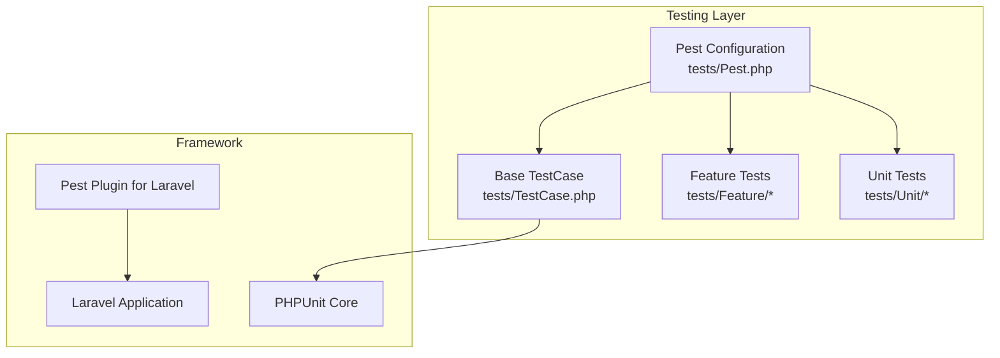
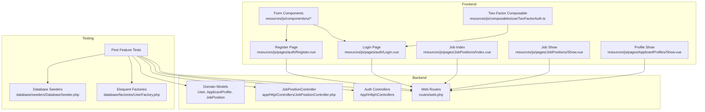
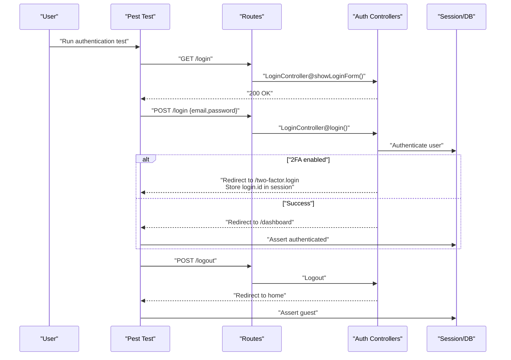
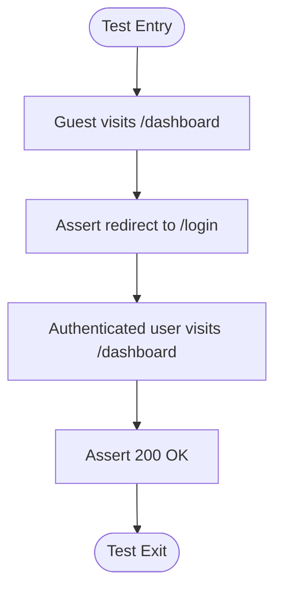
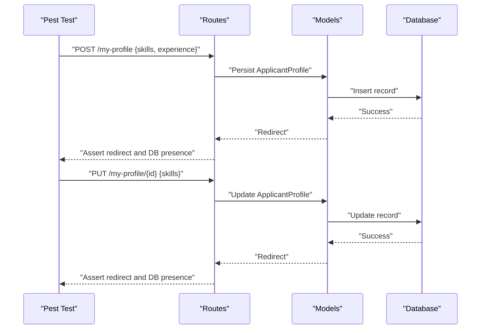
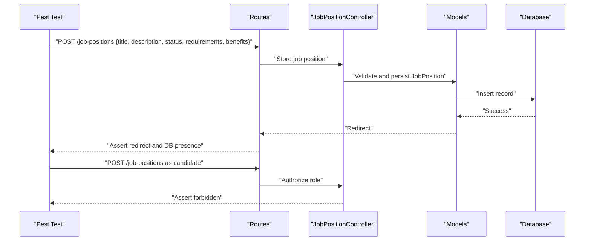
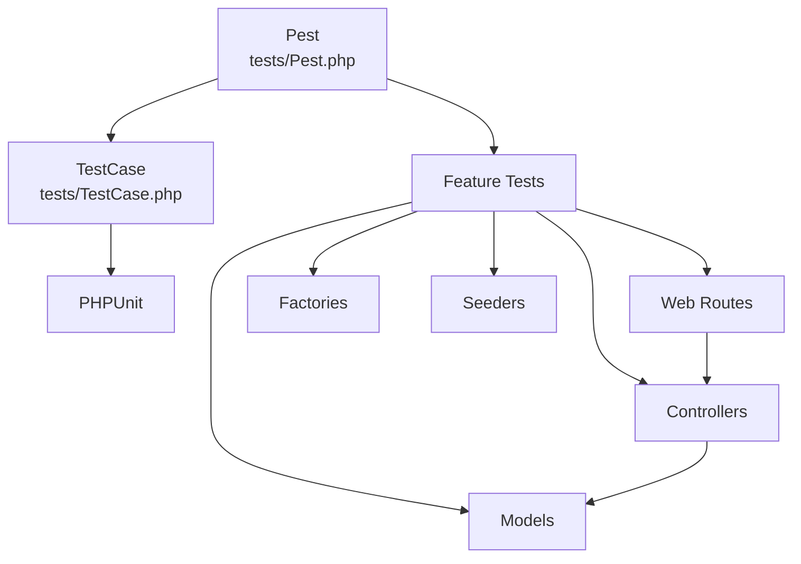

# Testing Strategy

<cite>
**Referenced Files in This Document**
- [tests/Pest.php](file://tests/Pest.php)
- [tests/TestCase.php](file://tests/TestCase.php)
- [tests/Feature/Auth/AuthenticationTest.php](file://tests/Feature/Auth/AuthenticationTest.php)
- [tests/Feature/DashboardTest.php](file://tests/Feature/DashboardTest.php)
- [tests/Feature/ApplicantProfileTest.php](file://tests/Feature/ApplicantProfileTest.php)
- [tests/Feature/JobPositionTest.php](file://tests/Feature/JobPositionTest.php)
- [composer.json](file://composer.json)
- [phpunit.xml](file://phpunit.xml)
- [database/factories/UserFactory.php](file://database/factories/UserFactory.php)
- [database/seeders/DatabaseSeeder.php](file://database/seeders/DatabaseSeeder.php)
- [routes/web.php](file://routes/web.php)
- [app/Http/Controllers/JobPositionController.php](file://app/Http/Controllers/JobPositionController.php)
- [app/Models/User.php](file://app/Models/User.php)
- [app/Models/ApplicantProfile.php](file://app/Models/ApplicantProfile.php)
- [app/Models/JobPosition.php](file://app/Models/JobPosition.php)
- [resources/js/pages/auth/Login.vue](file://resources/js/pages/auth/Login.vue)
- [resources/js/pages/auth/Register.vue](file://resources/js/pages/auth/Register.vue)
- [resources/js/pages/JobPositions/Index.vue](file://resources/js/pages/JobPositions/Index.vue)
- [resources/js/pages/JobPositions/Show.vue](file://resources/js/pages/JobPositions/Show.vue)
- [resources/js/pages/ApplicantProfiles/Show.vue](file://resources/js/pages/ApplicantProfiles/Show.vue)
- [resources/js/components/ui/button/Button.vue](file://resources/js/components/ui/button/Button.vue)
- [resources/js/components/ui/input/Input.vue](file://resources/js/components/ui/input/Input.vue)
- [resources/js/composables/useTwoFactorAuth.ts](file://resources/js/composables/useTwoFactorAuth.ts)
</cite>

## Table of Contents
1. [Introduction](#introduction)
2. [Project Structure](#project-structure)
3. [Core Components](#core-components)
4. [Architecture Overview](#architecture-overview)
5. [Detailed Component Analysis](#detailed-component-analysis)
6. [Dependency Analysis](#dependency-analysis)
7. [Performance Considerations](#performance-considerations)
8. [Troubleshooting Guide](#troubleshooting-guide)
9. [Conclusion](#conclusion)
10. [Appendices](#appendices)

## Introduction
This document describes the testing strategy for SmartRecruit ATS, focusing on Pest PHP-based tests. It covers feature tests, unit tests, test organization patterns, authentication flows, job management operations, and application workflows. It also documents test case structure, factory usage, database seeding, continuous integration readiness, and best practices for maintainable tests.

## Project Structure
The testing setup leverages Pest for expressive PHP tests and Laravel's testing infrastructure. Tests are organized under:
- tests/Feature: End-to-end and integration tests for application workflows
- tests/Unit: Isolated unit tests for individual classes or functions
- tests/Pest.php: Global Pest configuration extending Laravel's TestCase and enabling database refresh
- tests/TestCase.php: Shared helpers, including Fortify feature gating

Key configuration:
- phpunit.xml defines test suites and environment overrides for fast, isolated testing
- composer.json includes Pest and Laravel plugin for Pest, enabling seamless Laravel integration

**Diagram sources**
- [tests/Pest.php:17-19](file://tests/Pest.php#L17-L19)
- [tests/TestCase.php:8-16](file://tests/TestCase.php#L8-L16)
- [phpunit.xml:7-14](file://phpunit.xml#L7-L14)
- [composer.json:30-31](file://composer.json#L30-L31)

**Section sources**
- [tests/Pest.php:17-19](file://tests/Pest.php#L17-L19)
- [tests/TestCase.php:8-16](file://tests/TestCase.php#L8-L16)
- [phpunit.xml:7-14](file://phpunit.xml#L7-L14)
- [composer.json:30-31](file://composer.json#L30-L31)

## Core Components
- Pest configuration extends the base Laravel test case and enables database refresh per test suite, ensuring isolation and deterministic state.
- Global expectations and helper functions can be registered in Pest for reuse across tests.
- Feature tests exercise real routes and controllers, validating authentication, authorization, and domain-specific workflows.
- Factories and seeders provide realistic, controlled test data.

Key implementation references:
- Pest extension and RefreshDatabase trait binding
- TestCase helper for skipping tests when Fortify features are disabled
- Feature tests for authentication, dashboard access, applicant profiles, and job positions

**Section sources**
- [tests/Pest.php:17-19](file://tests/Pest.php#L17-L19)
- [tests/TestCase.php:10-15](file://tests/TestCase.php#L10-L15)
- [tests/Feature/Auth/AuthenticationTest.php:1-77](file://tests/Feature/Auth/AuthenticationTest.php#L1-L77)
- [tests/Feature/DashboardTest.php:1-16](file://tests/Feature/DashboardTest.php#L1-L16)
- [tests/Feature/ApplicantProfileTest.php:1-33](file://tests/Feature/ApplicantProfileTest.php#L1-L33)
- [tests/Feature/JobPositionTest.php:1-35](file://tests/Feature/JobPositionTest.php#L1-L35)

## Architecture Overview
The testing architecture aligns with Laravel’s MVC and Inertia stack:
- Backend routes and controllers handle authentication and job/profile operations
- Frontend Vue components render forms and UI states
- Pest tests simulate user actions against routes and verify backend responses and database changes

**Diagram sources**
- [routes/web.php](file://routes/web.php)
- [app/Http/Controllers/JobPositionController.php](file://app/Http/Controllers/JobPositionController.php)
- [app/Models/User.php](file://app/Models/User.php)
- [app/Models/ApplicantProfile.php](file://app/Models/ApplicantProfile.php)
- [app/Models/JobPosition.php](file://app/Models/JobPosition.php)
- [resources/js/pages/auth/Login.vue](file://resources/js/pages/auth/Login.vue)
- [resources/js/pages/auth/Register.vue](file://resources/js/pages/auth/Register.vue)
- [resources/js/pages/JobPositions/Index.vue](file://resources/js/pages/JobPositions/Index.vue)
- [resources/js/pages/JobPositions/Show.vue](file://resources/js/pages/JobPositions/Show.vue)
- [resources/js/pages/ApplicantProfiles/Show.vue](file://resources/js/pages/ApplicantProfiles/Show.vue)
- [resources/js/components/ui/button/Button.vue](file://resources/js/components/ui/button/Button.vue)
- [resources/js/components/ui/input/Input.vue](file://resources/js/components/ui/input/Input.vue)
- [resources/js/composables/useTwoFactorAuth.ts](file://resources/js/composables/useTwoFactorAuth.ts)
- [tests/Feature/Auth/AuthenticationTest.php](file://tests/Feature/Auth/AuthenticationTest.php)
- [tests/Feature/JobPositionTest.php](file://tests/Feature/JobPositionTest.php)
- [tests/Feature/ApplicantProfileTest.php](file://tests/Feature/ApplicantProfileTest.php)
- [database/factories/UserFactory.php](file://database/factories/UserFactory.php)
- [database/seeders/DatabaseSeeder.php](file://database/seeders/DatabaseSeeder.php)

## Detailed Component Analysis

### Pest Configuration and Test Organization
- Pest extends the base Laravel TestCase and applies RefreshDatabase to each Feature test, ensuring a clean database state per test.
- Global expectation extensions and helper functions can be registered centrally for reuse.
- phpunit.xml defines test suites and environment variables optimized for speed and isolation (SQLite in-memory database).

Recommended practices:
- Keep Feature tests focused on user journeys; use Unit tests for pure logic verification.
- Prefer Pest’s expressive syntax for readability while maintaining precise assertions.

**Section sources**
- [tests/Pest.php:17-19](file://tests/Pest.php#L17-L19)
- [phpunit.xml:7-14](file://phpunit.xml#L7-L14)
- [phpunit.xml:20-35](file://phpunit.xml#L20-L35)

### Authentication Strategy
Authentication tests validate:
- Rendering of login and registration pages
- Successful login and redirection to dashboard
- Two-factor authentication redirect and session persistence
- Invalid credentials and rate limiting behavior
- Logout and guest redirection

**Diagram sources**
- [tests/Feature/Auth/AuthenticationTest.php:7-43](file://tests/Feature/Auth/AuthenticationTest.php#L7-L43)
- [tests/Feature/Auth/AuthenticationTest.php:56-64](file://tests/Feature/Auth/AuthenticationTest.php#L56-L64)
- [routes/web.php](file://routes/web.php)

**Section sources**
- [tests/Feature/Auth/AuthenticationTest.php:1-77](file://tests/Feature/Auth/AuthenticationTest.php#L1-L77)
- [tests/TestCase.php:10-15](file://tests/TestCase.php#L10-L15)

### Dashboard Access Control
- Guest attempts to access the dashboard are redirected to the login page.
- Authenticated users can access the dashboard successfully.

**Diagram sources**
- [tests/Feature/DashboardTest.php:5-16](file://tests/Feature/DashboardTest.php#L5-L16)

**Section sources**
- [tests/Feature/DashboardTest.php:1-16](file://tests/Feature/DashboardTest.php#L1-L16)

### Applicant Profile Management
- Candidate users can create and update their profiles via dedicated endpoints.
- Assertions verify redirects and database persistence.

**Diagram sources**
- [tests/Feature/ApplicantProfileTest.php:6-32](file://tests/Feature/ApplicantProfileTest.php#L6-L32)
- [app/Models/ApplicantProfile.php](file://app/Models/ApplicantProfile.php)

**Section sources**
- [tests/Feature/ApplicantProfileTest.php:1-33](file://tests/Feature/ApplicantProfileTest.php#L1-L33)

### Job Position Management
- HRD users can create job positions with title, description, status, requirements, and benefits.
- Non-HRD users receive forbidden responses when attempting creation.

**Diagram sources**
- [tests/Feature/JobPositionTest.php:6-34](file://tests/Feature/JobPositionTest.php#L6-L34)
- [app/Http/Controllers/JobPositionController.php](file://app/Http/Controllers/JobPositionController.php)
- [app/Models/JobPosition.php](file://app/Models/JobPosition.php)

**Section sources**
- [tests/Feature/JobPositionTest.php:1-35](file://tests/Feature/JobPositionTest.php#L1-L35)

### Test Case Structure and Assertion Patterns
- Feature tests use Pest’s test() and it() blocks for readability.
- Assertions include response status checks, redirects, and database assertions.
- Use actingAs() to simulate authenticated users and assert session state.

Common assertion patterns:
- Response assertions: assertOk(), assertRedirect(), assertForbidden(), assertTooManyRequests()
- Authentication assertions: assertAuthenticated(), assertGuest()
- Database assertions: assertDatabaseHas()

**Section sources**
- [tests/Feature/Auth/AuthenticationTest.php:13-23](file://tests/Feature/Auth/AuthenticationTest.php#L13-L23)
- [tests/Feature/DashboardTest.php:10-16](file://tests/Feature/DashboardTest.php#L10-L16)
- [tests/Feature/ApplicantProfileTest.php:14-17](file://tests/Feature/ApplicantProfileTest.php#L14-L17)
- [tests/Feature/JobPositionTest.php:17-21](file://tests/Feature/JobPositionTest.php#L17-L21)

### Factory Usage and Database Seeding
- Eloquent Factories generate realistic user records with default attributes and optional two-factor configurations.
- Seeders create initial data for deterministic testing environments.

Factory highlights:
- Default user state includes hashed passwords and verified emails
- withTwoFactor() sets up two-factor fields for 2FA tests

**Section sources**
- [database/factories/UserFactory.php:25-37](file://database/factories/UserFactory.php#L25-L37)
- [database/factories/UserFactory.php:52-59](file://database/factories/UserFactory.php#L52-L59)
- [database/seeders/DatabaseSeeder.php:16-24](file://database/seeders/DatabaseSeeder.php#L16-L24)

### Continuous Integration and Automation
- composer scripts orchestrate linting, type checking, and test execution.
- The project is configured for CI-friendly commands via npm and Artisan test commands.
- phpunit.xml sets environment variables for SQLite in-memory database and disables external services during tests.

Recommended CI steps:
- Install dependencies
- Run linting and type checks
- Execute tests via Artisan test command
- Collect coverage (configure coverage tooling as needed)

**Section sources**
- [composer.json:45-79](file://composer.json#L45-L79)
- [phpunit.xml:20-35](file://phpunit.xml#L20-L35)

### Best Practices and Guidelines
- Write small, focused tests that verify one behavior per test
- Use factories for realistic data and seeders for initial fixtures
- Prefer Pest’s expressive syntax for readability
- Mock external services only when necessary; favor integration tests for critical flows
- Keep assertions explicit and close to the action being tested
- Use database refresh to avoid cross-test contamination

[No sources needed since this section provides general guidance]

### Debugging Test Failures
- Enable verbose output and environment variables for clearer failure diagnostics
- Inspect database state after failing tests using tinker or database viewers
- Temporarily add logging around controller actions to trace request flow
- Verify route names and middleware assignments when redirects behave unexpectedly

**Section sources**
- [phpunit.xml:20-35](file://phpunit.xml#L20-L35)

## Dependency Analysis
Testing dependencies and relationships:
- Pest depends on Laravel’s TestCase and the Laravel Pest plugin
- Feature tests depend on routes, controllers, models, and factories
- Frontend components interact with backend through Inertia and routes

**Diagram sources**
- [tests/Pest.php:17-19](file://tests/Pest.php#L17-L19)
- [tests/TestCase.php:8-16](file://tests/TestCase.php#L8-L16)
- [routes/web.php](file://routes/web.php)
- [app/Http/Controllers/JobPositionController.php](file://app/Http/Controllers/JobPositionController.php)
- [app/Models/User.php](file://app/Models/User.php)
- [database/factories/UserFactory.php](file://database/factories/UserFactory.php)
- [database/seeders/DatabaseSeeder.php](file://database/seeders/DatabaseSeeder.php)

**Section sources**
- [tests/Pest.php:17-19](file://tests/Pest.php#L17-L19)
- [composer.json:30-31](file://composer.json#L30-L31)

## Performance Considerations
- Use SQLite in-memory database for fast test runs
- Minimize external service calls; stub or fake when appropriate
- Keep test suites parallelizable by avoiding shared mutable state
- Prefer targeted factories and minimal dataset generation

[No sources needed since this section provides general guidance]

## Troubleshooting Guide
Common issues and resolutions:
- Tests fail due to missing database connection: verify DB env variables in phpunit.xml
- Authentication tests inconsistent: ensure RefreshDatabase is applied and rate limiter resets
- Two-factor tests skipped: confirm Fortify feature flags and proper setup

**Section sources**
- [phpunit.xml:20-35](file://phpunit.xml#L20-L35)
- [tests/TestCase.php:10-15](file://tests/TestCase.php#L10-L15)
- [tests/Feature/Auth/AuthenticationTest.php:25-43](file://tests/Feature/Auth/AuthenticationTest.php#L25-L43)

## Conclusion
SmartRecruit ATS employs Pest for expressive, Laravel-integrated tests. The strategy emphasizes Feature tests for end-to-end workflows, robust factory usage for test data, and clear assertion patterns. With SQLite-backed test databases and CI-ready scripts, the project supports reliable, maintainable testing practices across authentication, job management, and application workflows.

[No sources needed since this section summarizes without analyzing specific files]

## Appendices

### Practical Examples Index
- Authentication scenarios: login, logout, two-factor challenge, rate limiting
  - [tests/Feature/Auth/AuthenticationTest.php](file://tests/Feature/Auth/AuthenticationTest.php)
- Form submissions: applicant profile creation and updates
  - [tests/Feature/ApplicantProfileTest.php](file://tests/Feature/ApplicantProfileTest.php)
- API endpoints and backend interactions: job position creation and authorization checks
  - [tests/Feature/JobPositionTest.php](file://tests/Feature/JobPositionTest.php)
- Frontend interactions: form components and UI elements
  - [resources/js/components/ui/button/Button.vue](file://resources/js/components/ui/button/Button.vue)
  - [resources/js/components/ui/input/Input.vue](file://resources/js/components/ui/input/Input.vue)
  - [resources/js/pages/auth/Login.vue](file://resources/js/pages/auth/Login.vue)
  - [resources/js/pages/auth/Register.vue](file://resources/js/pages/auth/Register.vue)
  - [resources/js/pages/JobPositions/Index.vue](file://resources/js/pages/JobPositions/Index.vue)
  - [resources/js/pages/JobPositions/Show.vue](file://resources/js/pages/JobPositions/Show.vue)
  - [resources/js/pages/ApplicantProfiles/Show.vue](file://resources/js/pages/ApplicantProfiles/Show.vue)
  - [resources/js/composables/useTwoFactorAuth.ts](file://resources/js/composables/useTwoFactorAuth.ts)

### Test Coverage Goals
- Target high coverage for critical paths: authentication, profile management, job operations
- Maintain readable tests with clear assertions and minimal duplication
- Use factories and seeders to keep tests fast and deterministic

[No sources needed since this section provides general guidance]