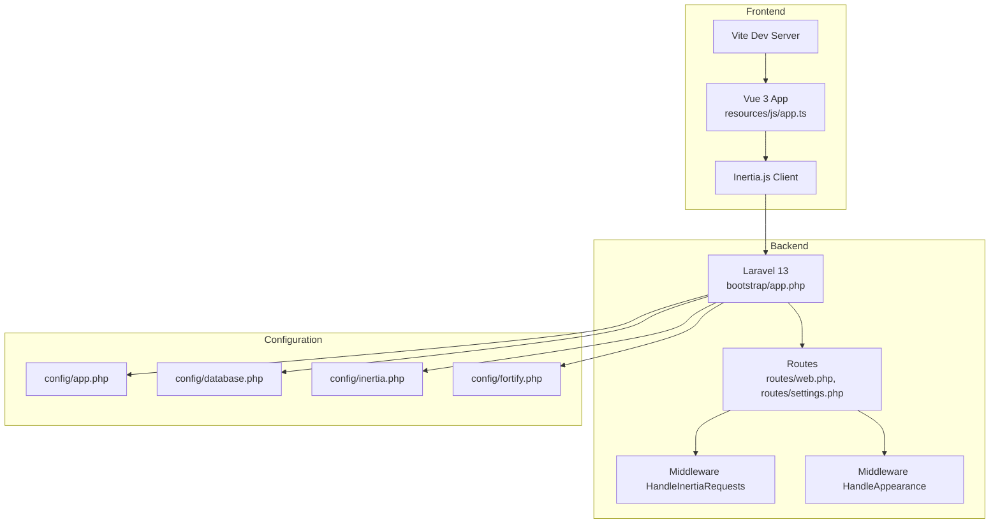
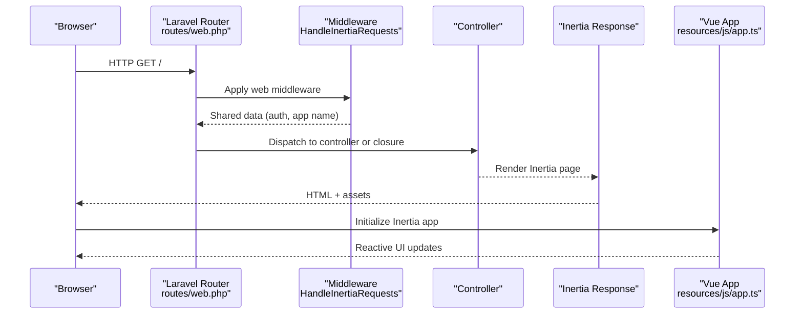
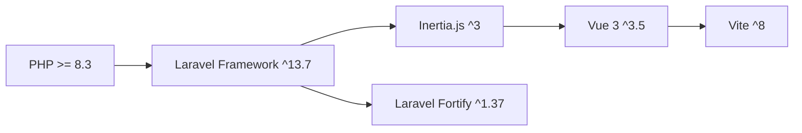

# Troubleshooting & FAQ

<cite>
**Referenced Files in This Document**
- [composer.json](file://composer.json)
- [package.json](file://package.json)
- [config/app.php](file://config/app.php)
- [config/database.php](file://config/database.php)
- [config/inertia.php](file://config/inertia.php)
- [config/fortify.php](file://config/fortify.php)
- [bootstrap/app.php](file://bootstrap/app.php)
- [app/Http/Middleware/HandleInertiaRequests.php](file://app/Http/Middleware/HandleInertiaRequests.php)
- [app/Http/Middleware/HandleAppearance.php](file://app/Http/Middleware/HandleAppearance.php)
- [resources/js/app.ts](file://resources/js/app.ts)
- [routes/web.php](file://routes/web.php)
- [routes/settings.php](file://routes/settings.php)
- [app/Models/User.php](file://app/Models/User.php)
- [app/Models/ApplicantProfile.php](file://app/Models/ApplicantProfile.php)
- [app/Http/Controllers/Controller.php](file://app/Http/Controllers/Controller.php)
- [app/Http/Controllers/Settings/ProfileController.php](file://app/Http/Controllers/Settings/ProfileController.php)
- [app/Http/Controllers/Settings/SecurityController.php](file://app/Http/Controllers/Settings/SecurityController.php)
- [app/Http/Controllers/ApplicantProfileController.php](file://app/Http/Controllers/ApplicantProfileController.php)
- [app/Http/Controllers/JobPositionController.php](file://app/Http/Controllers/JobPositionController.php)
- [storage/logs](file://storage/logs)
- [public](file://public)
</cite>

## Table of Contents
1. [Introduction](#introduction)
2. [Project Structure](#project-structure)
3. [Core Components](#core-components)
4. [Architecture Overview](#architecture-overview)
5. [Detailed Component Analysis](#detailed-component-analysis)
6. [Dependency Analysis](#dependency-analysis)
7. [Performance Considerations](#performance-considerations)
8. [Troubleshooting Guide](#troubleshooting-guide)
9. [Conclusion](#conclusion)
10. [Appendices](#appendices)

## Introduction
This document provides comprehensive troubleshooting and Frequently Asked Questions for SmartRecruit ATS. It focuses on resolving installation issues (PHP and Node.js compatibility, database connectivity), runtime problems (authentication, uploads, performance), and debugging techniques for Laravel backend, Vue.js frontend, and Inertia.js integration. It also covers environment-specific pitfalls, deployment failures, configuration errors, performance optimization, memory monitoring, scalability, security, data migration, upgrades, and escalation paths.

## Project Structure
SmartRecruit ATS is a Laravel 13 application with Vue 3 and Inertia.js. The backend runs on PHP 8.3+ with Laravel’s modern bootstrapping, while the frontend uses Vite for development and builds. Configuration is centralized via Laravel config files, with Inertia SSR enabled and Fortify providing authentication features.

**Diagram sources**
- [bootstrap/app.php:11-31](file://bootstrap/app.php#L11-L31)
- [routes/web.php:1-32](file://routes/web.php#L1-L32)
- [routes/settings.php:1-35](file://routes/settings.php#L1-L35)
- [config/app.php:1-127](file://config/app.php#L1-L127)
- [config/database.php:1-185](file://config/database.php#L1-L185)
- [config/inertia.php:1-71](file://config/inertia.php#L1-L71)
- [config/fortify.php:1-178](file://config/fortify.php#L1-L178)
- [app/Http/Middleware/HandleInertiaRequests.php:1-48](file://app/Http/Middleware/HandleInertiaRequests.php#L1-L48)
- [app/Http/Middleware/HandleAppearance.php:1-24](file://app/Http/Middleware/HandleAppearance.php#L1-L24)
- [resources/js/app.ts:1-34](file://resources/js/app.ts#L1-L34)

**Section sources**
- [bootstrap/app.php:11-31](file://bootstrap/app.php#L11-L31)
- [routes/web.php:1-32](file://routes/web.php#L1-L32)
- [routes/settings.php:1-35](file://routes/settings.php#L1-L35)
- [config/app.php:1-127](file://config/app.php#L1-L127)
- [config/database.php:1-185](file://config/database.php#L1-L185)
- [config/inertia.php:1-71](file://config/inertia.php#L1-L71)
- [config/fortify.php:1-178](file://config/fortify.php#L1-L178)
- [app/Http/Middleware/HandleInertiaRequests.php:1-48](file://app/Http/Middleware/HandleInertiaRequests.php#L1-L48)
- [app/Http/Middleware/HandleAppearance.php:1-24](file://app/Http/Middleware/HandleAppearance.php#L1-L24)
- [resources/js/app.ts:1-34](file://resources/js/app.ts#L1-L34)

## Core Components
- Laravel 13 application with modern bootstrapping and routing.
- Inertia.js integration for seamless SPA-like UX with server-driven data.
- Vue 3 frontend with Vite for development and production builds.
- Fortify for authentication (passwords, two-factor, passkeys).
- SQLite as default database; MySQL/MariaDB/PostgreSQL/SQLServer supported.
- SSR enabled for Inertia pages.

Key configuration highlights:
- PHP requirement: ^8.3
- Node.js toolchain via npm scripts and Vite
- Inertia SSR endpoint configured
- Fortify features enabled (registration, password reset, email verification, 2FA, passkeys)
- Default database connection is SQLite unless overridden

**Section sources**
- [composer.json:11-19](file://composer.json#L11-L19)
- [package.json:1-62](file://package.json#L1-L62)
- [config/inertia.php:18-23](file://config/inertia.php#L18-L23)
- [config/fortify.php:163-175](file://config/fortify.php#L163-L175)
- [config/database.php:20](file://config/database.php#L20)

## Architecture Overview
The application follows a classic MVC pattern with Inertia bridging the backend and frontend. Requests flow through Laravel routes, apply middleware, and render Inertia responses that hydrate Vue components on the client.

**Diagram sources**
- [routes/web.php:9-29](file://routes/web.php#L9-L29)
- [app/Http/Middleware/HandleInertiaRequests.php:36-46](file://app/Http/Middleware/HandleInertiaRequests.php#L36-L46)
- [resources/js/app.ts:10-27](file://resources/js/app.ts#L10-L27)

**Section sources**
- [routes/web.php:9-29](file://routes/web.php#L9-L29)
- [app/Http/Middleware/HandleInertiaRequests.php:36-46](file://app/Http/Middleware/HandleInertiaRequests.php#L36-L46)
- [resources/js/app.ts:10-27](file://resources/js/app.ts#L10-L27)

## Detailed Component Analysis

### Authentication and Authorization (Fortify)
Fortify manages registration, password resets, email verification, two-factor authentication, and passkeys. It integrates with Laravel’s authentication guards and applies rate limits.

Common issues:
- Incorrect home path after login/reset
- Passkey origin mismatch
- Two-factor confirmation required
- Throttling on password updates

Resolution steps:
- Verify home path and middleware chain
- Ensure relying party ID and allowed origins match APP_URL
- Confirm rate limit configuration and IP/email combinations
- Check session and cookie settings for persistence

**Section sources**
- [config/fortify.php:76](file://config/fortify.php#L76)
- [config/fortify.php:145-150](file://config/fortify.php#L145-L150)
- [config/fortify.php:117-121](file://config/fortify.php#L117-L121)
- [routes/settings.php:22-24](file://routes/settings.php#L22-L24)

### Inertia.js Integration
Inertia bridges Laravel and Vue, sharing data via the HandleInertiaRequests middleware and initializing layouts in resources/js/app.ts.

Common issues:
- SSR not reachable
- Asset version mismatches
- Layout resolution failures
- Progress bar color not applied

Resolution steps:
- Confirm SSR URL is reachable
- Clear caches and rebuild assets
- Verify page component paths and extensions
- Ensure layout selection logic matches component names

**Section sources**
- [config/inertia.php:18-23](file://config/inertia.php#L18-L23)
- [config/inertia.php:36-51](file://config/inertia.php#L36-L51)
- [app/Http/Middleware/HandleInertiaRequests.php:17](file://app/Http/Middleware/HandleInertiaRequests.php#L17)
- [resources/js/app.ts:10-27](file://resources/js/app.ts#L10-L27)

### Database Connectivity
Default connection is SQLite unless environment variables override it. The configuration supports sqlite, mysql, mariadb, pgsql, and sqlsrv.

Common issues:
- Wrong credentials or host/port
- Missing PDO extensions
- Foreign key constraints or journal mode defaults
- SSL/TLS configuration for MySQL/MariaDB

Resolution steps:
- Validate DB_CONNECTION and related variables
- Enable required PDO extensions
- Adjust sqlite journal_mode or busy_timeout if needed
- Configure SSL CA for MySQL/MariaDB when required

**Section sources**
- [config/database.php:20](file://config/database.php#L20)
- [config/database.php:35-45](file://config/database.php#L35-L45)
- [config/database.php:47-85](file://config/database.php#L47-L85)
- [config/database.php:87-100](file://config/database.php#L87-L100)
- [config/database.php:102-115](file://config/database.php#L102-L115)

### Frontend Build and Assets (Vite)
Development and production builds are orchestrated via npm scripts. Ensure Node.js and npm are installed and compatible with the project.

Common issues:
- Node/npm version mismatch
- Missing dependencies after clone
- Build failures due to TypeScript/Vue type checks
- Port conflicts with Vite

Resolution steps:
- Install Node.js matching project toolchain
- Run npm install and build
- Fix TypeScript/Vue type errors
- Change Vite port if needed

**Section sources**
- [package.json:5-14](file://package.json#L5-L14)
- [package.json:36-61](file://package.json#L36-L61)
- [composer.json:45-57](file://composer.json#L45-L57)

### Controllers and Routes
Routes define the application surface, with authentication and verification middleware applied to protected areas. Controllers orchestrate data retrieval and responses.

Common issues:
- Missing auth middleware
- Resource route method mismatches
- Redirect loops after logout/verification
- Settings routes requiring password confirmation

Resolution steps:
- Verify middleware order and presence
- Align HTTP verbs with resource actions
- Check redirect targets and password confirmation middleware
- Confirm controller method signatures and validation rules

**Section sources**
- [routes/web.php:18-29](file://routes/web.php#L18-L29)
- [routes/settings.php:8-27](file://routes/settings.php#L8-L27)
- [app/Http/Controllers/Controller.php:1-9](file://app/Http/Controllers/Controller.php#L1-L9)

### Models and Eloquent
Models define fillable attributes, casts, and relationships. Ensure migrations are up-to-date and relationships are correctly defined.

Common issues:
- Missing fillable attributes leading to mass assignment errors
- Casting mismatches causing serialization issues
- Relationship method naming inconsistencies

Resolution steps:
- Review fillable arrays and casts
- Verify foreign keys and relationship definitions
- Run migrations and check schema alignment

**Section sources**
- [app/Models/User.php:30-61](file://app/Models/User.php#L30-L61)
- [app/Models/ApplicantProfile.php:12-40](file://app/Models/ApplicantProfile.php#L12-L40)

## Dependency Analysis
The application relies on Laravel 13, Inertia.js, Vue 3, and Fortify. Composer and npm scripts coordinate installation, setup, and development tasks.

**Diagram sources**
- [composer.json:11-19](file://composer.json#L11-L19)
- [package.json:36-61](file://package.json#L36-L61)

**Section sources**
- [composer.json:11-19](file://composer.json#L11-L19)
- [package.json:36-61](file://package.json#L36-L61)

## Performance Considerations
- Use production-ready queues and workers for background jobs.
- Enable Redis for caching and sessions if scaling.
- Monitor database queries and optimize slow migrations or joins.
- Minimize shared Inertia payload sizes; avoid heavy initial props.
- Leverage browser caching and asset hashing.
- Keep PHP and Node.js versions aligned with project constraints.

[No sources needed since this section provides general guidance]

## Troubleshooting Guide

### Installation Issues

- PHP Version Conflicts
  - Symptom: Composer fails with PHP version requirement errors.
  - Resolution: Ensure PHP ^8.3 is installed and selected by Composer.
  - Related configuration: [composer.json:12](file://composer.json#L12)

- Node.js Compatibility Problems
  - Symptom: npm install or build scripts fail.
  - Resolution: Install Node.js matching project toolchain; re-run npm install and build.
  - Related configuration: [package.json:5-14](file://package.json#L5-L14), [package.json:36-61](file://package.json#L36-L61)

- Database Connection Errors
  - Symptom: SQLSTATE errors or inability to connect.
  - Resolution: Verify DB_CONNECTION and credentials; enable required PDO extensions; adjust sqlite or MySQL settings as needed.
  - Related configuration: [config/database.php:20](file://config/database.php#L20), [config/database.php:35-45](file://config/database.php#L35-L45), [config/database.php:47-85](file://config/database.php#L47-L85)

### Runtime Issues

- Authentication Failures
  - Symptom: Login, password reset, or 2FA challenges failing.
  - Resolution: Check Fortify home path, rate limits, passkey origins, and session cookies.
  - Related configuration: [config/fortify.php:76](file://config/fortify.php#L76), [config/fortify.php:117-121](file://config/fortify.php#L117-L121), [config/fortify.php:145-150](file://config/fortify.php#L145-L150)

- File Upload Problems
  - Symptom: Resume uploads or profile picture not saved.
  - Resolution: Confirm storage permissions, public symlink, and filesystem configuration; validate controller store/update logic.
  - Related files: [routes/web.php:26-28](file://routes/web.php#L26-L28), [app/Http/Controllers/ApplicantProfileController.php](file://app/Http/Controllers/ApplicantProfileController.php), [public](file://public)

- Performance Bottlenecks
  - Symptom: Slow page loads or high memory usage.
  - Resolution: Enable queue workers, Redis caching, reduce shared Inertia props, and optimize database queries.
  - Related configuration: [config/database.php:146-182](file://config/database.php#L146-L182)

### Debugging Techniques

- Laravel Backend
  - Enable debug mode temporarily and review logs.
  - Use tinker for quick queries and inspection.
  - Related configuration: [config/app.php:42](file://config/app.php#L42), [storage/logs](file://storage/logs)

- Vue.js Frontend
  - Inspect browser console and network tab for hydration errors.
  - Verify component paths and layout resolution.
  - Related files: [resources/js/app.ts:10-27](file://resources/js/app.ts#L10-L27), [config/inertia.php:36-51](file://config/inertia.php#L36-L51)

- Inertia.js Integration
  - Confirm SSR URL accessibility and asset versioning.
  - Validate shared props and root template.
  - Related files: [config/inertia.php:18-23](file://config/inertia.php#L18-L23), [app/Http/Middleware/HandleInertiaRequests.php:17](file://app/Http/Middleware/HandleInertiaRequests.php#L17), [app/Http/Middleware/HandleInertiaRequests.php:36-46](file://app/Http/Middleware/HandleInertiaRequests.php#L36-L46)

### Environment-Specific Problems

- Environment Variables
  - Symptom: Unexpected behavior across environments.
  - Resolution: Validate APP_ENV, APP_DEBUG, APP_URL, DB_* variables, and REDIS_* settings.
  - Related configuration: [config/app.php:29](file://config/app.php#L29), [config/app.php:55](file://config/app.php#L55), [config/database.php:20](file://config/database.php#L20), [config/database.php:146-182](file://config/database.php#L146-L182)

- Deployment Failures
  - Symptom: Production deploy not serving assets or routes.
  - Resolution: Ensure proper .env, storage permissions, symlink creation, and queue workers.
  - Related files: [routes/web.php:9-16](file://routes/web.php#L9-L16), [bootstrap/app.php:11-31](file://bootstrap/app.php#L11-L31)

### Configuration Errors

- Inertia SSR Misconfiguration
  - Symptom: SSR not rendering or timeouts.
  - Resolution: Verify SSR URL and ensure SSR process is reachable.
  - Related configuration: [config/inertia.php:18-23](file://config/inertia.php#L18-L23)

- Middleware Order and Cookies
  - Symptom: Theme/appearance not persisting or auth state lost.
  - Resolution: Confirm middleware order and cookie handling.
  - Related files: [bootstrap/app.php:17-25](file://bootstrap/app.php#L17-L25), [app/Http/Middleware/HandleAppearance.php:17-22](file://app/Http/Middleware/HandleAppearance.php#L17-L22)

### Security and Compliance

- Two-Factor Authentication
  - Symptom: 2FA challenge not accepted.
  - Resolution: Confirm two-factor enabled on user model and confirm settings.
  - Related files: [app/Models/User.php:35](file://app/Models/User.php#L35), [config/fortify.php:167-171](file://config/fortify.php#L167-L171)

- Passkeys
  - Symptom: Passkey enrollment/manage endpoints failing.
  - Resolution: Verify relying party ID and allowed origins match APP_URL.
  - Related configuration: [config/fortify.php:145-150](file://config/fortify.php#L145-L150), [routes/settings.php:29-34](file://routes/settings.php#L29-L34)

### Data Migration and Upgrades

- Running Migrations
  - Symptom: Schema mismatch after updates.
  - Resolution: Run migrations and ensure database connection is correct.
  - Related configuration: [config/database.php:20](file://config/database.php#L20)

- Upgrade Paths
  - Symptom: Breaking changes after framework update.
  - Resolution: Review Laravel upgrade guide, update dependencies, and re-run setup scripts.
  - Related configuration: [composer.json:45-57](file://composer.json#L45-L57)

### Escalation and Community Support
- Capture full logs and environment details.
- Provide reproduction steps and expected vs. actual behavior.
- Use GitHub Discussions or repository issues for community support.

[No sources needed since this section provides general guidance]

## Conclusion
By aligning PHP and Node.js versions, validating database and environment configurations, and leveraging Inertia and Fortify correctly, most issues can be resolved quickly. Use the debugging techniques and configuration references above to isolate and fix problems efficiently.

[No sources needed since this section summarizes without analyzing specific files]

## Appendices

### System Requirements Checklist
- PHP: ^8.3
- Node.js: Matching project toolchain
- Database: SQLite (default) or MySQL/MariaDB/PostgreSQL/SQLServer
- Web server: Apache/Nginx with PHP-FPM
- Optional: Redis for caching/session

**Section sources**
- [composer.json:12](file://composer.json#L12)
- [package.json:5-14](file://package.json#L5-L14)
- [config/database.php:20](file://config/database.php#L20)

### Frequently Asked Questions

- What PHP and Node.js versions are supported?
  - PHP ^8.3; Node.js matching project toolchain.
  - Related configuration: [composer.json:12](file://composer.json#L12), [package.json:5-14](file://package.json#L5-L14)

- How do I enable MySQL/MariaDB/PostgreSQL/SQLServer?
  - Set DB_CONNECTION and related variables; ensure PDO extensions are enabled.
  - Related configuration: [config/database.php:20](file://config/database.php#L20), [config/database.php:47-85](file://config/database.php#L47-L85), [config/database.php:87-100](file://config/database.php#L87-L100), [config/database.php:102-115](file://config/database.php#L102-L115)

- Why does SSR fail?
  - Check SSR URL reachability and ensure SSR process is running.
  - Related configuration: [config/inertia.php:18-23](file://config/inertia.php#L18-L23)

- How do I customize authentication behavior?
  - Adjust Fortify features, rate limits, and home path.
  - Related configuration: [config/fortify.php:117-121](file://config/fortify.php#L117-L121), [config/fortify.php:76](file://config/fortify.php#L76), [config/fortify.php:163-175](file://config/fortify.php#L163-L175)

- How do I monitor memory usage?
  - Use PHP memory_get_usage(), server metrics, and browser devtools.
  - Related configuration: [config/app.php:42](file://config/app.php#L42)

- How do I scale the application?
  - Use queue workers, Redis, and horizontal scaling for web servers.
  - Related configuration: [config/database.php:146-182](file://config/database.php#L146-L182)

- How do I migrate data safely?
  - Back up before migrations, run migrations, and verify schema.
  - Related configuration: [config/database.php:20](file://config/database.php#L20)

- How do I upgrade the application?
  - Update dependencies, run setup scripts, and test thoroughly.
  - Related configuration: [composer.json:45-57](file://composer.json#L45-L57)