# UI Component Library

<cite>
**Referenced Files in This Document**
- [Button.vue](file://resources/js/components/ui/button/Button.vue)
- [button/index.ts](file://resources/js/components/ui/button/index.ts)
- [Dialog.vue](file://resources/js/components/ui/dialog/Dialog.vue)
- [dialog/index.ts](file://resources/js/components/ui/dialog/index.ts)
- [Card.vue](file://resources/js/components/ui/card/Card.vue)
- [Input.vue](file://resources/js/components/ui/input/Input.vue)
- [Checkbox.vue](file://resources/js/components/ui/checkbox/Checkbox.vue)
- [Alert.vue](file://resources/js/components/ui/alert/Alert.vue)
- [alert/index.ts](file://resources/js/components/ui/alert/index.ts)
- [Badge.vue](file://resources/js/components/ui/badge/Badge.vue)
- [badge/index.ts](file://resources/js/components/ui/badge/index.ts)
- [Breadcrumb.vue](file://resources/js/components/ui/breadcrumb/Breadcrumb.vue)
- [breadcrumb/index.ts](file://resources/js/components/ui/breadcrumb/index.ts)
- [navigation-menu/index.ts](file://resources/js/components/ui/navigation-menu/index.ts)
- [DropdownMenu.vue](file://resources/js/components/ui/dropdown-menu/DropdownMenu.vue)
- [dropdown-menu/index.ts](file://resources/js/components/ui/dropdown-menu/index.ts)
- [Select.vue](file://resources/js/components/ui/select/Select.vue)
- [select/index.ts](file://resources/js/components/ui/select/index.ts)
- [Sheet.vue](file://resources/js/components/ui/sheet/Sheet.vue)
- [sheet/index.ts](file://resources/js/components/ui/sheet/index.ts)
- [Sidebar.vue](file://resources/js/components/ui/sidebar/Sidebar.vue)
- [sidebar/index.ts](file://resources/js/components/ui/sidebar/index.ts)
- [Skeleton.vue](file://resources/js/components/ui/skeleton/Skeleton.vue)
- [skeleton/index.ts](file://resources/js/components/ui/skeleton/index.ts)
- [Sonner.vue](file://resources/js/components/ui/sonner/Sonner.vue)
- [sonner/index.ts](file://resources/js/components/ui/sonner/index.ts)
- [Spinner.vue](file://resources/js/components/ui/spinner/Spinner.vue)
- [spinner/index.ts](file://resources/js/components/ui/spinner/index.ts)
- [Tooltip.vue](file://resources/js/components/ui/tooltip/Tooltip.vue)
- [tooltip/index.ts](file://resources/js/components/ui/tooltip/index.ts)
- [Avatar.vue](file://resources/js/components/ui/avatar/Avatar.vue)
- [avatar/index.ts](file://resources/js/components/ui/avatar/index.ts)
- [Separator.vue](file://resources/js/components/ui/separator/Separator.vue)
- [separator/index.ts](file://resources/js/components/ui/separator/index.ts)
- [Label.vue](file://resources/js/components/ui/label/Label.vue)
- [label/index.ts](file://resources/js/components/ui/label/index.ts)
- [InputOTP.vue](file://resources/js/components/ui/input-otp/InputOTP.vue)
- [input-otp/index.ts](file://resources/js/components/ui/input-otp/index.ts)
- [Collapsible.vue](file://resources/js/components/ui/collapsible/Collapsible.vue)
- [collapsible/index.ts](file://resources/js/components/ui/collapsible/index.ts)
- [utils.ts](file://resources/js/components/ui/sidebar/utils.ts)
- [utils.ts](file://resources/js/lib/utils.ts)
- [app.css](file://resources/css/app.css)
- [app.ts](file://resources/js/app.ts)
- [global.d.ts](file://resources/js/types/global.d.ts)
- [ui.ts](file://resources/js/types/ui.ts)
</cite>

## Table of Contents
1. [Introduction](#introduction)
2. [Project Structure](#project-structure)
3. [Core Components](#core-components)
4. [Architecture Overview](#architecture-overview)
5. [Detailed Component Analysis](#detailed-component-analysis)
6. [Dependency Analysis](#dependency-analysis)
7. [Performance Considerations](#performance-considerations)
8. [Accessibility Compliance](#accessibility-compliance)
9. [Responsive Design and Cross-Browser Compatibility](#responsive-design-and-cross-browser-compatibility)
10. [Extensibility Guidelines](#extensibility-guidelines)
11. [Troubleshooting Guide](#troubleshooting-guide)
12. [Conclusion](#conclusion)

## Introduction
This document describes the SmartRecruit ATS UI component library, a Vue.js-based design system built on Tailwind CSS utility classes and composition patterns. The library provides a cohesive set of reusable components for building forms, dialogs, navigation, and data displays. It leverages composable variant systems for consistent styling, integrates with reka-ui primitives for accessible behaviors, and exposes a modular index per component group for clean imports.

## Project Structure
The UI components are organized under a dedicated ui folder with one subfolder per component group. Each group exports a primary component and an index module that defines variants and re-exports subcomponents. Many components wrap reka-ui primitives to inherit accessible semantics and keyboard interactions while applying Tailwind utility classes for styling.

```mermaid
graph TB
subgraph "UI Components"
BTN["button/Button.vue"]
DIALOG["dialog/Dialog.vue"]
CARD["card/Card.vue"]
INPUT["input/Input.vue"]
CHECK["checkbox/Checkbox.vue"]
ALERT["alert/Alert.vue"]
BADGE["badge/Badge.vue"]
BREAD["breadcrumb/Breadcrumb.vue"]
NAVM["navigation-menu/index.ts"]
DROP["dropdown-menu/index.ts"]
SELECT["select/index.ts"]
SHEET["sheet/index.ts"]
SBAR["sidebar/index.ts"]
SKELETON["skeleton/index.ts"]
SONNER["sonner/index.ts"]
SPINNER["spinner/index.ts"]
TOOLTIP["tooltip/index.ts"]
AVATAR["avatar/index.ts"]
SEPARATOR["separator/index.ts"]
LABEL["label/index.ts"]
OTP["input-otp/index.ts"]
COLLAPSE["collapsible/index.ts"]
end
BTN --> |"uses"| BTN_VARIANTS["button/index.ts"]
DIALOG --> |"wraps"| REKA["reka-ui"]
INPUT --> |"uses"| VUEUSE["@vueuse/core"]
CHECK --> |"wraps"| REKA
ALERT --> |"uses"| ALERT_VARIANTS["alert/index.ts"]
BADGE --> |"uses"| BADGE_VARIANTS["badge/index.ts"]
BREAD --> |"exports"| BREAD_IDX["breadcrumb/index.ts"]
NAVM --> |"exports"| NAVM_IDX["navigation-menu/index.ts"]
DROP --> |"exports"| DROP_IDX["dropdown-menu/index.ts"]
SELECT --> |"exports"| SELECT_IDX["select/index.ts"]
SHEET --> |"exports"| SHEET_IDX["sheet/index.ts"]
SBAR --> |"exports"| SBAR_IDX["sidebar/index.ts"]
SKELETON --> |"exports"| SKELETON_IDX["skeleton/index.ts"]
SONNER --> |"exports"| SONNER_IDX["sonner/index.ts"]
SPINNER --> |"exports"| SPINNER_IDX["spinner/index.ts"]
TOOLTIP --> |"exports"| TOOLTIP_IDX["tooltip/index.ts"]
AVATAR --> |"exports"| AVATAR_IDX["avatar/index.ts"]
SEPARATOR --> |"exports"| SEPARATOR_IDX["separator/index.ts"]
LABEL --> |"exports"| LABEL_IDX["label/index.ts"]
OTP --> |"exports"| OTP_IDX["input-otp/index.ts"]
COLLAPSE --> |"exports"| COLLAPSE_IDX["collapsible/index.ts"]
```

**Diagram sources**
- [Button.vue:1-32](file://resources/js/components/ui/button/Button.vue#L1-L32)
- [button/index.ts:1-39](file://resources/js/components/ui/button/index.ts#L1-L39)
- [Dialog.vue:1-20](file://resources/js/components/ui/dialog/Dialog.vue#L1-L20)
- [Input.vue:1-34](file://resources/js/components/ui/input/Input.vue#L1-L34)
- [Checkbox.vue:1-36](file://resources/js/components/ui/checkbox/Checkbox.vue#L1-L36)
- [Alert.vue](file://resources/js/components/ui/alert/Alert.vue)
- [alert/index.ts:1-25](file://resources/js/components/ui/alert/index.ts#L1-L25)
- [Badge.vue](file://resources/js/components/ui/badge/Badge.vue)
- [badge/index.ts:1-27](file://resources/js/components/ui/badge/index.ts#L1-L27)
- [Breadcrumb.vue](file://resources/js/components/ui/breadcrumb/Breadcrumb.vue)
- [breadcrumb/index.ts:1-8](file://resources/js/components/ui/breadcrumb/index.ts#L1-L8)
- [navigation-menu/index.ts:1-15](file://resources/js/components/ui/navigation-menu/index.ts#L1-L15)
- [dropdown-menu/index.ts:1-17](file://resources/js/components/ui/dropdown-menu/index.ts#L1-L17)
- [select/index.ts](file://resources/js/components/ui/select/index.ts)
- [sheet/index.ts](file://resources/js/components/ui/sheet/index.ts)
- [sidebar/index.ts](file://resources/js/components/ui/sidebar/index.ts)
- [skeleton/index.ts](file://resources/js/components/ui/skeleton/index.ts)
- [sonner/index.ts](file://resources/js/components/ui/sonner/index.ts)
- [spinner/index.ts](file://resources/js/components/ui/spinner/index.ts)
- [tooltip/index.ts](file://resources/js/components/ui/tooltip/index.ts)
- [avatar/index.ts:1-4](file://resources/js/components/ui/avatar/index.ts#L1-L4)
- [separator/index.ts](file://resources/js/components/ui/separator/index.ts)
- [label/index.ts](file://resources/js/components/ui/label/index.ts)
- [input-otp/index.ts](file://resources/js/components/ui/input-otp/index.ts)
- [collapsible/index.ts](file://resources/js/components/ui/collapsible/index.ts)

**Section sources**
- [Button.vue:1-32](file://resources/js/components/ui/button/Button.vue#L1-L32)
- [button/index.ts:1-39](file://resources/js/components/ui/button/index.ts#L1-L39)
- [Dialog.vue:1-20](file://resources/js/components/ui/dialog/Dialog.vue#L1-L20)
- [Input.vue:1-34](file://resources/js/components/ui/input/Input.vue#L1-L34)
- [Checkbox.vue:1-36](file://resources/js/components/ui/checkbox/Checkbox.vue#L1-L36)
- [alert/index.ts:1-25](file://resources/js/components/ui/alert/index.ts#L1-L25)
- [badge/index.ts:1-27](file://resources/js/components/ui/badge/index.ts#L1-L27)
- [breadcrumb/index.ts:1-8](file://resources/js/components/ui/breadcrumb/index.ts#L1-L8)
- [navigation-menu/index.ts:1-15](file://resources/js/components/ui/navigation-menu/index.ts#L1-L15)
- [dropdown-menu/index.ts:1-17](file://resources/js/components/ui/dropdown-menu/index.ts#L1-L17)
- [select/index.ts](file://resources/js/components/ui/select/index.ts)
- [sheet/index.ts](file://resources/js/components/ui/sheet/index.ts)
- [sidebar/index.ts](file://resources/js/components/ui/sidebar/index.ts)
- [skeleton/index.ts](file://resources/js/components/ui/skeleton/index.ts)
- [sonner/index.ts](file://resources/js/components/ui/sonner/index.ts)
- [spinner/index.ts](file://resources/js/components/ui/spinner/index.ts)
- [tooltip/index.ts](file://resources/js/components/ui/tooltip/index.ts)
- [avatar/index.ts:1-4](file://resources/js/components/ui/avatar/index.ts#L1-L4)
- [separator/index.ts](file://resources/js/components/ui/separator/index.ts)
- [label/index.ts](file://resources/js/components/ui/label/index.ts)
- [input-otp/index.ts](file://resources/js/components/ui/input-otp/index.ts)
- [collapsible/index.ts](file://resources/js/components/ui/collapsible/index.ts)

## Core Components
This section catalogs the reusable UI components and their primary capabilities.

- Buttons
  - Purpose: Trigger actions with multiple variants and sizes.
  - Key props/events/slots:
    - Props: variant, size, as, asChild, class.
    - Events: Inherits from underlying primitive.
    - Slots: default slot for button content.
  - Variants and sizes are defined via a composable variant system.
  - Usage pattern: Import Button from the button index and pass variant/size/class as needed.

- Inputs and Forms
  - Input: Two-way binding with v-model, supports defaultValue and modelValue, includes focus-visible and invalid states.
  - Checkbox: Accessible checkbox with indicator and check icon.
  - Label: Associates text with controls for accessibility.
  - Select: Menu-driven selection with trigger, content, items, and value handling.
  - InputOTP: One-time password input with grouped slots and separators.
  - Collapsible: Expandable content area with trigger and content.

- Feedback and Status
  - Alert: Contextual messages with title and description subcomponents and variant styling.
  - Badge: Lightweight labels with multiple variants (default, secondary, destructive, outline).
  - Skeleton: Provides loading placeholders with configurable animation.
  - Sonner: Toast/notification container for non-blocking feedback.

- Overlays and Modals
  - Dialog: Root wrapper around reka-ui dialog primitives with forwarded props/emits.
  - Sheet: Slide-in panel overlay with header, footer, and close controls.
  - DropdownMenu: Menu system with items, groups, checkboxes, radios, and submenus.

- Navigation and Layout
  - Breadcrumb: Hierarchical navigation with list, item, link/page, ellipsis, and separator.
  - NavigationMenu: Multi-level navigation with viewport and indicators.
  - Sidebar: Responsive layout scaffold with provider, content, header/footer, menu groups, and triggers.

- Content Containers
  - Card: Flexible content container with header, content, footer, and action areas.

- Decorative and Interactive
  - Avatar: Image with fallback and separate image component.
  - Separator: Horizontal or vertical divider.
  - Tooltip: Floating label with trigger and content.
  - Spinner: Loading indicator.

**Section sources**
- [Button.vue:1-32](file://resources/js/components/ui/button/Button.vue#L1-L32)
- [button/index.ts:1-39](file://resources/js/components/ui/button/index.ts#L1-L39)
- [Input.vue:1-34](file://resources/js/components/ui/input/Input.vue#L1-L34)
- [Checkbox.vue:1-36](file://resources/js/components/ui/checkbox/Checkbox.vue#L1-L36)
- [Label.vue](file://resources/js/components/ui/label/Label.vue)
- [select/index.ts](file://resources/js/components/ui/select/index.ts)
- [InputOTP.vue](file://resources/js/components/ui/input-otp/InputOTP.vue)
- [Collapsible.vue](file://resources/js/components/ui/collapsible/Collapsible.vue)
- [Alert.vue](file://resources/js/components/ui/alert/Alert.vue)
- [alert/index.ts:1-25](file://resources/js/components/ui/alert/index.ts#L1-L25)
- [Badge.vue](file://resources/js/components/ui/badge/Badge.vue)
- [badge/index.ts:1-27](file://resources/js/components/ui/badge/index.ts#L1-L27)
- [Skeleton.vue](file://resources/js/components/ui/skeleton/Skeleton.vue)
- [skeleton/index.ts](file://resources/js/components/ui/skeleton/index.ts)
- [Sonner.vue](file://resources/js/components/ui/sonner/Sonner.vue)
- [sonner/index.ts](file://resources/js/components/ui/sonner/index.ts)
- [Dialog.vue:1-20](file://resources/js/components/ui/dialog/Dialog.vue#L1-L20)
- [dialog/index.ts:1-11](file://resources/js/components/ui/dialog/index.ts#L1-L11)
- [Sheet.vue](file://resources/js/components/ui/sheet/Sheet.vue)
- [sheet/index.ts](file://resources/js/components/ui/sheet/index.ts)
- [DropdownMenu.vue](file://resources/js/components/ui/dropdown-menu/DropdownMenu.vue)
- [dropdown-menu/index.ts:1-17](file://resources/js/components/ui/dropdown-menu/index.ts#L1-L17)
- [Breadcrumb.vue](file://resources/js/components/ui/breadcrumb/Breadcrumb.vue)
- [breadcrumb/index.ts:1-8](file://resources/js/components/ui/breadcrumb/index.ts#L1-L8)
- [navigation-menu/index.ts:1-15](file://resources/js/components/ui/navigation-menu/index.ts#L1-L15)
- [Sidebar.vue](file://resources/js/components/ui/sidebar/Sidebar.vue)
- [sidebar/index.ts](file://resources/js/components/ui/sidebar/index.ts)
- [Avatar.vue](file://resources/js/components/ui/avatar/Avatar.vue)
- [avatar/index.ts:1-4](file://resources/js/components/ui/avatar/index.ts#L1-L4)
- [Separator.vue](file://resources/js/components/ui/separator/Separator.vue)
- [separator/index.ts](file://resources/js/components/ui/separator/index.ts)
- [Tooltip.vue](file://resources/js/components/ui/tooltip/Tooltip.vue)
- [tooltip/index.ts](file://resources/js/components/ui/tooltip/index.ts)
- [Spinner.vue](file://resources/js/components/ui/spinner/Spinner.vue)
- [spinner/index.ts](file://resources/js/components/ui/spinner/index.ts)

## Architecture Overview
The component library follows a layered architecture:
- Composition Layer: Each component uses Vue’s script setup and composable patterns.
- Variant Layer: Uses class-variance-authority (cva) to define variant and size styles.
- Primitive Layer: Wraps reka-ui primitives to ensure accessible behaviors and keyboard interactions.
- Styling Layer: Applies Tailwind utility classes via a shared cn utility for merging classes.
- Export Layer: Each group exports a primary component and an index module aggregating variants and subcomponents.

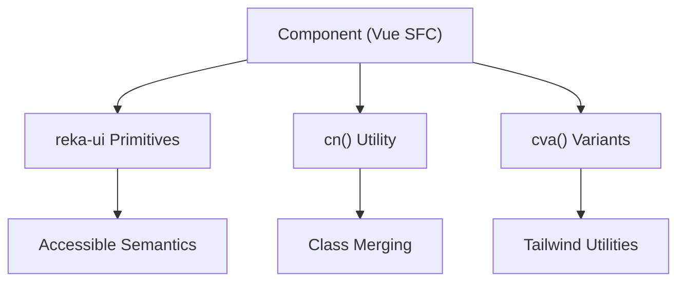

**Diagram sources**
- [Button.vue:1-32](file://resources/js/components/ui/button/Button.vue#L1-L32)
- [button/index.ts:1-39](file://resources/js/components/ui/button/index.ts#L1-L39)
- [Input.vue:1-34](file://resources/js/components/ui/input/Input.vue#L1-L34)
- [Checkbox.vue:1-36](file://resources/js/components/ui/checkbox/Checkbox.vue#L1-L36)
- [utils.ts](file://resources/js/lib/utils.ts)

**Section sources**
- [Button.vue:1-32](file://resources/js/components/ui/button/Button.vue#L1-L32)
- [button/index.ts:1-39](file://resources/js/components/ui/button/index.ts#L1-L39)
- [Input.vue:1-34](file://resources/js/components/ui/input/Input.vue#L1-L34)
- [Checkbox.vue:1-36](file://resources/js/components/ui/checkbox/Checkbox.vue#L1-L36)
- [utils.ts](file://resources/js/lib/utils.ts)

## Detailed Component Analysis

### Button
- Implementation pattern: Delegates to a primitive with data attributes for variant/size, merges classes via cn, and forwards as/asChild.
- Props:
  - variant: default, destructive, outline, secondary, ghost, link.
  - size: default, sm, lg, icon, icon-sm, icon-lg.
  - as/asChild/class: forwarded to the primitive.
- Events: Inherits from the underlying primitive.
- Slots: default slot for button content.
- Styling: Uses buttonVariants for consistent spacing, transitions, focus rings, and invalid states.

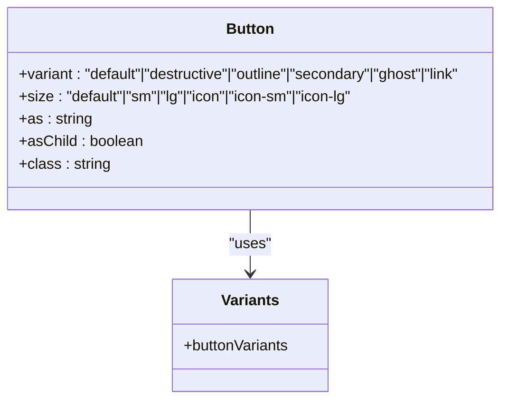

**Diagram sources**
- [Button.vue:1-32](file://resources/js/components/ui/button/Button.vue#L1-L32)
- [button/index.ts:1-39](file://resources/js/components/ui/button/index.ts#L1-L39)

**Section sources**
- [Button.vue:1-32](file://resources/js/components/ui/button/Button.vue#L1-L32)
- [button/index.ts:1-39](file://resources/js/components/ui/button/index.ts#L1-L39)

### Dialog
- Implementation pattern: Thin wrapper around reka-ui DialogRoot forwarding props and emits, exposing a slot with slotProps.
- Subcomponents: DialogTrigger, DialogOverlay, DialogContent, DialogHeader, DialogFooter, DialogTitle, DialogDescription, DialogClose, DialogScrollContent.
- Props/Events: Defined by reka-ui DialogRootProps/Emits; forwarded via useForwardPropsEmits.
- Accessibility: Inherits reka-ui dialog semantics and ARIA roles.

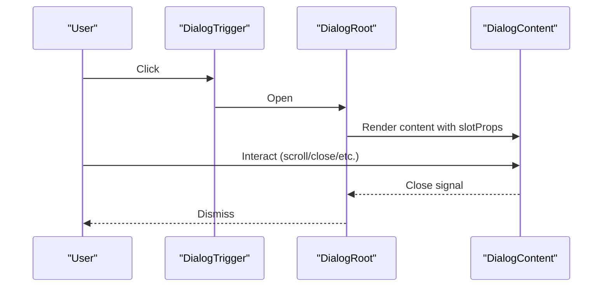

**Diagram sources**
- [Dialog.vue:1-20](file://resources/js/components/ui/dialog/Dialog.vue#L1-L20)
- [dialog/index.ts:1-11](file://resources/js/components/ui/dialog/index.ts#L1-L11)

**Section sources**
- [Dialog.vue:1-20](file://resources/js/components/ui/dialog/Dialog.vue#L1-L20)
- [dialog/index.ts:1-11](file://resources/js/components/ui/dialog/index.ts#L1-L11)

### Input
- Implementation pattern: Uses @vueuse/core’s useVModel for two-way binding with passive mode and defaultValue support.
- Props:
  - modelValue/defaultValue: controlled/uncontrolled value.
  - class: additional classes.
- Events:
  - update:modelValue: emitted on input change.
- States: Focus-visible ring, disabled opacity, aria-invalid highlighting.

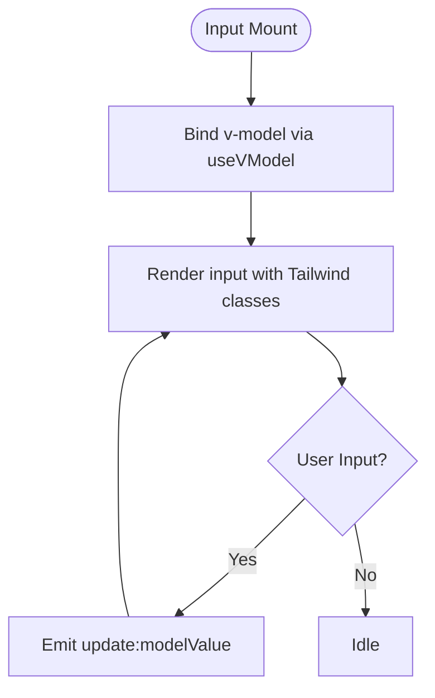

**Diagram sources**
- [Input.vue:1-34](file://resources/js/components/ui/input/Input.vue#L1-L34)

**Section sources**
- [Input.vue:1-34](file://resources/js/components/ui/input/Input.vue#L1-L34)

### Checkbox
- Implementation pattern: Wraps reka-ui CheckboxRoot and Indicator; applies focus-visible and invalid states; allows custom indicator via slot.
- Props/Events: Inherits from reka-ui CheckboxRootProps/Emits; delegates class via reactiveOmit.
- Accessibility: Uses proper ARIA states and keyboard interactions.

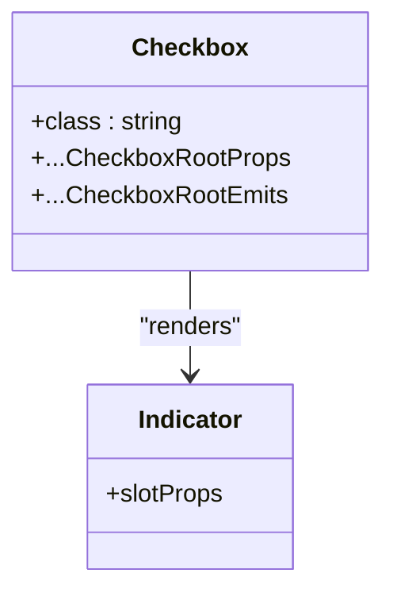

**Diagram sources**
- [Checkbox.vue:1-36](file://resources/js/components/ui/checkbox/Checkbox.vue#L1-L36)

**Section sources**
- [Checkbox.vue:1-36](file://resources/js/components/ui/checkbox/Checkbox.vue#L1-L36)

### Alert
- Implementation pattern: Container with optional leading icon grid; subcomponents AlertTitle and AlertDescription.
- Variants: default, destructive.
- Usage: Wrap AlertTitle and AlertDescription inside Alert for semantic grouping.

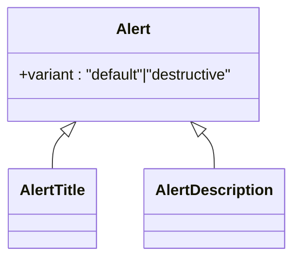

**Diagram sources**
- [Alert.vue](file://resources/js/components/ui/alert/Alert.vue)
- [alert/index.ts:1-25](file://resources/js/components/ui/alert/index.ts#L1-L25)

**Section sources**
- [Alert.vue](file://resources/js/components/ui/alert/Alert.vue)
- [alert/index.ts:1-25](file://resources/js/components/ui/alert/index.ts#L1-L25)

### Badge
- Implementation pattern: Inline tag with rounded indicator styling.
- Variants: default, secondary, destructive, outline.
- Usage: Lightweight status or labeling; supports icons and focus/invalid states.

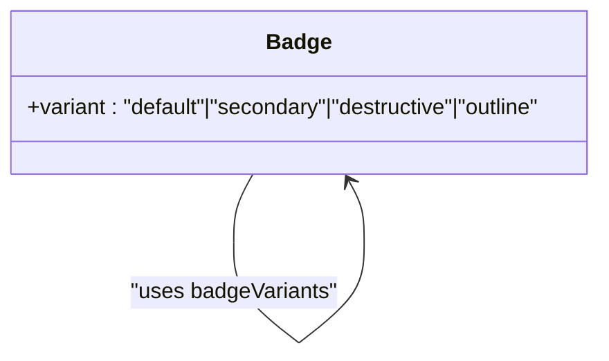

**Diagram sources**
- [Badge.vue](file://resources/js/components/ui/badge/Badge.vue)
- [badge/index.ts:1-27](file://resources/js/components/ui/badge/index.ts#L1-L27)

**Section sources**
- [Badge.vue](file://resources/js/components/ui/badge/Badge.vue)
- [badge/index.ts:1-27](file://resources/js/components/ui/badge/index.ts#L1-L27)

### Breadcrumb
- Implementation pattern: List-based navigation with explicit item, link/page, ellipsis, and separator components.
- Usage: Hierarchical navigation; combine BreadcrumbList, BreadcrumbItem, BreadcrumbLink/Page, BreadcrumbSeparator, and BreadcrumbEllipsis.

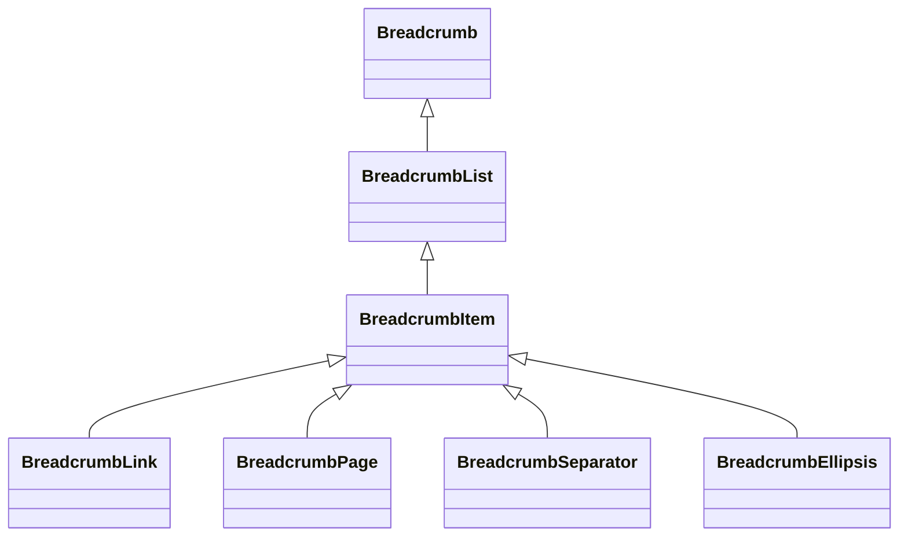

**Diagram sources**
- [Breadcrumb.vue](file://resources/js/components/ui/breadcrumb/Breadcrumb.vue)
- [breadcrumb/index.ts:1-8](file://resources/js/components/ui/breadcrumb/index.ts#L1-L8)

**Section sources**
- [Breadcrumb.vue](file://resources/js/components/ui/breadcrumb/Breadcrumb.vue)
- [breadcrumb/index.ts:1-8](file://resources/js/components/ui/breadcrumb/index.ts#L1-L8)

### NavigationMenu
- Implementation pattern: Exposes trigger style via cva; provides lists, items, links, content, viewport, and indicator.
- Usage: Multi-level navigation with open states and focus management.

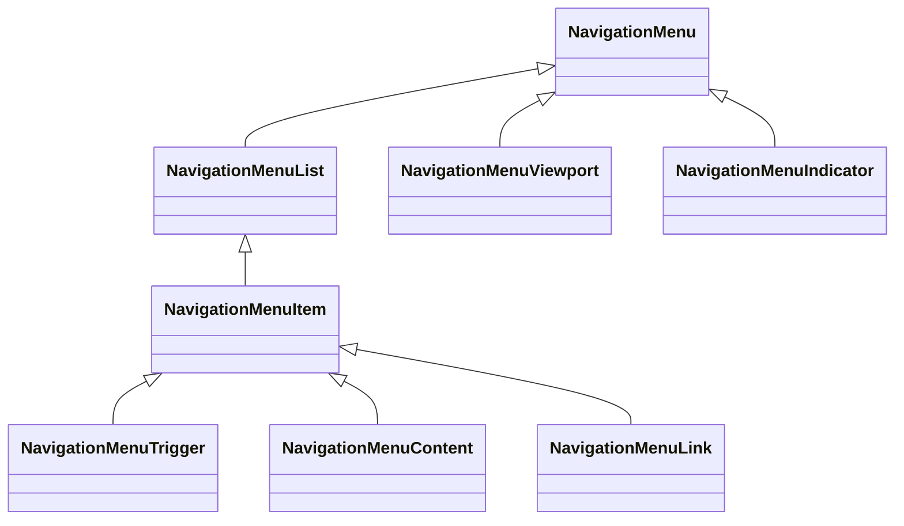

**Diagram sources**
- [navigation-menu/index.ts:1-15](file://resources/js/components/ui/navigation-menu/index.ts#L1-L15)

**Section sources**
- [navigation-menu/index.ts:1-15](file://resources/js/components/ui/navigation-menu/index.ts#L1-L15)

### DropdownMenu
- Implementation pattern: Menu with trigger, content, items, groups, labels, separators, checkboxes, radios, submenus, and portal support.
- Usage: Contextual actions and selections with nested submenus.

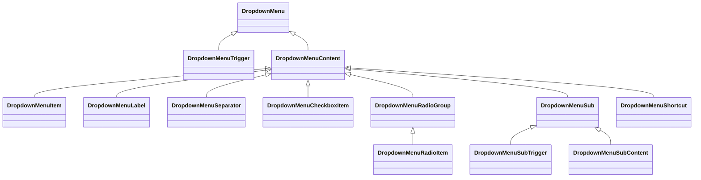

**Diagram sources**
- [dropdown-menu/index.ts:1-17](file://resources/js/components/ui/dropdown-menu/index.ts#L1-L17)

**Section sources**
- [dropdown-menu/index.ts:1-17](file://resources/js/components/ui/dropdown-menu/index.ts#L1-L17)

### Select
- Implementation pattern: Trigger, content, item, label, separator, scroll buttons, and value display.
- Usage: Replacement for native selects with rich customization.

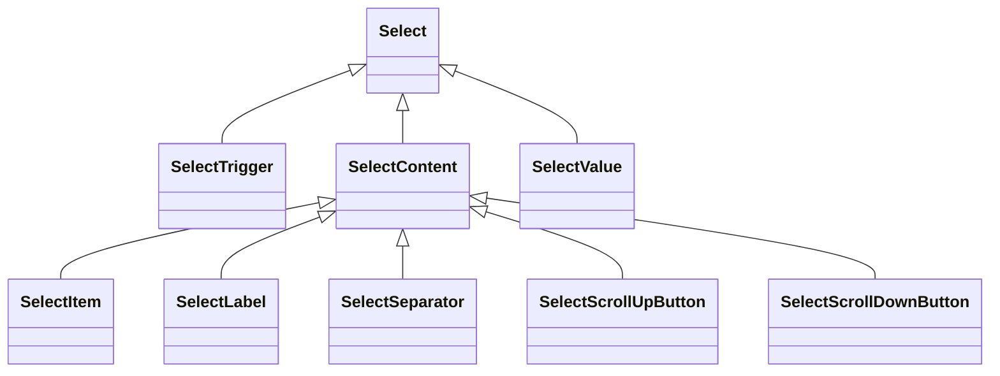

**Diagram sources**
- [select/index.ts](file://resources/js/components/ui/select/index.ts)

**Section sources**
- [select/index.ts](file://resources/js/components/ui/select/index.ts)

### Sheet
- Implementation pattern: Overlay with content, header, footer, title, description, and close trigger.
- Usage: Slide-in panels for settings, filters, or supplementary content.

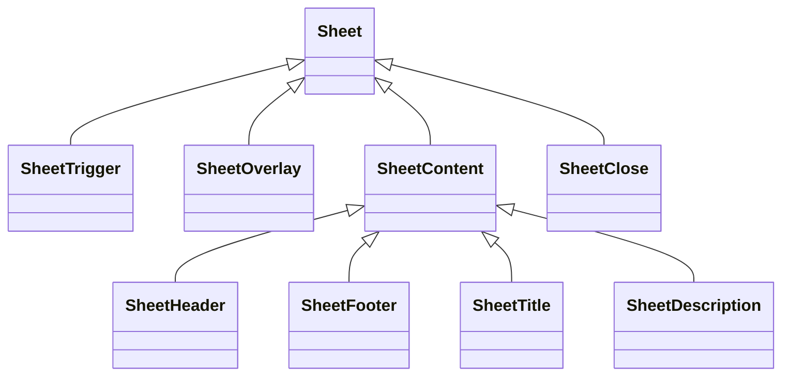

**Diagram sources**
- [sheet/index.ts](file://resources/js/components/ui/sheet/index.ts)

**Section sources**
- [sheet/index.ts](file://resources/js/components/ui/sheet/index.ts)

### Sidebar
- Implementation pattern: Provider, content, header/footer, group/action/content/label, menu, input, inset, rail, separator, trigger, and utilities for layout.
- Usage: Persistent or floating navigation sidebar with menu items and submenus.

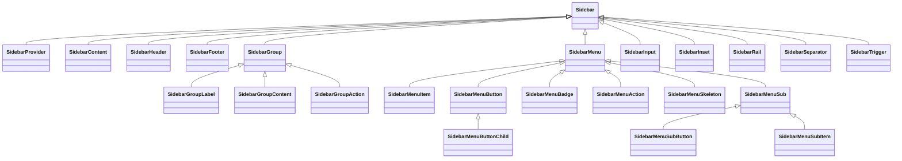

**Diagram sources**
- [sidebar/index.ts](file://resources/js/components/ui/sidebar/index.ts)
- [utils.ts](file://resources/js/components/ui/sidebar/utils.ts)

**Section sources**
- [sidebar/index.ts](file://resources/js/components/ui/sidebar/index.ts)
- [utils.ts](file://resources/js/components/ui/sidebar/utils.ts)

### Skeleton
- Implementation pattern: Provides animated placeholders for loading states.
- Usage: Pre-render containers while data loads.

**Section sources**
- [skeleton/index.ts](file://resources/js/components/ui/skeleton/index.ts)

### Sonner
- Implementation pattern: Notification/toast container for non-blocking feedback.
- Usage: Global toast notifications with positioning and duration control.

**Section sources**
- [sonner/index.ts](file://resources/js/components/ui/sonner/index.ts)

### Spinner
- Implementation pattern: Lightweight loading indicator.
- Usage: Inline or page-level loading cues.

**Section sources**
- [spinner/index.ts](file://resources/js/components/ui/spinner/index.ts)

### Tooltip
- Implementation pattern: Trigger and content with provider for context.
- Usage: Short explanatory text on hover/focus.

**Section sources**
- [tooltip/index.ts](file://resources/js/components/ui/tooltip/index.ts)

### Avatar
- Implementation pattern: Image with fallback when image fails to load.
- Usage: User avatars or generic placeholders.

**Section sources**
- [avatar/index.ts:1-4](file://resources/js/components/ui/avatar/index.ts#L1-L4)

### Separator
- Implementation pattern: Horizontal or vertical divider.
- Usage: Visual separation in forms, menus, or cards.

**Section sources**
- [separator/index.ts](file://resources/js/components/ui/separator/index.ts)

### Label
- Implementation pattern: Associates text with form controls for accessibility.
- Usage: Labels for inputs, checkboxes, radios, and selects.

**Section sources**
- [label/index.ts](file://resources/js/components/ui/label/index.ts)

### InputOTP
- Implementation pattern: Grouped inputs with individual slots and separators.
- Usage: One-time passwords and verification codes.

**Section sources**
- [input-otp/index.ts](file://resources/js/components/ui/input-otp/index.ts)

### Collapsible
- Implementation pattern: Expandable content with trigger and content.
- Usage: Accordions and expandable sections.

**Section sources**
- [collapsible/index.ts](file://resources/js/components/ui/collapsible/index.ts)

### Card
- Implementation pattern: Flexible content container with header, content, footer, and action areas.
- Usage: Encapsulating related information and actions.

**Section sources**
- [Card.vue:1-23](file://resources/js/components/ui/card/Card.vue#L1-L23)

## Dependency Analysis
- Internal dependencies:
  - Components import cn from a shared utility for merging Tailwind classes.
  - Many components rely on reka-ui primitives for accessible behaviors.
  - Variant systems are centralized in each component’s index module.
- External dependencies:
  - reka-ui: Provides primitives and forward utilities.
  - class-variance-authority: Provides cva for variant definitions.
  - @vueuse/core: Provides useVModel and reactive helpers.

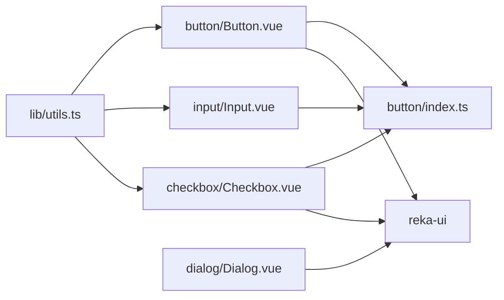

**Diagram sources**
- [utils.ts](file://resources/js/lib/utils.ts)
- [Button.vue:1-32](file://resources/js/components/ui/button/Button.vue#L1-L32)
- [Input.vue:1-34](file://resources/js/components/ui/input/Input.vue#L1-L34)
- [Checkbox.vue:1-36](file://resources/js/components/ui/checkbox/Checkbox.vue#L1-L36)
- [button/index.ts:1-39](file://resources/js/components/ui/button/index.ts#L1-L39)
- [Dialog.vue:1-20](file://resources/js/components/ui/dialog/Dialog.vue#L1-L20)

**Section sources**
- [utils.ts](file://resources/js/lib/utils.ts)
- [Button.vue:1-32](file://resources/js/components/ui/button/Button.vue#L1-L32)
- [Input.vue:1-34](file://resources/js/components/ui/input/Input.vue#L1-L34)
- [Checkbox.vue:1-36](file://resources/js/components/ui/checkbox/Checkbox.vue#L1-L36)
- [button/index.ts:1-39](file://resources/js/components/ui/button/index.ts#L1-L39)
- [Dialog.vue:1-20](file://resources/js/components/ui/dialog/Dialog.vue#L1-L20)

## Performance Considerations
- Prefer variant classes over dynamic conditionals to minimize re-renders.
- Use passive v-model bindings where appropriate to avoid unnecessary updates.
- Limit heavy computations in slots; memoize derived values at the parent level.
- Keep overlay content lightweight; defer heavy DOM until opened.
- Use Skeleton components to improve perceived performance during async operations.

## Accessibility Compliance
- Keyboard navigation: Components built on reka-ui primitives inherit robust keyboard support.
- ARIA roles and states: Components apply aria-invalid and maintain focus-visible rings.
- Screen reader support: Proper labeling via Label and semantic structures in Breadcrumb/NavigationMenu.
- Focus management: Dialogs, Sheets, and Dropdowns manage focus traps and return focus after dismissal.
- Contrast and visibility: Variant classes emphasize sufficient contrast; invalid states use color tokens for error indication.

## Responsive Design and Cross-Browser Compatibility
- Responsive breakpoints: Components use md: and similar utilities for responsive typography and spacing.
- Cross-browser: Tailwind utilities and reka-ui primitives target modern browsers; ensure polyfills if legacy IE support is required.
- Touch targets: Button sizes and spacing meet minimum touch target guidelines.
- Orientation changes: Components adapt via Tailwind’s responsive modifiers; test on devices with varying screen sizes.

## Extensibility Guidelines
- Adding a new variant:
  - Define a new variant in the component’s index.ts using cva with consistent tokens.
  - Update the component’s props to accept the new variant and propagate it to the root element.
- Creating a new component:
  - Place the SFC under the ui directory and add an index.ts exporting the component and variants.
  - Use cn for class merging and follow existing prop/event/slot conventions.
- Customizing appearance:
  - Override via the class prop; avoid hardcoding Tailwind classes inside components.
  - Extend tokens in the design system (colors, spacing, typography) to keep consistency.
- Theming:
  - Use CSS variables or Tailwind theme overrides to switch modes (light/dark).
  - Ensure focus rings and invalid states remain visible across themes.

## Troubleshooting Guide
- Dialog/Sheet not closing:
  - Verify DialogClose/SheetClose is present and bound to close handlers.
  - Ensure overlay click-to-close is enabled if desired.
- Input not updating:
  - Confirm v-model binding and that update:modelValue is emitted.
  - Check defaultValue vs modelValue precedence.
- Checkbox not reflecting state:
  - Ensure value/state is bound and forwarded to the primitive.
- Dropdown menu misaligned:
  - Use Portal for absolute positioning outside clipping containers.
- Focus ring not visible:
  - Ensure focus-visible ring classes are applied and not overridden by custom styles.
- Accessibility warnings:
  - Pair Label with inputs and ensure ARIA attributes are not duplicated.

## Conclusion
The SmartRecruit ATS UI component library combines Vue.js composition patterns with Tailwind CSS and reka-ui primitives to deliver a consistent, accessible, and extensible design system. By centralizing variants, leveraging shared utilities, and wrapping accessible primitives, the library enables rapid development of forms, overlays, navigation, and data displays while maintaining design consistency and strong UX guarantees.